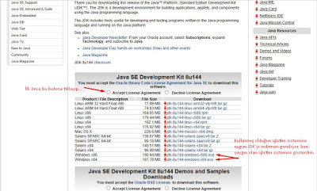
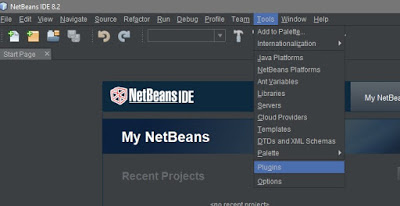
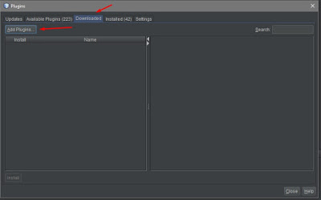
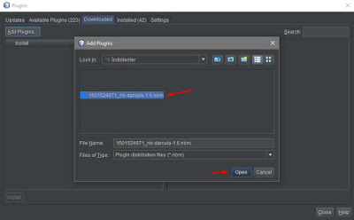
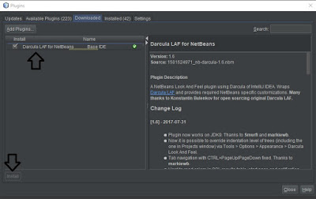
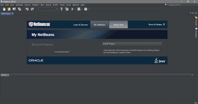
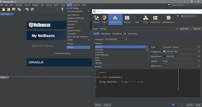
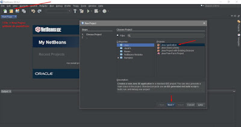
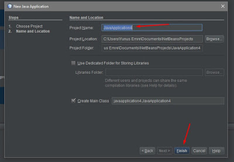
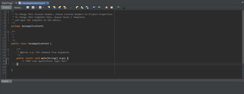

# NetBeans Kurulumu

## Java JDK Kurulumu

İlk olarak bilgisayarımızda *Java JDK*'nin yüklü olması gerektiğinden [buraya][Java JDK 8] tıklayarak indirme bağlantısına gitmelisin ve uygun *JDK*'yı indirmelisin.

## NetBeans İndirilmesi

Kurulum tamamlandıktan sonra, [buraya][NetBeans Setup] tıklayarak NetBeans'i indirebilirsin.

### Netbeans Tema ve Font Özelleştirme

> Eğer aydınlık bana uygun diyorsan bu adımı atlayabilirsin.

Aydınlık temalar benlik değil diye düşünüyorsan, hiç merak etme *NetBeans*'in karanlık bir teması olan [Darcula Laf][Darcula Laf] teması tam senlik.

- Dosyayı bulabileceğin bir dizine kaydetmeni tavsiye ederim çünkü konumu bize lazım olacak. NetBeans'i açma vakti geldi.
- Sırasıyla; `Tools` -> `Plugins` -> `Downloaded` -> `Add Plugins` -> `Install`
- İşlem sonrasında *NetBeans*'i yeniden başlatman gerekmektedir
- Font özelleştirme: `Tools` -> `Options` -> `Fonts & Colors`

#### Resimlerle Tema ve Font Ayarlama

## İlk Projeyi Oluşturma

Sırasıyla: `File` -> `New Project` -> `Java Application` -> `Next` -> `"Proje İsmin"` -> `Finish`

### Resimler ile Proje Oluşturma Anlatımı

<!-- Links -->

[Java JDK 8]: https://www.oracle.com/technetwork/java/javase/downloads/jdk8-downloads-2133151.html
[NetBeans Setup]: https://netbeans.org/downloads/start.html?platform=windows&lang=en&option=javase
[Darcula Laf]: http://plugins.netbeans.org/download/plugin/9293
