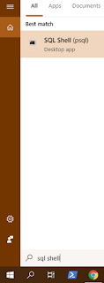
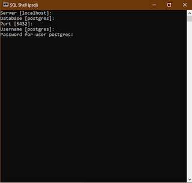

# NetBeans PostgreSQL Bağlantısı

## Kurulum

- [Buraya](https://get.enterprisedb.com/postgresql/postgresql-11.1-1-windows-x64.exe) (x64 win) tıklayarak *PostgreSQL*' indir.
- Kurulumda 1. kutucuğu ve 'shell' yazan sonuncu kutucuğu seçmen yeterli
- Şifreni unutma bağlantıda lazım olacak! (123 yap hızlıca devam etmek için)

## PostgreSQL Kullanımı

- Windows tuşuna basıp arama yerine 'SQL shell' yazmalısın
- Çıkan terminalde 'şifre' alanı gelene kadar 'ENTER' a bas
- Şifreni yazdıktan sonra örnek database komutunu çalıştırabilirsin




## PostgreSQL Database Oluşturma

Alttaki kodları kopyalıyıp, terminale yapıştırın.

- `mydb` Database ismi
- `123` Netbeans'den bağlantı yapacak kullanıcı şifresi
- `admin` Netbeans'den bağlantı yapacak kullanıcı ismi

```sql
create database mydb;
\c mydb

create user admin with encrypted password '123';

CREATE TABLE Users (
username varchar(15),
password varchar(15)
);

CREATE TABLE Books (
id int,
name varchar(15),
price int
);

CREATE TABLE Orders (
username varchar(15),
bookid int
);

CREATE TABLE Payments (
username varchar(15),
price varchar(15)
);

GRANT ALL PRIVILEGES ON ALL TABLES IN SCHEMA public TO admin;

INSERT INTO Books VALUES (1, 'kitap1', 20);
INSERT INTO Books VALUES (2, 'kitap2', 10);
INSERT INTO Books VALUES (3, 'kitap3', 30);
INSERT INTO Books VALUES (4, 'kitap4', 50);
INSERT INTO Books VALUES (5, 'kitap5', 5);
INSERT INTO Books VALUES (6, 'kitap6', 19);
```

## NetBeans'e PostgreSQL Driver'ı Ekleme

- Bu [link](https://jdbc.postgresql.org/download/postgresql-42.2.5.jar) üzerinden driver'ı indir. (İndirme engellenecek, 'sakla' demen lazım)
- Projeni aç (Netbeans üzerinden)
- Alttaki resimde gösterdiğim şekilde .jar uzantılı dosyayı projene ekle


## PostgreSQL Bağlantı Kodu (Connection String)

```java
/**
 * PostgreSQL'e bağlanmayı deneme
 * @return Bağlanırsa true, aksi halde false
 */
public static boolean connectPSQL() {
    try {
        // Driverı yükleme
        Class.forname("org.postgresql.Driver");

        // URL'i tanımlama
        String url = "jdbc:postgresql://localhost/database_ismi";

        // Database özelliklerini ayarlama
        Properties props = new Properties();
        props.setProperty("user", "yemreak");
        props.setProperty("password", "yemreak.com");

        // PostgreSQL bağlantısını oluşturma
        Connection conn = DriverManager.getConnection(url, props);

        return true;
    } catch(ClassNotFoundException | SQLException e) {
        System.out.println(e);
        return false;
    }
}
```

## Harici Bağlantılar

- [PostgreSQL kullanıcı oluşturma ve yetki verme](https://medium.com/coding-blocks/creating-user-database-and-adding-access-on-postgresql-8bfcd2f4a91e)
- [PostgreSQL Doc](https://jdbc.postgresql.org/documentation/81/intro.html)
- [PostgreSQL JDBC ile SQL sorgusu çalıştırma](https://jdbc.postgresql.org/documentation/81/query.html)
- [PostgreSQL Trigger Example](https://www.postgresql.org/docs/9.2/plpgsql-trigger.html)
- [PSQL yetki hatası çözümü](https://dba.stackexchange.com/questions/53914/permission-denied-for-relation-table)