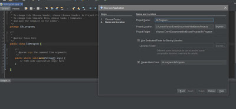
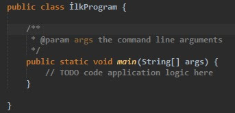
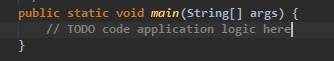
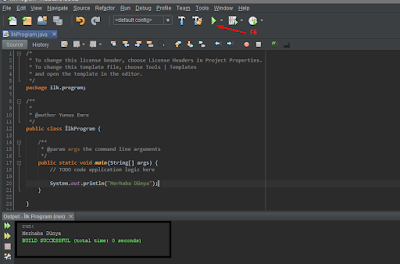
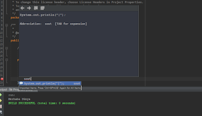
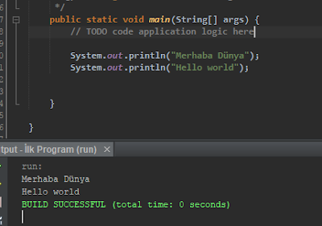
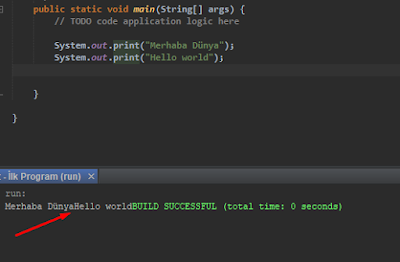

# Java Programlama

Programlamaya başlamanın olmazsa olmazlarından biri de *consola* `"Merhaba Dünya"` (`"Hello World"`) yazdırmaktır, o halde biz de bu geleneği bozmadan başlayalım 😊

> Bu yazımda **NetBeans** tabanlı ilerleyeceğim, eğer *NetBeans* kullanmak istiyorsan [buraya][NetBeans Kurulumu] tıklayarak *NetBeans* kurulum talimatlarına ve proje açılımına bakabilirsin.

## İlk Programı Oluşturma

`"İlk Program"` adında bir proje oluşturalım.

## Birkaç Faydalı Terim

Kesinlikle Bilmeliyiz ki, Java'da kodlar **main** methodu üzerinden okunmaya başlar, bu sebeple kodlamayı **main methodu**'nun içine yapmamız gerekmektedir.

| Terim  | Açıklama                                                                                                                                             |
| ------ | ---------------------------------------------------------------------------------------------------------------------------------------------------- |
| Class  | Soyut bir veri kümesidir, kodlamaların her biri bunlar içinde olmak zorundadır. Methodlardan oluşur                                                  |
| Method | Diğer programlama dillerinde Fonksiyon olarak da anılır, birden fazla kez kullanılabilen, kod bloklarıdır. Matematik dersindeki fonksiyonlar gibi... |

> İlerleyen zamanlarda methodlar hakkında geniş bir bilgi vereceğim, şimdilik ismen yabancı olmamanız için adlarına kısaca değindim ama ben merak ettim şimdi bakacağım diyorsan [buraya][Java Methodları] tıklayabilirsin 😁

### Class ve Method Resmi

> Soldan sağa ilerler.

 

## Ekrana Yazı Basma

`System.out.println("isteğimiz yazı");` yazarak istediğimiz yazıyı ekranda bastıra biliriz.

- Ekrandaki yeşil **play** butona ya da <kbd>F6</kbd> 'ya basarak derleyin
- Çıktı *java console*unda (alttaki ekran) oluşacaktır

> `sout` yazıp <kbd>CTRL</kbd> + <kbd>SPACE</kbd> yaparsan <kbd>ENTER</kbd>'a absarak derleyici sana tam halini gösterecektir. (İmleç olması gereken yerde olacaktır)

## Ekrana Çoklu Yazı Basma

- `System.out.println("");` Tırnak işareti içindeki veriyi ekrana yazdırıp, **yeni bir satır** atlatır.
- `System.out.print("");` Tırnak işareti içindeki veriyi ekrana yazdırıp, **satır atlatmaz**

 

<!--- Links -->

[NetBeans Kurulumu]: ./NetBeans%20Kurulumu.md
[Java Methodları]: http://umiitkose.com/2015/08/metodlar/
