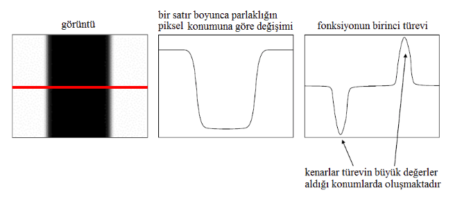
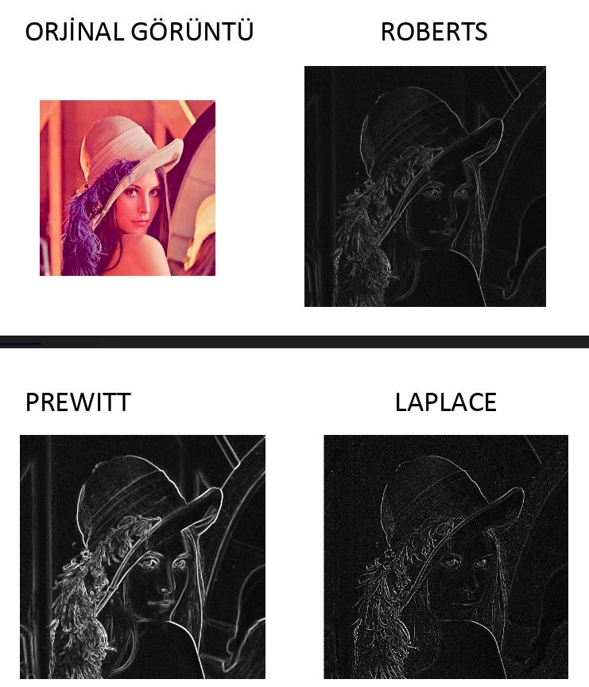
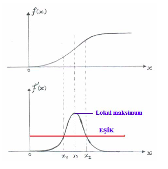
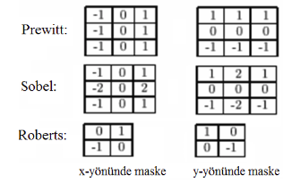
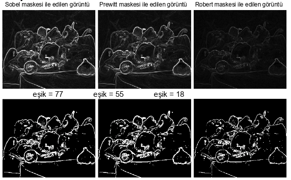
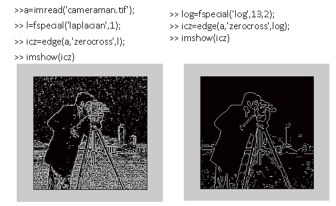

# Görüntü İşleme <!-- omit in toc -->

Ders matlab üzerinden işlenmektedir.

## İçerikler <!-- omit in toc -->

> `HOME` tuşu ile yukarı yönlenebilrsiniz

- [Ders Hakkında](#ders-hakk%C4%B1nda)
- [Ders İçerikleri](#ders-i%CC%87%C3%A7erikleri)
- [Ders Notlarım Hakkında](#ders-notlar%C4%B1m-hakk%C4%B1nda)
- [Sayısal Görüntü Örnekleme ve Niceleme, İkili Görüntü İşleme](#say%C4%B1sal-g%C3%B6r%C3%BCnt%C3%BC-%C3%B6rnekleme-ve-niceleme-i%CC%87kili-g%C3%B6r%C3%BCnt%C3%BC-i%CC%87%C5%9Fleme)
  - [Sayısal Görüntü](#say%C4%B1sal-g%C3%B6r%C3%BCnt%C3%BC)
    - [Siyah-Beyaz Görüntü](#siyah-beyaz-g%C3%B6r%C3%BCnt%C3%BC)
- [Lineer Filtreleme ve Kenar Belirleme](#lineer-filtreleme-ve-kenar-belirleme)
  - [Kenar Belirleme (Edge Detection)](#kenar-belirleme-edge-detection)
  - [Kenar Belirleme Sorunları](#kenar-belirleme-sorunlar%C4%B1)
  - [Kenar Belirleme Yöntemleri](#kenar-belirleme-y%C3%B6ntemleri)
    - [Gradyan Tabanlı Kenar Belirleme](#gradyan-tabanl%C4%B1-kenar-belirleme)
    - [Laplasyan Tabanlı Kenar Belirleme](#laplasyan-tabanl%C4%B1-kenar-belirleme)
      - [Marr-Hilderth Kenar Belirleme](#marr-hilderth-kenar-belirleme)
      - [Canny Kenar Belirleme](#canny-kenar-belirleme)
  - [Gürültü (Noise)](#g%C3%BCr%C3%BClt%C3%BC-noise)
    - [Gürültülü Engelleme](#g%C3%BCr%C3%BClt%C3%BCl%C3%BC-engelleme)
  - [Frekans Kavramı](#frekans-kavram%C4%B1)
  - [Lineer Filtreler](#lineer-filtreler)
    - [Alçak Geçirgen Filtreler](#al%C3%A7ak-ge%C3%A7irgen-filtreler)
    - [Yüksek Geçirgen Filtreler](#y%C3%BCksek-ge%C3%A7irgen-filtreler)
    - [Guassian Filtre](#guassian-filtre)
    - [Laplasyan Fitre](#laplasyan-fitre)
  - [LoG (Laplasyan of Guassian)](#log-laplasyan-of-guassian)
  - [Medyan Filtre](#medyan-filtre)
  - [Temel Görüntü İşlemleri](#temel-g%C3%B6r%C3%BCnt%C3%BC-i%CC%87%C5%9Flemleri)
- [Renk ve Geometrik Dönüşümler](#renk-ve-geometrik-d%C3%B6n%C3%BC%C5%9F%C3%BCmler)
  - [Renk Formatları](#renk-formatlar%C4%B1)
    - [RGB](#rgb)
  - [Perspektif İzdüşüm](#perspektif-i%CC%87zd%C3%BC%C5%9F%C3%BCm)
  - [Gemometrik Dönüşümler](#gemometrik-d%C3%B6n%C3%BC%C5%9F%C3%BCmler)
  - [Homojen Koordinatlar](#homojen-koordinatlar)
- [Görüntü İyileştirme Metodları](#g%C3%B6r%C3%BCnt%C3%BC-i%CC%87yile%C5%9Ftirme-metodlar%C4%B1)
  - [Histogram Germe](#histogram-germe)
    - [Pythonda Histogram Germe İşlemi](#pythonda-histogram-germe-i%CC%87%C5%9Flemi)
  - [Histogram Eşitleme](#histogram-e%C5%9Fitleme)
    - [Python'da Histogram Eşitleme](#pythonda-histogram-e%C5%9Fitleme)
- [Harici Bağlantılar](#harici-ba%C4%9Flant%C4%B1lar)

## Ders Hakkında

- Yoklama: Yok
- Ödev: %20 etkilemekte
  - En az 5 ödev olacak.
  - Aksis üzerinden verilecek

## Ders İçerikleri

Ders içerikleri drive üzerinden yedeklenmektedir, [buraya](https://drive.google.com/open?id=1Ma1V8w584R9ISva9XpH9OQcr2wsrmS20) tıklayarak erişebilirsin.

## Ders Notlarım Hakkında

- GI05, GI04 hakkında not alınmıştır

> Notlar tam değildir, sorumluluk kabul etmem 🤝

## Sayısal Görüntü Örnekleme ve Niceleme, İkili Görüntü İşleme

### Sayısal Görüntü

- İkili (*binary*) görüntü
- Gri Ölçekli (*gray scale*) görüntü
- Renkli (*colour*) görüntü


#### Siyah-Beyaz Görüntü

*Binary* görüntü olarak da bilinir. 2 boyutlu bir fonksyion ile gösterilir.

- f(x,y)
  - x: Satır (i)
  - y: Sütun (j)

> Derinlik değeri (renk boyutu) 1'dir

## Lineer Filtreleme ve Kenar Belirleme

### Kenar Belirleme (Edge Detection)

- Kenar, görüntü içerisinde parklaklığın sıçrama yaptığı bölgedir.
- Belli eşiğin üstündeki ani değişimler (255'ten 0'a değişim 255'tir)
- Türevin yüksek değer aldığı yerler kenarları oluşturur. (*gradient descent*)



### Kenar Belirleme Sorunları

- Gürültü (*noise*)
- Kenar belirleme ve konumlama ölçütleri arasındaki karşılıklı ilişki
- Kenarların çok ölçekli yapısı

### Kenar Belirleme Yöntemleri

- Eşik değerini geçmesi koşulunda kenar kabul edilir.
- Gradyan (*gradient*) parlaklık seviyesindeki değişimin en yüksek olduğu yönü belirtir
  - Gradyan, kenar yönüne diktir
- Gradyan genliği (*gradient amplitude*) **kenarın yönü** hakkında bilgi verir
- Gradyan açısı (*gradient angle*) **kenarın kalınlığı** hakkında bilgi verir

> Gradyan'a eğim denilebilir.




#### Gradyan Tabanlı Kenar Belirleme



Görüntünün birinci türevindeki maks ve min değerlere bakarak kenar belirleme yöntemidir.

| Teknik  | AÇıklama                                                       |
| ------- | -------------------------------------------------------------- |
| Sobel   | 2 maske ile, 2 boyutlu eğim (gradyan) ölçümü yapar             |
| Prewitt | *Sobel*'e göre daha basit ama gürültülü sonuçlar elde eder     |
| Robert  | En basit eğim opreratörüdür, köşeden köşeye çapraz geçiş yapar |

(G = kök(gx'in karesi + gx'in karesi))



#### Laplasyan Tabanlı Kenar Belirleme

İkinci türevdeki sıfır geçişleriyle belirleme.

- İkinci türev 1.nin max noktasındayken 0 olur, 0 noktaları tespit edilir
- Marr-Hilderth
- Canny 🌟


##### Marr-Hilderth Kenar Belirleme

- LoG (*Laplacian of Guassion*)'un 0 Kesişimini ele alır
- Ön işlem olarak yumuşatma (*gauss filter*) kullanır



##### Canny Kenar Belirleme

- Çok fazla kullanılır
- Gradyan büyüklüğü ve yönü belirlenir 
- Birden fazla *pixel* kalınlıktaki kenarlar, inceltme ile bir *pixel* kalınlığa düşürülür
  - İnceltme, *q* bir kenarsa, komşularından daha büyük değer almalıdır
- Büyük ve küçük olmak üzere iki eşik değeri (*threshold*) tanımlanır
  - Eşik değeri yüksek seçilirse kalın kenarlar, düşük seçilirse ince kenarlar ve gürültü tespit edilir
  - Büyük olan ile kalın kenar eğrileri belirlenir
  - Küçük olan ile eğriler devam ettirilir
    - Komşularının gradyan açıları yakın değerler alıyorsa kenara dahil edilir


### Gürültü (Noise)

| Tür                            | Açıklama                                                           |
| ------------------------------ | ------------------------------------------------------------------ |
| Tuz ve biber (*salt & pepper*) | Rastgele siyah ve beyaz piksellerin oluşması                       |
| İmpuls (*impulse*)             | Rastgele beyaz piksellerin oluşması                                |
| Gauss                          | Parlaklık seviyerilnde gauss dağılımına uyan değişimlerin oluşması |


#### Gürültülü Engelleme

Gauss fonksiyonu ile çarpılarak gürültü sönümlenebilir.

### Frekans Kavramı

Mesafeye göre gri seviye değişiminin miktarını ifade eder.

- 0'dan 255 değişimi veya tam tersi yüksek frekans
- 200'den 220 değişimi veya tam tersi düşük frekans

### Lineer Filtreler

Filtreler **frekans**'a göre *pixel*'leri temizlemek için kullanılır.

#### Alçak Geçirgen Filtreler

- Gürültüyü yok eder (*noise cleaning*)
- Görüntüyü yumuşatır (*smoothing*)
- Kenarları bulanıklaştırır (*blurring*)

| Filtre    | Açıklama                                                                                                                             |
| --------- | ------------------------------------------------------------------------------------------------------------------------------------ |
| Guassian  | Sert ton değişklerini azaltır ve görüntünün daha yumuşak olmasını sağlar. Maskenin artması bulanıklığı ve kenar kalınlığını arttırır |
| Laplasyan | Sayısal olarak en yakın iki *pixel*'in x ve y düzlemine göre türevidir. Gürültüye çok duyarlıdır                                     |
| LoG       | Önce huassian                                                                                                                        |

#### Yüksek Geçirgen Filtreler

Görüntü içerisindeki detayları, kenarları ve gürültüyü ortaya çıkarır.


#### Guassian Filtre

- Alçak geçirgen filtredir
- Sert ton değişiklerini azaltır
- Görüntünün yumuşak olmasını sağlar
- Maskenin artması bulanıklığı ve kenar kalınlığını arttırır

#### Laplasyan Fitre

- En yakın iki *pixel*'in x ve y düzlemine göre türevini hesaplar
- Gürültüye karşı çok duyarlıdır

### LoG (Laplasyan of Guassian)

2 filtreleme tekniğin sıralı olarak birleştirilmiş halidir

- Laplansyan gürültüye çok duyarlıdır
- Gürültü, **guassian filre** ile azaltırılır ve görüntü yumuşatılır
- Sonra laplasyan filtre uygulanır

### Medyan Filtre

Gaussian Filtre'si gürültüyü giderirken görüntüyü bulanıklaştırır. Medyan filtre:

- Görüntüyü bulanıklaştırmadan gürültüyü engeller
- *Pixel* değerinin komşu *pixel* değerlerine göre medyanı alınır


### Temel Görüntü İşlemleri

| İşlem                      | Yapılma Yöntemi                                                                                                                                                                                                            |
| -------------------------- | -------------------------------------------------------------------------------------------------------------------------------------------------------------------------------------------------------------------------- |
| Bulanıklaştırma (*blur*)   | *Ppixel* değerlenin çevresindeki *pixel* değerleri ile ortalamasının hesaplanması                                                                                                                                          |
| Keskinleştirme (*sharpen*) | Orjinal görüntüye kenarları bulunmş görüntü eklenir (Maskedeki merkez değeri 1 arttırılarak)                                                                                                                               |
| Kabartma                   | Resme 3D efekti verir, merkezin bir tarafındaki *pixel* değerlerinden diğer taraftakilerin çıkarılması ile yapılır. Negatif olanlar gölge, pozitif olanlar aydınlık yüzey olur. Görüntünün çoğu gri tonlarına dönüşecektir |


## Renk ve Geometrik Dönüşümler

### Renk Formatları

Her bir renk için 8bit'lik bir tanımlama var. (255)

| Format | Açıklama                                           | Kullanım Alanı |
| ------ | -------------------------------------------------- | -------------- |
| RGB    | Işığa eş değer, genel kullanılan method            | TV, PC vs.     |
| CMYK   | Boya renklerini taklit eder, baskılarda kullanılır | Printer        |
| HSI    |
| YIQ    |

#### RGB

- Cihaza ve donanıma bağlı bir renk formatıdır
- RGB ile kodlanan dosyalar az yer kaplar
- RGB: Red Green Blue
- CMYK: Cyan, Magena, Yellow, Key (Key siyah rengi temsil eder)
  - Key (siyah) renk, baskıda kullanılmazsa, teorideki karşılığını sağlamaz
- RGB beyaza odaklı, CMYK siyaha odaklı hareket eder
  - max RGB: Beyaz
  - max CMYK: Siyah
  - CMY = 1 - RGB

### Perspektif İzdüşüm

3D resmi 2D'ye geçirince derinlik verisinin kaybolma sebebi, benzerlerlik teoreminden kaynaklanır.

> Mutlak siyah varsa boşluk gibi görünür.

### Gemometrik Dönüşümler

- Öteleme
- Ölçekleme
- Döndürme

> Her birinde homojen koordinatlar kullanılır.

### Homojen Koordinatlar

Fazlalık olan kısımlara 1, diğer alanlara değişkenler verilir. [xy1] vs.

> Matrikslerde çarpım işlemleri daha kolaydır.

## Görüntü İyileştirme Metodları

Çok koyu ya da çok açık görüntüler üzerinde uygulanır.

| Metod              | Açıklama                                                |
| ------------------ | ------------------------------------------------------- |
| Histogram Germe    | Verilerin aralığını arttırma işlemi                     |
| Histogram Eşitleme | Her renk değeri için eşit sayıda pixel olmasını sağlama |

### Histogram Germe

Pixel değerlerinin aralığını genişletme işlemi olarak da bilinir.

- Resmin sahip olduğu en düşük ve en yüksek pixel değeri bulunur
  - $eski_{max}, eski_{min}$
- İstenen en yüksek ve en düşük pixel aralıkları belirlenir
  - Genelde 0, 255 değerleri seçilir
  - $yeni_{max}, yeni_{min}$
- Her bir pixel, yeni başlangıç ve bitiş noktasına göre değerler alır

$$
yeni_i = ((yeni_{max} - yeni_{min}) / (eski_{max} - eski_{min})) . (eski_i - eski_{min}) + yeni_{min}
$$

#### Pythonda Histogram Germe İşlemi

```py
def histogram_stretching(image: Image, new=(0, 255)):
    """Histogram Germe

    Arguments:
        image {PIL.Image} -- Resim

    Keyword Arguments:
        new {(min, max)} -- tuple (default: {(0, 255)})

    Returns:
        PIL.Image -- Gerilmiş resim
    """

    def difference(variable: tuple):
        return variable[1] - variable[0]

    np_image = np.array(image)  # Resmi numpy.ndarray formatına çevirme
    flatten_img_np = np_image.reshape(-1)  # Resmi tek boyuta indirgeme

    # Histogram germe denklemi
    old = flatten_img_np.min(), flatten_img_np.max()
    for i in range(0, len(flatten_img_np)):
        flatten_img_np[i] = (difference(new) / difference(old)) * \
            (flatten_img_np[i] - old[0]) + new[0]

    # Aynı boyutlardaki yeni resmi oluşturma
    return Image.fromarray(flatten_img_np.reshape(np_image.shape))

```

### Histogram Eşitleme

Her bir parlaklık seviyesi için aynı sayıda pixel bulunmasını sağlayarak resmin pixellerinin dengeli (uniform) dağılımda olması amaçlanır.

- Her pixel ton değerinin resmin içinde hangi oranda olduğu $p_r(r_k)$ hesaplanır
  - $P_r(r_k) = n_k / n$
    - $n$: Toplam pixel sayısı
    - $n_k$: k. pixel sayısı
- Kümülatif olasılık fonksiyonu $s_k$ hesaplanır
  - $s_k = T(r_k) = \sum_{j=0}^k P_r(r_k) = \sum_{j=0}^k n_j / n$
- Ters dönüşüm yapılarak, hangi renk tonu yerine hangisinin geleceği hesaplanır
  - $r_k = T^-(s_k) = L * T(r_k)$
    - $L$: Maksimum pixel değeri (255)

#### Python'da Histogram Eşitleme

```py
def histogram_equalization(image: Image):
    """Histogram eşitleme

    Arguments:
        image {PIL.Image} -- Resim

    Returns:
        PIL.Image -- Resim
    """

    np_image = np.copy(image)  # Numpy formatına çevirme
    flatten_image = np_image.flatten()  # Resmi tek boyuta indirgeme

    # Pixel bilgilerini alma
    pixel_num = len(flatten_image)
    max_pixel_num = flatten_image.max()
    min_pixel_num = flatten_image.min()

    # Pixel dağılımını hesaplama
    pixel_manager = {}  # Pixel yönlendirici
    cumulative_probability = 0  # Kümülatif pixel bulunma olasılığı
    for i in range(min_pixel_num, max_pixel_num + 1):
        pixel_count = 0  # Pixel'in tekrar etme sayısı
        for pixel in flatten_image:
            if i == pixel:
                pixel_count += 1
        cumulative_probability += pixel_count / pixel_num
        pixel_manager[f'{i}'] = round(
            max_pixel_num * cumulative_probability
        )

    for i in range(len(flatten_image)):
        flatten_image[i] = pixel_manager[f"{flatten_image[i]}"]

    return Image.fromarray(flatten_image.reshape(np_image.shape))

```

> Ek kaynak için [buraya](https://opencv-python-tutroals.readthedocs.io/en/latest/py_tutorials/py_imgproc/py_histograms/py_histogram_equalization/py_histogram_equalization.html) bakabilirsin.

## Harici Bağlantılar

- [Python ile Görüntü İşleme: Histogram, Normalleştirilmiş Histogram ve Histogram Eşitleme](https://medium.com/@sddkal/python-ile-g%C3%B6r%C3%BCnt%C3%BC-i%CC%87%C5%9Fleme-histogram-normalle%C5%9Ftirilmi%C5%9F-histogram-ve-histogram-e%C5%9Fitleme-3d0052174f1f)
- [Edge Detection](https://www.mathworks.com/discovery/edge-detection.html)