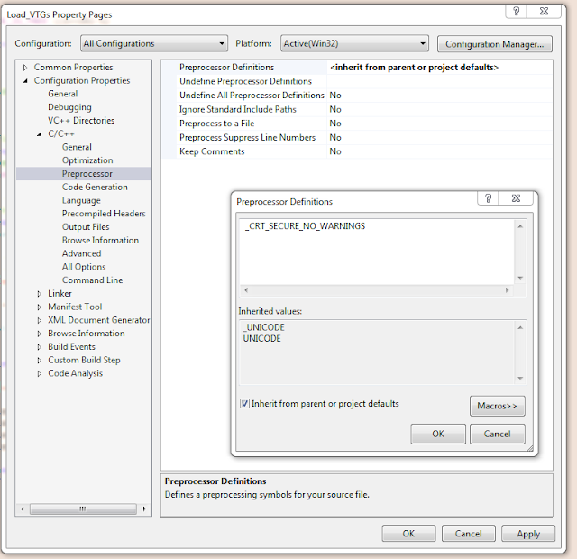

# Visual Studio _CRT_SECURE_NO_WARNINGS Sorunu

- Çözüm gezginine sağ tıklayıp `Ayarlar` (`Properties`) veya <kbd>ALT</kbd> + <kbd>ENTER</kbd> a basınız.
- Configuration: All Configuration
- C++
- Preprocessor
- Preprocessor Definitaion - Edit
- En üst boşluğa `_CRT_SECURE_NO_WARNINGS` yazın ve kaydedin.

