# GroupLayaouts

İnternette pek kaynağı bulunmayan ve diğer layoutlara nazaran daha zor olan `GroupLayout`, doğru yerlerde kullanıldığında oldukça kullanışlı olmakta. Video yok mu dersen (ki bu yazıda çok detaylı bir şekilde ele aldım) [buraya](https://www.youtube.com/watch?v=vA9ZSgaLaJs&t=317s) tıklayarak farklı bir kaynağa bakabilirsin :(

## Kısaca GroupLayout

- Hem yatay, hem de dikey olarak özel tasarlanmış bir layout oluşturmamıza olanak sağlamakta.
- Bu layout diğer layoutların aksine, new GroupLayout(...) şeklinde kullanılmamakta, bunu kullanmak için GroupLayout gl = new GroupLayout(component); şeklinde nesnesini oluşturup özelleştirmemiz gerekmekte.
  - compenent ; Layout'u kullanacak olan compenent.
- Özelleştirmeyi yaparken, soldan sağa (horizontal) ve yukarıdan aşağı (vertical) olarak componentlerin konumlarını ayarlamamız gerekmekte. Ayrıca girilen kodların birbiri ile uyumlu olması gerekmekte, aksi halde kod hata verecektir.

## Ana GroupLayout Metdoları

- setHorizontalGroup(Group grup); Componentlerin yatay konumlarını bu metodu kullanarak ayarlayacağız.
- setVerticalGroup(Group grup); Componentlerin dikey konumlarını ayarlamak için.
- Bu iki metodun içerisine;
  - createSequentialGroup(); Ardışık olarak compenent eklemek için oluşturulan grup.
  - createParallelGroup(); Paralel olarak component eklemek için oluşturulan grup.
- Bu metodların ardından da
  - addComponent(component); ile componentlerimizi ekleyeceğiz.
  - addGap(...); ile gerekirse boşluk ekleyeceğiz.

## Temel Yapılış Şekli

- Yatay İnceleme için hayali dikey çizgiler
- Dikey İnceleme için hayali yatay çizgiler çiziyoruz
- Aynı çizgide olanlar paralel, farklı çizgilerde olanlar seridir.

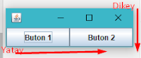

## Basit Bir Örnek

Alt taraftaki gibi bir çıktı almak istediğimiz zaman, adım adım yatay ve dikey olarak inceleme yapmamız gerekmekte; (gl = GroupLayout, b1 = buton1, b2 = buton2)

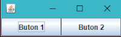

### Yatay Olarak İncelersek

Buton1 ve Buton2 birbirlerine seri (ardışık) durmakta.

```java
gl.setHorizontalGroup(
    gl.createSequentialGroup()
    .addComponent(b1)
    .addComponent(b2)
    );
);
```

### Dikey Olarak İncelersek

Buton1 ve Buton2 birbirlerine paralel durmakta.

```java
gl.setVerticalGroup(
    gl.createParallelGroup()
    .addComponent(b1)
    .addComponent(b2)
    );
);
```

### Detaylı Resim İle Açıklama

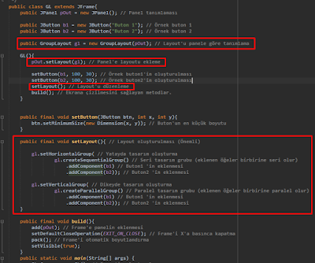

> Kaynak kodlarını YScript içerisinde.

## Biraz Daha Zor Bir Örnek

Alt taraftaki gibi bir çıktı almak istediğimiz zaman, adım adım yatay ve dikey olarak inceleme yapmamız gerekmekte; (gl = GroupLayout, b1 = buton1, b2 = buton2)

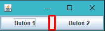

### Örneği Yatay Olarak İncelersek

Buton1 ve Buton2 birbirlerine seri (ardışık) durmakta.

- Yatayda 10px boşluk var.
- İnceleme 1'de alt kısımdaki yeri bulup, b1 ve b2 arasına .addGap(10) eklemen yeterli.

```java
gl.setHorizontalGroup(
    gl.createSequentialGroup()
    .addComponent(b1)
    .addGap(10) // Boşluk
    .addComponent(b2)
    );
);
```

### Örneği Dikey Olarak İncelersek

Dikeyde boşluk bulunmamakta.

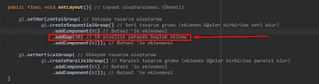

```java
gl.setVerticalGroup(
    gl.createParallelGroup()
    .addComponent(b1)
    .addComponent(b2)
    );
);
```

### Ek Örnek Daha

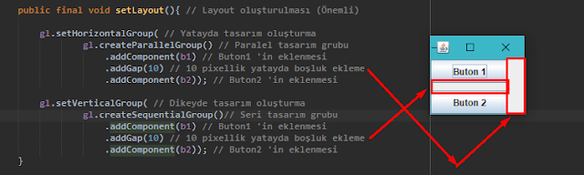

## Karmaşık Bir Örnek

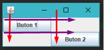

### Yatay Olarak İncelersek (Kırmızı Çizgiler)

Buton1 ve Buton2 birbirlerine seri (ardışık) durmakta. ( Dikey konumlarını göz ardı ediyoruz, tek boyut olarak inceliyoruz.)

```java
gl.setHorizontalGroup(
    gl.createSequentialGroup()
    .addComponent(b1)
    .addComponent(b2)
    );
);
```

### Dikey Olarak İncelersek (Mor Çizgiler)

Buton1 ve Buton2 birbirlerine seri durmakta. (Yatay konumlarını göz ardı ediyoruz, tek boyut olarak inceliyoruz.)

```java
gl.setVerticalGroup(
    gl.createSequentialGroup()
    .addComponent(b1)
    .addComponent(b2)
    );
);
```

### Sonuç Resmi

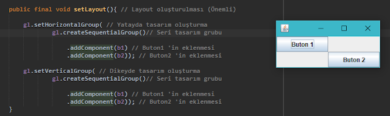

### Hızlı Örnekler

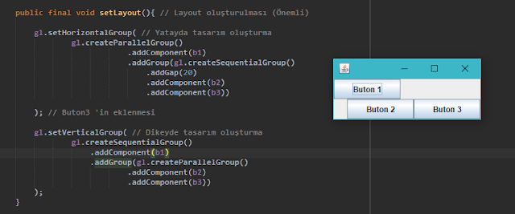

**Yatay Olarak İncelersek:**

- Buton1, Buton2 ve Buton3 'e paralel.
- Buton2 ve Butom3 birbirlerine seri.

**Dikey Olarak:**

- Buton1, Buton2 ve Buton3 'e seri.
- Buton2 ve Buton3 paralel.

---

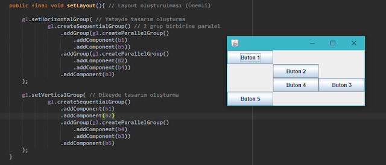

**Yatay Olarak İncelersek (Kırmızılar):**

- 1, 5 paralel
- 2, 4 paralel
- 3,  (2, 4), (1, 5) seri

**Dikey Olarak;**

- 4, 3 paralel
- 1, 2, (4, 3), 5 seri

---

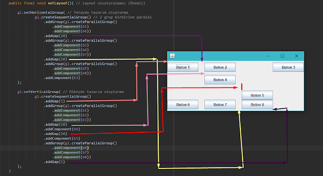