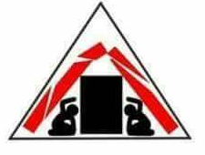
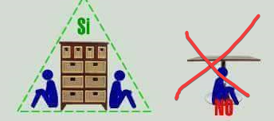
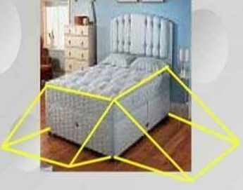
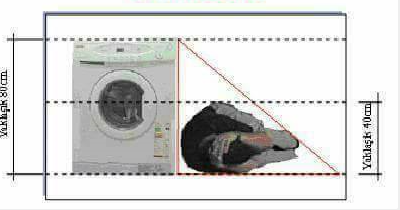
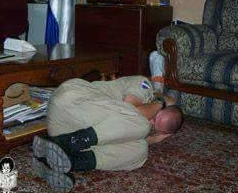
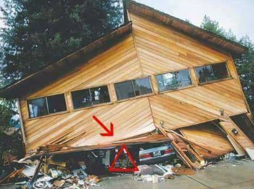
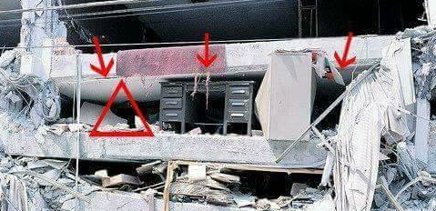
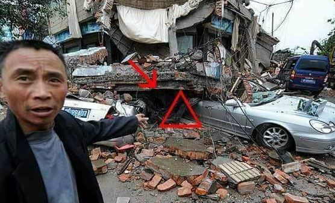

# 💒 Derpem Anında Kişisel Korunma

Orjinal kaynak için [buraya](http://ogretmenlerdiyari.com/deprem-aninda-hayat-ucgeni-ve-onemi) bakabilirsin.

## 🗽 Açıklama

Dünyanın en tecrübeli kurtarma birimi Amerikan Uluslararası
Kurtarma ekibinin Kurtarma şefi **Doug Copp** tarafından önerilmekte.

- 20 maket okulu ve evi yıkarak, test edilmiş.
- 10 maket _çömel ve korun_ metodunu uygularken, 10 maket _hayat üçgeni_ metodunu uygulamış
- **Hayat üçgeni** metodunu uygulayanlar **yaklaşık %100 ihtimalle** korunmuş

## 📐 Hayat Üçgeni

- 🏃‍ Dışarı çıkma şansınız varsa **dışarı çıkın**, yoksa alttakileri uygulayın
- Binanın **dışarı yakın kısımlarına** geçmeye çalışın, deprem sonrasındaki çöküntüden rahat kurutlmanızı sağlar
- Hafifçe ezilecek ama **yanıda boşluk bırakacak** türde eşyaların **yanına** geçin (Şekil 1)
  - Kanepe veya büyük ve **dayanıklı** bir koltuğun yanına geçin
  - Eğer **uyuyorsanız yataktan yuvarlanarak düşün**, orada kalın (Şekil 2)
- Dizi, karına doğru çekerek kıvrılın (**cenin pozisyonu**) (Şekil 3)

### 🙍‍ Cenin Pozisyonu

Dizleri, karına doğru çekerek kıvrılma pozisyonudur

## 🧱 Örnek Yıkım Alanları ve Hayat Üçgeni

## ⛔ Yapılamaması Gerekenler

- 🪑 Masa, araba gibi nesnelerin **altına giren** kişiler
her zaman **ezilirler**. 
- 🚪 Kapı kirişlerinin altına geçenler **ölürler**
  - Eğer kapı kirişlerinin altına
geçerseniz ve kapı kirişi öne veya arkaya doğru düşürse inen tavanın altında
ezilirsiniz
  - Eğer kapı kirişi yana doğru yıkılırsa ikiye bölünürsünüz
  - Her iki
durumda da ölürsünüz!
- Merdivenlere hiçbir zaman gitmeyin, yıkılabilir ve tehlikelidir

