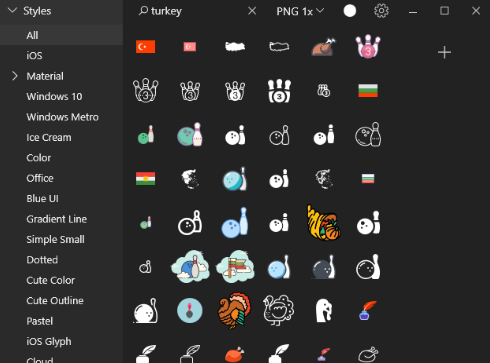

# Tasarım Notları <!-- omit in toc -->

## İçerikler <!-- omit in toc -->

- [CV Notları](#cv-notlar%C4%B1)
- [Windows için İkon Seti](#windows-i%C3%A7in-i%CC%87kon-seti)
- [Renk Kodları](#renk-kodlar%C4%B1)

## CV Notları

CV'ler için en sık kullanılan fontlar için [buraya][Best and Worst Resume Fonts] bakabilirsin.

> Tasarım yapma istesi olan [canva][Canva] üzerinden CV'ni de tasarlayabilirsin

## Windows için İkon Seti

Windows için ikon paketini [buradan][Windows Icon Pack] indirebilirsin

- Sağ alt köşede, çok hızlı bir erişimi oldukça kolaydır
- 90k ikon içerir
- Çok sık kullanılan bir pakettir

## Renk Kodları

Hazır renk kodlarının olduğu xml dosyasını (color.xml) [buraya][Colors.rar] basarak indirebilirsin.

> Daha detaylı bir renk araştırması içerisindeysen, sana faydalı olabilecek bağlantıya ulaşman için [buraya][Colors] tıklayabilirsin. Sol kenardaki linklerden renklerin özel olarak sıralanmış hallerini kullanman daha faydalı olacaktır.

[Best and Worst Resume Fonts]: https://www.canva.com/learn/resume-fonts/

[Windows Icon Pack]: https://icons8.com/app

[Colors.rar]: https://gelecegiyazanlar.turkcell.com.tr/sites/default/files/colors.rar
[Colors]: https://www.w3schools.com/colors/default.asp
[Canva]: https://www.canva.com/
