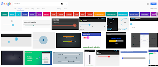
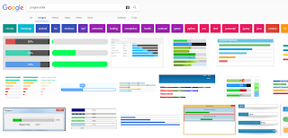
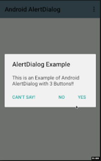
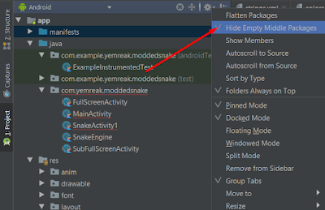
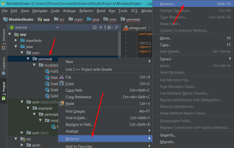
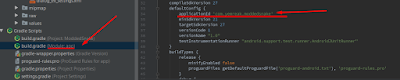

# Andorid

## Faydalı Eğitim Setleri

- [Udemy](https://www.udemy.com/android-o-mobil-uygulama-dersi-kotlin-java/learn/v4/overview) (Ücretli)
- [YouTube](https://www.youtube.com/playlist?list=PLaoF-xhnnrRWHtmb8ZGmu8N4Wl2Zr26V7) (İngilizce), ([Ek video](https://www.youtube.com/playlist?list=PLSg_-k7KzeO9rDMhNPlASaGH1E8JVpgYN))
- [Android](https://developer.android.com/training/index.html) (İngilizce)
- [Turkcell](https://gelecegiyazanlar.turkcell.com.tr/konu/android)
- [Yazılımcılar Dünyası](http://www.yazilimcilardunyasi.com/p/mobil-programlama.html)
- [Youtube](https://www.youtube.com/playlist?list=PL9qDMO9EzLX25NTHm0q7svKLx__OZY8-e)
- [Ümit KÖSE](http://umiitkose.com/android/)
- [AbhiAndroid Android App Development eBook](https://drive.google.com/file/d/1yZz8-MFs8WYb192ONy8M1KN9gVG988mg/view?usp=sharing)

## Animasyonlar

### Aşağıdan Gelme Animasyonu


Proje dizinine `anim` adlı klasör oluşturup içinde bir `resource file'`a bu kodları yazıyoruz.

```xml
<?xml version="1.0" encoding="utf-8"?>
<set xmlns:android="http://schemas.android.com/apk/res/android">
    <translate
          android:duration="800"
          android:fromXDelta="0%p"
          android:fromYDelta="100%p"/>
</set>
```

`Main`'e alttakiler eklenmeli:

```kt
class MainActivity : AppCompatActivity() {
    override fun onCreate(savedInstanceState: Bundle?) {
        super.onCreate(savedInstanceState)
        setContentView(R.layout.activity_main)
        btn_start.animation = AnimationUtils.loadAnimation(this, R.anim.frombuttom)
   }}
    ...
}
```

- `btn_start` = Get Started adlı view'ın ID'si
- `frombutton` = üstteki kodların yazıldığı dosyanın adı

### Soluk Belirme


```xml
<?xml version="1.0" encoding="utf-8"?>
<alpha xmlns:android="http://schemas.android.com/apk/res/android"
    android:duration="2000"
    android:fromAlpha="0.0"
    android:toAlpha="1.0"    />
```

## Kaydırmalı Uygulama (ViewPager ve PageAdapter)


`Manifest` kodları:

```xml
<?xml version="1.0" encoding="utf-8"?>
<manifest xmlns:android="http://schemas.android.com/apk/res/android"
    package="com.yemreak.iuapp">
    <application
        android:allowBackup="true"
        android:icon="@mipmap/ic_launcher"
        android:label="@string/app_name"
        android:roundIcon="@mipmap/ic_launcher_round"
        android:supportsRtl="true"
        android:theme="@style/AppTheme">
        <activity
            android:name=".MainActivity"
            android:theme="@style/LogInTheme">
            <intent-filter>

                <action android:name="android.intent.action.MAIN" />

                <category android:name="android.intent.category.LAUNCHER" />
            </intent-filter>
        </activity>
    </application>
</manifest>
```

`Main` kodları:

```kt
package com.yemreak.iuapp

import android.support.v7.app.AppCompatActivity
import android.os.Bundle
import android.support.v4.view.ViewPager
import kotlinx.android.synthetic.main.activity_main.*

class MainActivity : AppCompatActivity() {

    private lateinit var slideAdapter: SlideAdapter

    override fun onCreate(savedInstanceState: Bundle?) {
        super.onCreate(savedInstanceState)
        setContentView(R.layout.activity_main)

        slideAdapter = SlideAdapter(applicationContext)
        vp_main.adapter = slideAdapter
    }}
    ...
}
```

`SlideAdapter` dosyası kodları:

```kt
package com.yemreak.iuapp

import android.content.Context
import android.graphics.Color
import android.support.v4.view.PagerAdapter
import android.view.LayoutInflater
import android.view.View
import android.view.ViewGroup
import android.widget.ImageView
import android.widget.LinearLayout
import android.widget.TextView

class SlideAdapter(context : Context) : PagerAdapter() {

    lateinit var layoutInflater: LayoutInflater

    private val context = context
    private val arr_images = arrayListOf(
            R.drawable.ic_launcher_foreground,
            R.drawable.ic_launcher_foreground,
            R.drawable.water,
            R.drawable.text
    )
    private val arr_titles = arrayListOf("a", "b", "c", "d")
    private val arr_descriptions = arrayListOf("aa", "bb", "cc", "dd")
    private val arr_bgColors = arrayListOf(
            Color.rgb(55, 55, 55),
            Color.rgb(239, 85, 85),
            Color.rgb(110, 49, 89),
            Color.rgb(1, 118, 212)
    )


    override fun isViewFromObject(view: View, `object` : Any): Boolean {
        return (view == `object` as LinearLayout)
    }

    override fun getCount(): Int {
        return arr_images.size
    }

    override fun instantiateItem(container: ViewGroup, position: Int): Any {
        layoutInflater =  context.getSystemService(Context.LAYOUT_INFLATER_SERVICE) as LayoutInflater

        val view = layoutInflater.inflate(R.layout.slide, container, false)
        val layout = view.findViewById<LinearLayout>(R.id.ll_slide1)
        val image = view.findViewById<ImageView>(R.id.iv_slide)
        val title = view.findViewById<TextView>(R.id.tv_slide_tittle)
        val description = view.findViewById<TextView>(R.id.tv_slide_description)

        layout.setBackgroundColor(arr_bgColors[position])
        image.setImageResource(arr_images[position])
        title.text = arr_titles[position]
        description.text = arr_descriptions[position]
        container.addView(view)
        return view
    }
    override fun destroyItem(container: ViewGroup, position: Int, `object` : Any) {        container.removeView(`object` as LinearLayout)    }
}
```

`Styles.xml` kodları:

```xml
<resources>
    <!-- Base application theme. -->    <style name="AppTheme" parent="Theme.AppCompat.Light.DarkActionBar">        <!-- Customize your theme here. -->        <item name="colorPrimary">@color/colorPrimary</item>        <item name="colorPrimaryDark">@color/colorPrimaryDark</item>        <item name="colorAccent">@color/colorAccent</item>    </style>
    <style name="LogInTheme" parent="Theme.AppCompat.Light.NoActionBar">        <item name="colorPrimary">@color/colorPrimary</item>        <item name="colorPrimaryDark">@color/colorPrimaryDark</item>        <item name="colorAccent">@color/colorAccent</item>    </style>
</resources>
```

`String.xml` kodları:

```xml
<resources>    <string name="app_name">IUApp</string>    <string name="title_login">Bu uygulama da nedir?</string></resources>
```

`activity_main` kodları:

```xml
<?xml version="1.0" encoding="utf-8"?><LinearLayout xmlns:android="http://schemas.android.com/apk/res/android"    xmlns:app="http://schemas.android.com/apk/res-auto"    xmlns:tools="http://schemas.android.com/tools"    android:layout_width="match_parent"    android:layout_height="match_parent"    android:orientation="vertical"    tools:context=".MainActivity">
    <android.support.v4.view.ViewPager        android:id="@+id/vp_main"        android:layout_width="match_parent"        android:layout_height="match_parent" />

</LinearLayout>
```

`slide.xml` kodları:

```xml
<?xml version="1.0" encoding="utf-8"?><LinearLayout xmlns:android="http://schemas.android.com/apk/res/android"    xmlns:app="http://schemas.android.com/apk/res-auto"    android:id="@+id/ll_slide1"    android:layout_width="match_parent"    android:layout_height="match_parent"    android:orientation="vertical"    android:gravity="center">

    <ImageView        android:id="@+id/iv_slide"        android:layout_width="wrap_content"        android:layout_height="wrap_content"        app:srcCompat="@mipmap/ic_launcher" />
    <TextView        android:id="@+id/tv_slide_tittle"        android:layout_width="wrap_content"        android:layout_height="wrap_content"        android:text="@string/title_login"        android:textSize="30sp"        android:textStyle="bold"        android:textAlignment="center"        android:layout_marginTop="40dp"/>
    <TextView        android:id="@+id/tv_slide_description"        android:layout_width="wrap_content"        android:layout_height="wrap_content"        android:text="@string/title_login"        android:textSize="21sp"        android:textAlignment="center"        android:layout_marginTop="40dp"/>
</LinearLayout>
```

## SharedPreference ile Veri Saklama

### Veri Oluşturma ve Alma

- `val veri= this.getSharedPreferences(this.packageName, android.content.Context.MODE_PRIVATE)     // Veri kaydını değişkene atama`
  - this.packageName : paket ismi (com.... en üst satırdaki)
  - MODE_PRIVATE : sadece benim uygulamamdan erişilebilirlik
- `var age1 = 30`
- `veri.edit().putInt("userAge", age1).apply()    // Veriyi kaydetme`
  - userAge : anahtar
  - age1 : değer / değişken
- `val age2= veri.getInt("userAge", 0)     // Kayıtlı veriyi alma`  
  - userAge : anahtar (put'takini almak için aynı olmalı)
  - 0 : Eğer anahtar yoksa, varsayılan değer ataması
- `println("stored age : $storedAge")     // veriyi gösterme`

### Veri Güncelleme

```kt
age = 31
veri.edit().putInt("userAge", age).apply() // Daha önceden olan bir anahtarın üstüne kaydedilirse güncelleme olur.
```

### Veri Silme

- `veri.edit().remove("userAge").apply() // Veri silindi`
  - userAge : silinecek anahtar
- `val age3 = veri.getInt("userAge", 0) // Veri olmadığı için age3 = 0 olacak.`
  - userAge : anahtar
  - 0 : varsayılan değer

## SQLite ile Database Oluşturma

### SQLite Giriş Temelleri

İlk olarak try - catch yapısı kurulur ve olası sorunda programın kapanması engellenir.

```kt
try {
    ...
}
catch (e : Exception){
    e.printStackTrace()
}
```

> Bütün kodları `...` olan yere yazacağız. Artık başlayabiliriz.

### SQLite ile Basit DB Oluşturma

`database = openOrCreateDatabase("Datas", Context.MODE_PRIVATE, null)`

- "Datas" : Oluştumak istediğimiz database'in adı ("Veriler", "Hey", "hop" vb.)
  - Yazım kuralları gereği database adı büyük harfle başlamalı
- Context.MODE_PRİVATE : Database'i private (özel) sadece bizim erişebileceğimiz halde kurmak.
  - (Context.MODE yazıp ALT+ SPACE yaparsanız detaylar çıkacaktır karşınıza)
- null : CursorFactory

### SQLite DB Oluşturma Kodları

```kt
try {
    val database = openOrCreateDatabase("Datas", Context.MODE_PRIVATE, null)

    database.execSQL("CREATE TABLE IF NOT EXIST datas (name VARCHAR, age INT(2)")
// INT(2) ile 2 rakam olacağını belli ediyoruz
} catch (e : Exception){
    e.printStackTrace()
}
```

- `CREATE TABLE IF NOT EXITS` table oluşturma
- `datas` table ismi
- `VARCHAR` char
- `INT` Int

### SQLite DB İşlemleri Değiştirme

Temel yapısı `database.execSQL("...")` şeklindedir.

```kt
database.execSQL("INSERT INTO datas (name, age) VALUES ('Yunus' , 21)") // Veri Ekleme
database.execSQL("INSEER INTO datas (name, age) VALUES ('Emre', 15") // Veri Ekleme
database.execSQL("UPDATE datas SET age = 21 WHERE name = 'Yunus") // Veri güncelleme
database.execSQL("DELETE FROM datas WHERE age = 15") // Veri silme
database.execSQL("SELECT FROM datas WHERE name = 'Yunus") // Yunus isimli olan dataları alır
database.execSQL("SELECT FROM datas WHERE name LIKE '%s'") // sonunda 's' harfi olanları alır
database.execSQL("SELECT FROM datas WHERE name LIKE 'y%") // başında 'y' harfi olanları alır
database.execSQL("SELECT FROM datas WHERE name LIKE '%u%") // içinde 'u' harfi olanları alır
```

- `INSERT INTO` Veri ekleme için SQL kodu
- `UPDATE` Veri güncelleme
- `SELECT` Veri seçme
- `datas` table ismi
- `name` değişken ismi
- `age` değişken ismi
- `VALUES` değerleri atamak için SQL kodu
- `'Yunus'` VARCHAR (string) tipindeki veri
- `21` INT(2) (Int) tipindeki veri

### SQLite DB Okuma

```kt
if (database != null) {
    val cursor = database!!.rawQuery("SELECT * FROM datas", null)

    val nameIndex = cursor.getColumnIndex("name")
    val ageIndex = cursor.getColumnIndex("age")

    cursor.moveToFirst()

    while (cursor != null){
        println("İsim : ${cursor.getString(nameIndex)}" )
        println("Yaş : ${cursor.getString(ageIndex)}")

        cursor.moveToNext()
    }
}
```

- `rawQuery(...)` SQL kodu ile veri alma
- `SELECT * FROM` Bütün verileri almak için SQL kodu
- `nameIndex` name sütünundaki verilerin indexi
- `ageIndex` age sütunundaki verilerin indexi
- `Cursor.moveToFirst()` Cursoru ilk elemana atıyoruz
- `Cursor.getString()` İstenen indexteki string olarak döndürür.
- `Cursor.moveToNext()` cursoru bir sütün aşağı indirme

## Karma Notlar

### Component İsimleri

#### SeekBar



#### ProgressBar



#### Navigation Bar


#### Navigation View


#### AlertDialog



### Gecikmeli Activity Başlatma

```kt
Handler().postDelayed({    startActivity(Intent(this, SnakeActivity1::class.java))
}, 400)
```

### Bütün Eski Activity'leri Sonlandırıp Yeni Activity Açma

```kt
val intent = Intent(this, MainActivity::class.java)
intent.flags = Intent.FLAG_ACTIVITY_NEW_TASK or Intent.FLAG_ACTIVITY_CLEAR_TASK // Tüm işlemleri bitirme
finish() // İşlemi sonlandırma
startActivity(intent)
```

### Projeyi Oluşturduktan Sonra Package İsmi Değiştirme

- Project sekmesinden "Ayarlar" ikonundan "Hide Empty Middle Package"a tıklıyoruz.
- Değiştirmek istediğimiz klasöre sağ tıklayıp, "Refactor" -> "Rename" diyoruz ve adlandırıyoruz. (3. klasöre de aynısı yapıyoruz)
- Eğer klasörü kaldırmak istiyorsak; Kalkacak olan klasörün içindekileri, onun üstündeki klasöre (yani onun yanına) yapıştırıyoruz.
  - Örn; "moddedsnake"i kesip, "com" adlı klasöre yapıştırıyoruz ve "yemreak" ı siliyoruz.
- Gradle'imizdaki build.gradle (Module: app) 'a giriyoruz ve applicationId'yi güncelliyoruz. Bizim örneğimizde oraya "com.yemreak.moddedsnake" yazıyoruz.
- Son olarak; Manifestimize girip "package name"i güncelliyoruz.
- Artık başarıyla "package name"i güncellemiş olduk. Emin olmak için projenizi Build etmeyi unutmayın :)








## Online Android Emulator

APKOnline adlı sitenin *emulator*'ü için [buraya](https://www.apkonline.net/free-android-online-emulator/run-android-online-emulator) bakabilirsin.

## Google Play Store

Uygulamlarınızı **google play store**'a yüklemek için *develeport* hesabı açmanı gerekmektedir.

- Google tek seferlik **25$**'lık bir ücret almaktadır
  - Hesabınızı kapatmanız durumunda bu ücret **iade** edilecektir
  - Hesabınızdaki uygulamaları başka hesaplara aktarmak için [buraya](https://play.google.com/apps/publish/?account=6847951054083969806#AppTransferPlace) bakabilirsin
  - Detaylı bilgi için [buraya](https://support.appmachine.com/hc/en-us/articles/218378068-Transfer-your-app-from-one-Google-Play-developer-account-to-another) bakabilirsin.
- Uygulama satışlarının **%30**'u *Google*'a gitmektedir

## Harici Bağlantılar

- [Android Tasarım Bloğu](https://awsrh.blogspot.com/#)
- [Rename Package Name](https://stackoverflow.com/questions/16804093/rename-package-in-android-studio)
- [Finish All Previus Activity](https://stackoverflow.com/a/6330456/9770490)
- [ADB komut listesi](https://www.google.com.tr/url?sa=t&rct=j&q=&esrc=s&source=web&cd=1&cad=rja&uact=8&ved=2ahUKEwjN0LXv28fcAhVPalAKHSN6AIIQFjAAegQIABAB&url=https%3A%2F%2Fgist.github.com%2FPulimet%2F5013acf2cd5b28e55036c82c91bd56d8&usg=AOvVaw0QtLJ20OqCl3S4BR0S4BVe)
- [ADB ile telefona bağlanma](https://stackoverflow.com/questions/2604727/how-can-i-connect-to-android-with-adb-over-tcp)
- [Android Git Bağlantısı](https://code.tutsplus.com/tutorials/working-with-git-in-android-studio--cms-30514)

### Kotlin için Harici Bağlatılar

- Java kodunu Kotlin'e çevirmek için  CTRL + SHIFT + ALT + K
- [Kotlin Trick for Android](https://antonioleiva.com/kotlin-awesome-tricks-for-android/)
- [Android Webview](https://www.mobapptuts.com/kotlin-on-android-webview-tutorial/)
- [WebView'i appte kalarak kullanmak](https://stackoverflow.com/questions/47872078/how-to-load-an-url-inside-a-webview-using-android-kotlin)
- [MediaPlayer (.mp3)](https://www.tutorialspoint.com/android/android_mediaplayer.htm)
- [Videoplayer](https://www.youtube.com/watch?v=7ICuG3k_NLw)
- [TabLayout](https://alexdunn.org/2017/07/11/android-kotlin-create-a-tablayout/)
- [Navigation Drawer (Türkçe / Video)](https://www.youtube.com/watch?v=aVmQBdbRhXE)
- [Material Drawer (Navigation Drawer gelişmişi)](https://github.com/zsmb13/MaterialDrawerKt)
- [ViewPager (Kaydırmalı Görünüm) Tutarial](https://www.raywenderlich.com/169774/viewpager-tutorial-android-getting-started-kotlin)
- [Alert Dialog](http://www.prandroid.com/2017/09/alert-dialog-box-in-android-using-kotlin.html)