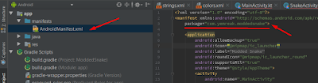

# Proje İşlemleri

## Projeyi Oluşturduktan Sonra Package İsmi Değiştirme

- Project sekmesinden "Ayarlar" ikonundan "Hide Empty Middle Package"a tıklıyoruz.
- Değiştirmek istediğimiz klasöre sağ tıklayıp, "Refactor" -> "Rename" diyoruz ve adlandırıyoruz. (3. klasöre de aynısı yapıyoruz)
- Eğer klasörü kaldırmak istiyorsak; Kalkacak olan klasörün içindekileri, onun üstündeki klasöre (yani onun yanına) yapıştırıyoruz.
  - Örn; "moddedsnake"i kesip, "com" adlı klasöre yapıştırıyoruz ve "yemreak" ı siliyoruz.
- Gradle'imizdaki build.gradle (Module: app) 'a giriyoruz ve applicationId'yi güncelliyoruz. Bizim örneğimizde oraya "com.yemreak.moddedsnake" yazıyoruz.
- Son olarak; Manifestimize girip "package name"i güncelliyoruz.
- Artık başarıyla "package name"i güncellemiş olduk. Emin olmak için projenizi Build etmeyi unutmayın :)

