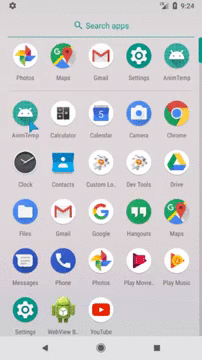

# Android'de Animasyonlar

## Aşağıdan Gelme Animasyonu



Proje dizinine `anim` adlı klasör oluşturup içinde bir `resource file'`a bu kodları yazıyoruz.

```xml
<?xml version="1.0" encoding="utf-8"?>
<set xmlns:android="http://schemas.android.com/apk/res/android">
    <translate
          android:duration="800"
          android:fromXDelta="0%p"
          android:fromYDelta="100%p"/>
</set>
```

`Main`'e alttakiler eklenmeli:

```kt
class MainActivity : AppCompatActivity() {
    override fun onCreate(savedInstanceState: Bundle?) {
        super.onCreate(savedInstanceState)
        setContentView(R.layout.activity_main)
        btn_start.animation = AnimationUtils.loadAnimation(this, R.anim.frombuttom)
   }}
    ...
}
```

- `btn_start` = Get Started adlı view'ın ID'si
- `frombutton` = üstteki kodların yazıldığı dosyanın adı

## Soluk Belirme


```xml
<?xml version="1.0" encoding="utf-8"?>
<alpha xmlns:android="http://schemas.android.com/apk/res/android"
    android:duration="2000"
    android:fromAlpha="0.0"
    android:toAlpha="1.0"    />
```
