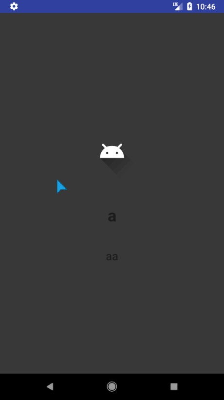

# Kaydırmalı Uygulama (ViewPager ve PageAdapter)



`Manifest` kodları:

```xml
<?xml version="1.0" encoding="utf-8"?>
<manifest xmlns:android="http://schemas.android.com/apk/res/android"
    package="com.yemreak.iuapp">
    <application
        android:allowBackup="true"
        android:icon="@mipmap/ic_launcher"
        android:label="@string/app_name"
        android:roundIcon="@mipmap/ic_launcher_round"
        android:supportsRtl="true"
        android:theme="@style/AppTheme">
        <activity
            android:name=".MainActivity"
            android:theme="@style/LogInTheme">
            <intent-filter>

                <action android:name="android.intent.action.MAIN" />

                <category android:name="android.intent.category.LAUNCHER" />
            </intent-filter>
        </activity>
    </application>
</manifest>
```

`Main` kodları:

```kt
package com.yemreak.iuapp

import android.support.v7.app.AppCompatActivity
import android.os.Bundle
import android.support.v4.view.ViewPager
import kotlinx.android.synthetic.main.activity_main.*

class MainActivity : AppCompatActivity() {

    private lateinit var slideAdapter: SlideAdapter

    override fun onCreate(savedInstanceState: Bundle?) {
        super.onCreate(savedInstanceState)
        setContentView(R.layout.activity_main)

        slideAdapter = SlideAdapter(applicationContext)
        vp_main.adapter = slideAdapter
    }}
    ...
}
```

`SlideAdapter` dosyası kodları:

```kt
package com.yemreak.iuapp

import android.content.Context
import android.graphics.Color
import android.support.v4.view.PagerAdapter
import android.view.LayoutInflater
import android.view.View
import android.view.ViewGroup
import android.widget.ImageView
import android.widget.LinearLayout
import android.widget.TextView

class SlideAdapter(context : Context) : PagerAdapter() {

    lateinit var layoutInflater: LayoutInflater

    private val context = context
    private val arr_images = arrayListOf(
            R.drawable.ic_launcher_foreground,
            R.drawable.ic_launcher_foreground,
            R.drawable.water,
            R.drawable.text
    )
    private val arr_titles = arrayListOf("a", "b", "c", "d")
    private val arr_descriptions = arrayListOf("aa", "bb", "cc", "dd")
    private val arr_bgColors = arrayListOf(
            Color.rgb(55, 55, 55),
            Color.rgb(239, 85, 85),
            Color.rgb(110, 49, 89),
            Color.rgb(1, 118, 212)
    )


    override fun isViewFromObject(view: View, `object` : Any): Boolean {
        return (view == `object` as LinearLayout)
    }

    override fun getCount(): Int {
        return arr_images.size
    }

    override fun instantiateItem(container: ViewGroup, position: Int): Any {
        layoutInflater =  context.getSystemService(Context.LAYOUT_INFLATER_SERVICE) as LayoutInflater

        val view = layoutInflater.inflate(R.layout.slide, container, false)
        val layout = view.findViewById<LinearLayout>(R.id.ll_slide1)
        val image = view.findViewById<ImageView>(R.id.iv_slide)
        val title = view.findViewById<TextView>(R.id.tv_slide_tittle)
        val description = view.findViewById<TextView>(R.id.tv_slide_description)

        layout.setBackgroundColor(arr_bgColors[position])
        image.setImageResource(arr_images[position])
        title.text = arr_titles[position]
        description.text = arr_descriptions[position]
        container.addView(view)
        return view
    }
    override fun destroyItem(container: ViewGroup, position: Int, `object` : Any) {        container.removeView(`object` as LinearLayout)    }
}
```

`Styles.xml` kodları:

```xml
<resources>
    <!-- Base application theme. -->    <style name="AppTheme" parent="Theme.AppCompat.Light.DarkActionBar">        <!-- Customize your theme here. -->        <item name="colorPrimary">@color/colorPrimary</item>        <item name="colorPrimaryDark">@color/colorPrimaryDark</item>        <item name="colorAccent">@color/colorAccent</item>    </style>
    <style name="LogInTheme" parent="Theme.AppCompat.Light.NoActionBar">        <item name="colorPrimary">@color/colorPrimary</item>        <item name="colorPrimaryDark">@color/colorPrimaryDark</item>        <item name="colorAccent">@color/colorAccent</item>    </style>
</resources>
```

`String.xml` kodları:

```xml
<resources>    <string name="app_name">IUApp</string>    <string name="title_login">Bu uygulama da nedir?</string></resources>
```

`activity_main` kodları:

```xml
<?xml version="1.0" encoding="utf-8"?><LinearLayout xmlns:android="http://schemas.android.com/apk/res/android"    xmlns:app="http://schemas.android.com/apk/res-auto"    xmlns:tools="http://schemas.android.com/tools"    android:layout_width="match_parent"    android:layout_height="match_parent"    android:orientation="vertical"    tools:context=".MainActivity">
    <android.support.v4.view.ViewPager        android:id="@+id/vp_main"        android:layout_width="match_parent"        android:layout_height="match_parent" />

</LinearLayout>
```

`slide.xml` kodları:

```xml
<?xml version="1.0" encoding="utf-8"?><LinearLayout xmlns:android="http://schemas.android.com/apk/res/android"    xmlns:app="http://schemas.android.com/apk/res-auto"    android:id="@+id/ll_slide1"    android:layout_width="match_parent"    android:layout_height="match_parent"    android:orientation="vertical"    android:gravity="center">

    <ImageView        android:id="@+id/iv_slide"        android:layout_width="wrap_content"        android:layout_height="wrap_content"        app:srcCompat="@mipmap/ic_launcher" />
    <TextView        android:id="@+id/tv_slide_tittle"        android:layout_width="wrap_content"        android:layout_height="wrap_content"        android:text="@string/title_login"        android:textSize="30sp"        android:textStyle="bold"        android:textAlignment="center"        android:layout_marginTop="40dp"/>
    <TextView        android:id="@+id/tv_slide_description"        android:layout_width="wrap_content"        android:layout_height="wrap_content"        android:text="@string/title_login"        android:textSize="21sp"        android:textAlignment="center"        android:layout_marginTop="40dp"/>
</LinearLayout>
```
