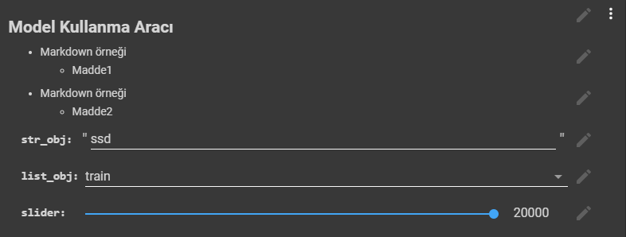

# IPython <!-- omit in toc -->

<!-- TODO: Google Colab notlarını buraya taşı -->

## İçerikler <!-- omit in toc -->

- [Temel Bilgiler](#Temel-Bilgiler)
- [Hızlı Notlar](#H%C4%B1zl%C4%B1-Notlar)
  - [Google Colab için Çalışma Ortamını Yapılandırma](#Google-Colab-i%C3%A7in-%C3%87al%C4%B1%C5%9Fma-Ortam%C4%B1n%C4%B1-Yap%C4%B1land%C4%B1rma)
- [Terminal İşlemleri](#Terminal-%C4%B0%C5%9Flemleri)
  - [Terminal İşlemleri Örneği](#Terminal-%C4%B0%C5%9Flemleri-%C3%96rne%C4%9Fi)
  - [İşletim Sistemi Bilgileri](#%C4%B0%C5%9Fletim-Sistemi-Bilgileri)
- [Magic Function](#Magic-Function)
- [Form Oluşturma İşlemleri (GUI)](#Form-Olu%C5%9Fturma-%C4%B0%C5%9Flemleri-GUI)
- [Drive İşlemleri](#Drive-%C4%B0%C5%9Flemleri)
  - [Drive Dosyalarını Dosya Sistemine Bağlama](#Drive-Dosyalar%C4%B1n%C4%B1-Dosya-Sistemine-Ba%C4%9Flama)
  - [Drive Dosyalarına Erişme](#Drive-Dosyalar%C4%B1na-Eri%C5%9Fme)
- [I / O (Giriş / Çıkış) İşlemleri](#I--O-Giri%C5%9F--%C3%87%C4%B1k%C4%B1%C5%9F-%C4%B0%C5%9Flemleri)
  - [Dosya Upload Etme](#Dosya-Upload-Etme)
  - [Dosya İndirme](#Dosya-%C4%B0ndirme)
  - [Dizin İndirme](#Dizin-%C4%B0ndirme)
    - [Dizin İndirme Arayüzü](#Dizin-%C4%B0ndirme-Aray%C3%BCz%C3%BC)
  - [Bilgisayar Kamerasına Erişme](#Bilgisayar-Kameras%C4%B1na-Eri%C5%9Fme)
- [Progress Bar](#Progress-Bar)
- [Harici Bağlantılar](#Harici-Ba%C4%9Flant%C4%B1lar)

## Temel Bilgiler

- Tüm python özelliklerini destekler, python'a ek özellikler barındırır.
- _Jupyter Notebook_ ve _Google Colab_ gibi platformlarda kulanılır

> Bu yazı _Google Colab_'ı temel almıştır.

## Hızlı Notlar

| Operatör           | Açıklama                                         |
| ------------------ | ------------------------------------------------ |
| `!`                | Komut terminal üzerinde çalıştırılır             |
| `%`                | Tüm os üzerinde kalıcı komutlar (Magic function) |
| `#`                | Yorum satırı                                     |
| `#@`               | Form komutları                                   |
| `\<satir_atlatma>` | Satır atlatmak için kullanılır                   |
| `<func>??`         | Fonksiyonun kodlarını gösterir                   |

### Google Colab için Çalışma Ortamını Yapılandırma

**Ekran Kartını Aktif Etme:**

- Change Run Time
  - TPU
  - GPU

## Terminal İşlemleri

- Terminal komutları **unix** komutlarıdır
- Terminal işlemlerinin her biri `!` ön eki ile başlamalıdır.

| İşlem                   | Açıklama                                               |
| ----------------------- | ------------------------------------------------------ |
| `!echo {<python_kodu>}` | Python kodunun return değerini kullanma                |
| `!echo $<py_degiskeni>` | Tek kelimelik değişken (veya ortam değişkeni) kullanma |
| `!cd`                   | Sadece o satır için terminal dizini değiştirme         |
| `%cd`                   | Terminalin dizinini değiştirme                         |
| `!kill -9 -1`           | Sistemi sıfırlama                                      |

- Python değişkenlerini terminal komutunda kullanamk için:
  - `{<python_kodu>}` Arasına python komutu yazılır, return değeri kullanılır
  - `$` tek kelimelik değişkenlerin kullanımı

> `!` (terminal) komutların en ufak yazım hatası, `{}` gibi operatörler ile python komutlarının alınmasını engeller.

### Terminal İşlemleri Örneği

```py
TEMP = 'gecici'
!echo {gecici} # Python değişkenini kullanma
!echo {gecici.split('i')[0]} # Python kod parçası kullanma

!echo $PYTHONPATH # Ortam değşkenini kullanma
```

### İşletim Sistemi Bilgileri

```ipynb
!less /etc/os-release
```

```sh
NAME="Ubuntu"
VERSION="18.04.2 LTS (Bionic Beaver)"
ID=ubuntu
ID_LIKE=debian
PRETTY_NAME="Ubuntu 18.04.2 LTS"
VERSION_ID="18.04"
HOME_URL="https://www.ubuntu.com/"
SUPPORT_URL="https://help.ubuntu.com/"
BUG_REPORT_URL="https://bugs.launchpad.net/ubuntu/"
PRIVACY_POLICY_URL="https://www.ubuntu.com/legal/terms-and-policies/privacy-policy"
VERSION_CODENAME=bionic
UBUNTU_CODENAME=bionic
(END)^C
```

## Magic Function

| Func                                | Açıklama                            |
| ----------------------------------- | ----------------------------------- |
| `%%timeit`                          | Blokta geçen süreyi hesaplar        |
| `%%expect_exception AttributeError` | Hatayı fırlatır, run error engeller |

## Form Oluşturma İşlemleri (GUI)

- Form komutları `#@` ile başlar

```py
#@title ## Model Kullanma Aracı { vertical-output: true, display-mode: "form" }

#@markdown - Markdown örneği
#@markdown     - Madde1

#@markdown - Markdown örneği
#@markdown     - Madde2

str_obj = "ssd" #@param {type:"string"}
list_obj = "train" #@param ["model_main", "train", "export_inference_graph"]
slider = 20000 #@param {type:"slider", min:100, max:20000, step:100}
bool_obj = False #@param {type:"boolean"}
```



## Drive İşlemleri

### Drive Dosyalarını Dosya Sistemine Bağlama

**Normal Bağlama:**

```py
from google.colab import drive
drive.mount('/content/gdrive')
```

**Kontrollü bağlama:**

```py
if 'mount' not in globals() or not mount:
    from google.colab import drive
    drive.mount('/content/gdrive')
    mount = True
```

### Drive Dosyalarına Erişme

```py
with open('/content/gdrive/My Drive/foo.txt', 'w') as f:
  f.write('Hello Google Drive!')
!cat /content/gdrive/My\ Drive/foo.txt
```

## I / O (Giriş / Çıkış) İşlemleri

Resmi [Google Colab dökümanına][i/0 ipython] bakmanda fayda var

### Dosya Upload Etme

```py
from google.colab import files

uploaded = files.upload()

for fn in uploaded.keys():
  print('User uploaded file "{name}" with length {length} bytes'.format(
      name=fn, length=len(uploaded[fn])))
```

### Dosya İndirme

```py
from google.colab import files

with open('example.txt', 'w') as f:
  f.write('some content')

files.download('example.txt')
```

### Dizin İndirme

```py
zipped_file = "/content/file.zip"
folder_to_zip = "/content/Folder_To_Zip"
!zip -r "{zipped_file}" "{folder_to_zip}"

from google.colab import files
files.download(zipped_file)
```

#### Dizin İndirme Arayüzü

```py
#@title Dizin İndirme Arayüzü
INDIRILECEK_DIZININ_YOLU = "sample_data" #@param {type:"string"}

from google.colab import files

# Dizin adını alma
folder_name = INDIRILECEK_DIZININ_YOLU.split('/').pop()

# Gerekli dosyaları oluşturma
!cp -r "/{INDIRILECEK_DIZININ_YOLU}" "/content"
!zip -r '{folder_name}.zip'  "{folder_name}"

# İndirme işlemini başlatma
files.download(f'{folder_name}.zip')

# Geçici dosyaları temizleme
!rm -rf '{folder_name}.zip'
!rm -rf '{folder_name}'
```

### Bilgisayar Kamerasına Erişme

```py
from IPython.display import display, Javascript
from google.colab.output import eval_js
from base64 import b64decode

def take_photo(filename='photo.jpg', quality=0.8):
  js = Javascript('''
    async function takePhoto(quality) {
      const div = document.createElement('div');
      const capture = document.createElement('button');
      capture.textContent = 'Capture';
      div.appendChild(capture);

      const video = document.createElement('video');
      video.style.display = 'block';
      const stream = await navigator.mediaDevices.getUserMedia({video: true});

      document.body.appendChild(div);
      div.appendChild(video);
      video.srcObject = stream;
      await video.play();

      // Resize the output to fit the video element.
      google.colab.output.setIframeHeight(document.documentElement.scrollHeight, true);

      // Wait for Capture to be clicked.
      await new Promise((resolve) => capture.onclick = resolve);

      const canvas = document.createElement('canvas');
      canvas.width = video.videoWidth;
      canvas.height = video.videoHeight;
      canvas.getContext('2d').drawImage(video, 0, 0);
      stream.getVideoTracks()[0].stop();
      div.remove();
      return canvas.toDataURL('image/jpeg', quality);
    }
    ''')
  display(js)
  data = eval_js('takePhoto({})'.format(quality))
  binary = b64decode(data.split(',')[1])
  with open(filename, 'wb') as f:
    f.write(binary)
  return filename
```

---

```py
from IPython.display import Image
try:
filename = take_photo()
print('Saved to {}'.format(filename))

# Show the image which was just taken.
display(Image(filename))
except Exception as err:
# Errors will be thrown if the user does not have a webcam or if they do not
# grant the page permission to access it.
print(str(err))
```

## Progress Bar

```py
from IPython.display import HTML, display
import time

def progress(value, max=100):
    return HTML("""
        <progress
            value='{value}'
            max='{max}',
            style='width: 100%'
        >
            {value}
        </progress>
    """.format(value=value, max=max))

out = display(progress(0, 100), display_id=True)
for ii in range(101):
    time.sleep(0.02)
    out.update(progress(ii, 100))

```

> [Kaynak](https://stackoverflow.com/questions/46939393/how-do-i-use-updatable-displays-on-colab)

## Harici Bağlantılar

- [Overview of Colaboratory Features](https://colab.research.google.com/notebooks/basic_features_overview.ipynb)
- [External data: Drive, Sheets, and Cloud Storage](https://colab.research.google.com/notebooks/io.ipynb)
- [Styled table outputs](https://colab.research.google.com/drive/1oXkzlM0lPbDC8saNRUnkGOjpKCTiDHvM)
- [Mardown Guide](https://colab.research.google.com/notebooks/markdown_guide.ipynb)
- [Froms](https://colab.research.google.com/notebooks/forms.ipynb)
- [Magic Command](https://ipython.readthedocs.io/en/stable/interactive/magics.html)
- [Resetting VM](https://stackoverflow.com/questions/49001921/how-to-restart-virtual-machine)
- [Interacting with Shell](http://mmcdan.github.io/posts/interacting-with-the-shell-via-jupyter-notebook/)

[i/0 ipython]: https://colab.research.google.com/notebooks/io.ipynb
