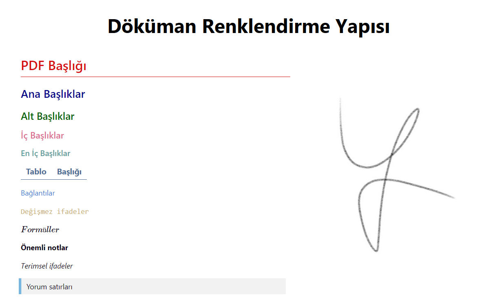

# Markdowns <!-- omit in toc -->

Ek kaynak için [buraya](https://github.com/adam-p/markdown-here/wiki/Markdown-Cheatsheet) tıklayabilirsin.

## İçerikler <!-- omit in toc -->

> `HOME` tuşu ile yukarı yönlenebilrsiniz.

- [Kullanım Örnekleri](#kullan%C4%B1m-%C3%B6rnekleri)
- [Temel Formatlar](#temel-formatlar)
- [Bağlantı Verme](#ba%C4%9Flant%C4%B1-verme)
  - [Satıriçi Bağlantı (Inline Link)](#sat%C4%B1ri%C3%A7i-ba%C4%9Flant%C4%B1-inline-link)
  - [Dinamik Bağlantı (Dynamic Link)](#dinamik-ba%C4%9Flant%C4%B1-dynamic-link)
  - [Resim Bağlantısı](#resim-ba%C4%9Flant%C4%B1s%C4%B1)
- [Tablo Oluşturma](#tablo-olu%C5%9Fturma)
- [Matematik Denklemleri](#matematik-denklemleri)
- [Sık Kullanılan Rozetler](#s%C4%B1k-kullan%C4%B1lan-rozetler)
- [VsCode için Faydalı Eklentiler](#vscode-i%C3%A7in-faydal%C4%B1-eklentiler)
  - [Markdown PDF](#markdown-pdf)
    - [PDF için Markdown Imzam](#pdf-i%C3%A7in-markdown-imzam)
    - [PDF için Özelleştirmem](#pdf-i%C3%A7in-%C3%B6zelle%C5%9Ftirmem)
    - [PDF için VsCode Ayarları](#pdf-i%C3%A7in-vscode-ayarlar%C4%B1)
- [Faydalı Siteler](#faydal%C4%B1-siteler)
- [Harici Bağlantılar](#harici-ba%C4%9Flant%C4%B1lar)

## Kullanım Örnekleri

Detaylar için [buraya](https://guides.github.com/features/mastering-markdown/) tıklayabilirsin.

> HTML etiketlerini destekler.

## Temel Formatlar

- `*[metin]*` Metni italik (eğik) yazma
- `**[metin]**` Metni bold (kalın) yazma
- 2 kez <kbd>SPACE</kbd> karakteri ile **satır** atlatabilirsiniz
- \\ Karakteri ile karakterleri biçimlendirmeden uzak tutabilirsin `\\`
- \` karakteri ile `<code>` etiketli metin yazabilirsin
  - Metni biçimlendirmeden uzak tutar
- `-` ile maddesel yapı oluşturabilirsin.
- `$ $` karakterleri arasına **latex** (matematiksel formül) yazabilirsin
  - `$$` ile çok satırlı matematiksel formül yazabilirsin

## Bağlantı Verme

Link işlemleri için bilgiler. Kaynak için [buraya](https://css-tricks.com/snippets/html/mailto-links/) tıklayabilirsin.

| İstek            | Anahtar           |
| ---------------- | ----------------- |
| Site             | `https://<link>`  |
| Mail             | `mailto:<eposta>` |
| Telefon          | `tel:<numara>`    |
| Başlıklar arası  | `#<başlık>`       |
| Aynı dizinden    | `./<yol>`         |
| Bir üst dizinden | `../<yol>`        |

> Bağlantı verme işlemlerinde özel karakter kullanmak için kodlama yapmanız gerekmekte. Kodlama yapan online site için [buraya](https://www.urlencoder.org/) tıklaytabilirsin. Siteye yol verini kopyalayıp *encoded* demeniz yeterli

- [Test](../Markdown#ba%C4%9Flant%C4%B1-verme) `[Test](../Markdown#ba%C4%9Flant%C4%B1-verme)`
- `%20` Boşluk karakteri

### Satıriçi Bağlantı (Inline Link)

`[metin](url)` yapısı ile metne *inline link* verebilirsin. [Test](https://yemreak.com)

> *Dynamic link*'te `[]` kullanıldığına dikkat ediniz.

### Dinamik Bağlantı (Dynamic Link)

Alttaki yapı ile metne *dynamic link* verebilirsin. [Test][test]

```md
[Test][test]
- [test]: https://www.yemreak.com
```

[test]: https://www.yemreak.com

> *Inline link*'te `()` kullanıldığına dikkat ediniz.

### Resim Bağlantısı

`![resim_açıklaması][resim_urli]` yapısı ile yazına resim yerleştirebilirsin.

## Tablo Oluşturma

```markdown
| Tables   |      Are      |  Cool |
| -------- | :-----------: | ----: |
| col 1 is | left-aligned  | $1600 |
| col 2 is |   centered    |   $12 |
| col 3 is | right-aligned |    $1 |
```

| Tables   |      Are      |  Cool |
| -------- | :-----------: | ----: |
| col 1 is | left-aligned  | $1600 |
| col 2 is |   centered    |   $12 |
| col 3 is | right-aligned |    $1 |

## Matematik Denklemleri

Detaylı bilgi için [buraya](https://csrgxtu.github.io/2015/03/20/Writing-Mathematic-Fomulars-in-Markdown/) bakabilirsin.

- Latex listesi için [buraya](https://oeis.org/wiki/List_of_LaTeX_mathematical_symbols) bakabilirsin
- Latex sembolleri için [buraya](https://artofproblemsolving.com/wiki/index.php/LaTeX:Symbols) bakabilirsin

> Online editör için [buraya](https://www.codecogs.com/latex/eqneditor.php) bakabilirsin.

## Sık Kullanılan Rozetler

Rozet yapımı için [buraya](https://shields.io/) bakabilirsin.


## VsCode için Faydalı Eklentiler

| Eklenti                                                                                               | Açıklama                                                                  |
| ----------------------------------------------------------------------------------------------------- | ------------------------------------------------------------------------- |
| [Markdown All in One](https://marketplace.visualstudio.com/items?itemName=yzhang.markdown-all-in-one) | Markdown için gerekli tüm içeriklere, kısayollara ve formatlayıcıya sahip |
| [markdownlint](https://marketplace.visualstudio.com/items?itemName=DavidAnson.vscode-markdownlint)    | Markdown hatalarının altını çizme ve uyarma                               |
| [Markdown PDF](https://marketplace.visualstudio.com/items?itemName=yzane.markdown-pdf)                | Markdown'u PDF'e çevirme                                                  |
| [ToDo Tree](https://marketplace.visualstudio.com/items?itemName=Gruntfuggly.todo-tree)                | Yapılacakları derleme ve arayüzde sunma                                   |
| [Paste Image](https://marketplace.visualstudio.com/items?itemName=mushan.vscode-paste-image)          | Panodan resim kopyalama                                                   |

### Markdown PDF

- PDF oluşumu için yeni sayfaya geçmek için `md` dosyasına `<div class="page"/>` satırını yazman gerekmekte
  - Yaklaşık **40** satırda bir yeni sayfaya geçmek mantıklı
  - Bu sayda metnini otomatik ekleyen script yazılabilir
- Dökümanda *latex* varsa, `md` dosyasının en altında, latex scipt'ini eklemen gerekmektedir
  - Aksi halde *latex* yapısı derlenmez.

```html
<script type="text/javascript" src="http://cdn.mathjax.org/mathjax/latest/MathJax.js?config=TeX-AMS-MML_HTMLorMML"></script>
<script type="text/x-mathjax-config">
    MathJax.Hub.Config({ tex2jax: {inlineMath: [['$', '$']]}, messageStyle: "none" });
</script>
```

- [ ] CSS yapısı araştırılacak ve en sevdiğim bulunacak
- [ ] İleride kullanışlı bir araç olacağından bunun detaylarını öğrenmem faydalı olur

#### PDF için Markdown Imzam

```md
Bu yazı **MIT** lisanslıdır. Lisanslar hakkında bilgi almak için [buraya](https://choosealicense.com/licenses/) bakmanda fayda var.

~ $Yunus$ $Emre$ $AK$ **©**

<script type="text/javascript" src="http://cdn.mathjax.org/mathjax/latest/MathJax.js?config=TeX-AMS-MML_HTMLorMML"></script>
<script type="text/x-mathjax-config">
    MathJax.Hub.Config({ tex2jax: {inlineMath: [['$', '$']]}, messageStyle: "none" });
</script>

<br>
<br>
<br>
<br>
<br>

---


---

<div class="page"/>
```

#### PDF için Özelleştirmem

- Css dosyamı [buradan](../res/markdown-pdf.css) indirebilirsin
- VsCode üzerinden ayarlara `"markdown-pdf.styles"` komutu ile `css` dosyasının yolunu belirtin
- Link: `http://tiny.cc/yek86y`



#### PDF için VsCode Ayarları

```json
{
    // Markdown PDF ayarları
    "markdown-pdf.styles": [
        "http://tiny.cc/yek86y"
    ],
    "markdown-pdf.headerTemplate": "<div style=\"width: 100%; font-size: 7px; margin: 0 auto; font: Segoe UI Light; text-align: center;\"><div style=\"float: left; font-size: 7px; width: 33.33%; color: gainsboro;\"><span class='date'></span></div><div style=\"float: left; width: 33.33%;\"><a style='text-decoration: none; color: navy;' href='https://www.yemreak.com'>Yunus Emre Ak ©</a></div><div style=\"float: left; font-size: 7px; width: 33.33%; color: gainsboro;\"><span class='date'></span></div></div>",
    "markdown-pdf.footerTemplate": "<div style=\"width: 100%; font-size: 7px; margin: 0 auto; font: Segoe UI Light\"> <div style=\"float: left; width: 20%; text-align: center\"><a style=\"text-decoration: none; display: inline-block; color: dodgerblue;\" href=\"https://yemreak.com\">Website</a></div><div style=\"float: left; width: 20%; text-align: center\"><a style=\"text-decoration: none; display: inline-block; color: dodgerblue;\" href=\"https://github.com/yedhrab \">Github</a></div><div style=\"float: left; width: 20%; text-align: center\"><span class=\"pageNumber \">3 </span> / <span class=\"totalPages \"> 5</span></div><div style=\"float: left; width: 20%; text-align: center\"><a style=\"text-decoration: none; display: inline-block; color: dodgerblue;\" href=\"https://www.linkedin.com/in/yemreak/\">LinkedIn</a></div><div style=\"float: left; width: 20%; text-align: center\"><a style=\"text-decoration: none; display: inline-block; color: dodgerblue;\" href=\"mailto::yedhrab@gmail.com?subject=YPDF%20%7C%20Github\">İletişim</a></div></div>",
}
```

## Faydalı Siteler

| Site                                       | Açıklama                   |
| ------------------------------------------ | -------------------------- |
| [Url Encoder](https://www.urlencoder.org/) | Link URL'leri oluşturma    |
| [StackEdit](https://stackedit.io)          | Çevrimiçi markdown editörü |

## Harici Bağlantılar

- <https://html.com/attributes/a-href/>
- [Markdown and Visual Studio Codes](https://code.visualstudio.com/docs/languages/markdown)