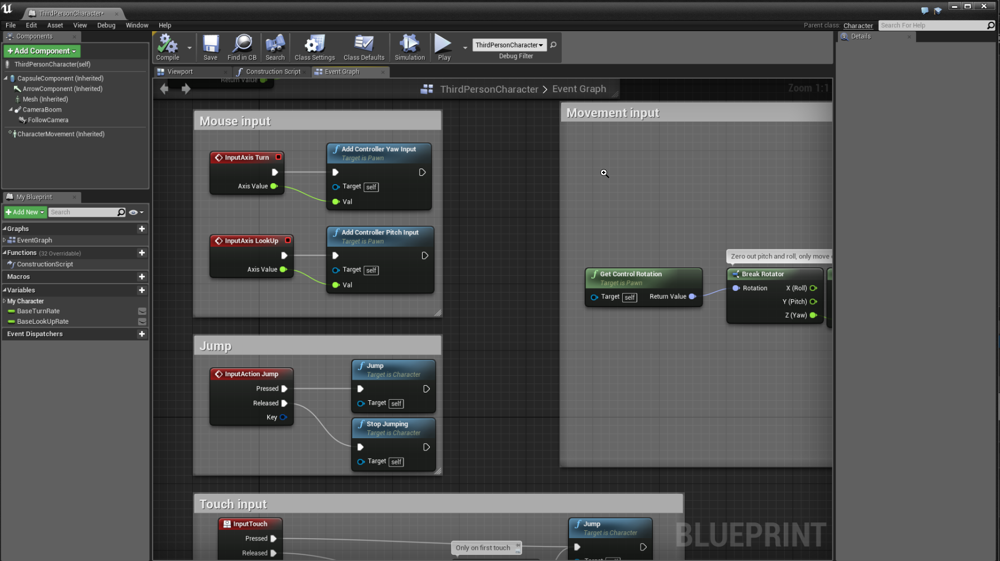

# Unreal Engine <!-- omit in toc -->

## İçerikler <!-- omit in toc -->

- [Ön Bilgileri](#%C3%B6n-bilgileri)
- [Blueprint](#blueprint)
- [Çalışma Kaynakları](#%C3%A7al%C4%B1%C5%9Fma-kaynaklar%C4%B1)
- [Makaleler](#makaleler)

## Ön Bilgileri

- **C++** dilini kullanmaktadır
- Kaynakları oldukça fazladır
- **Blueprint** yapısı ile kodsuz oyun yapabilme ortamı sağlayabilir

> Unity'e nazaran daha kullanışlı duruyor (?)

## Blueprint

Bu özellik sayesinden neredeyse hiç kod yazmadan oyun yapısını oluşturabilmekteyiz.

## Çalışma Kaynakları

- [Tower Defense Tutorial](https://www.youtube.com/playlist?list=PLxM99r8wgKfEoeq42rr_diGhcoeUe5k-s)

## Makaleler

- [Unity vs Unreal](https://www.pluralsight.com/blog/film-games/unreal-engine-4-vs-unity-game-engine-best)
