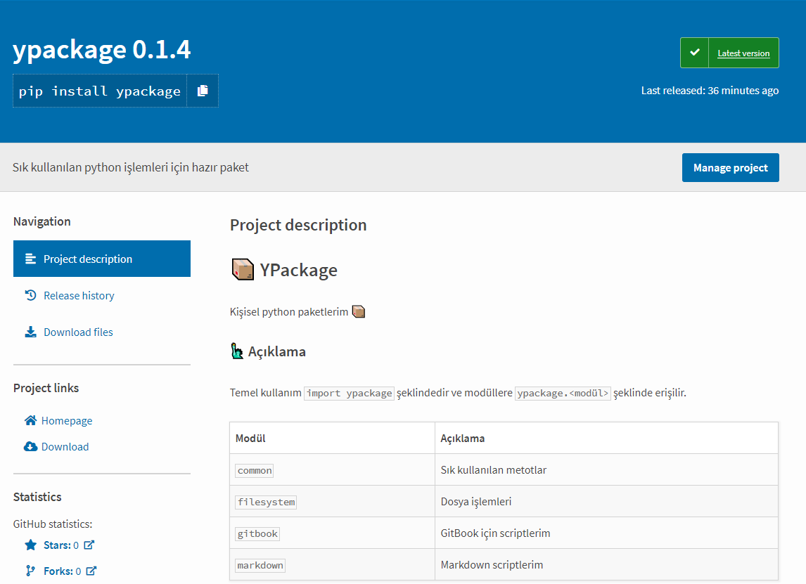
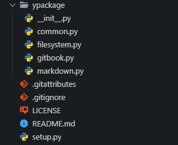

# 📦 Pip ile Kurulabilir Python Paketi Oluşturma

Nasıl bir şey mi yapmış olacaksınız 👇

> Eski adı: Pip Üzerinde Paket Yayınlama



## 🎟 PyPI'ya Kayıt olma

- [PyPI Register](https://pypi.org/account/register/)
- Email'inizi onaylayın

## 👷‍ Dosya Yapısını Oluşturma

Açıklama metninizi **markdown** formatı ile `README.md` içerisine yazın.



### ⚙ `setup.py` kurulum dosyası

Kurulum yapılandırma dosyasıdır.

```py
from distutils.core import setup
import setuptools

VERSION = "1.0.0" # BURAYI AKLINIZDA TUTUN (Değiştirebilirsiniz)

long_description = ""
with open("README.md", "r", encoding="utf-8") as file:
    long_description = file.read()


setup(
    name='PAKET_İSMİ',         # How you named your package folder (MyLib)
    packages=['PAKET_İSMİ'],   # Chose the same as "name"
    # Start with a small number and increase it with every change you make
    version=VERSION,
    # Chose a license from here: https://help.github.com/articles/licensing-a-repository
    license='MIT',
    # Give a short description about your library
    description='Sık kullanılan python işlemleri için hazır paket',
    long_description=long_description,
    long_description_content_type="text/markdown",
    author='İsim Soyisim',                   # Adınızı soyadınız yazın
    author_email='eposta@gmail.com',      # E-posta adresiniz
    # Provide either the link to your github or to your website
    url='https://github.com/github_hesabı/PAKET_İSMİ',
    # I explain this later on
    download_url=f'https://github.com/github_hesabı/PAKET_İSMİ/archive/{VERSION}.tar.gz',
    # Keywords that define your package best
    keywords=['Alakalı', 'kelimeler'],
    install_requires=[            # Bağımlılıklar

    ],
    classifiers=[
        # Chose either "3 - Alpha", "4 - Beta" or "5 - Production/Stable" as the current state of your package
        'Development Status :: 3 - Alpha',
        # Define that your audience are developers
        'Intended Audience :: Developers',
        'Topic :: Software Development :: Build Tools',
        'License :: OSI Approved :: MIT License',   # Again, pick a license
        # Specify which pyhton versions that you want to support
        'Programming Language :: Python :: 3',
        'Programming Language :: Python :: 3.4',
        'Programming Language :: Python :: 3.5',
        'Programming Language :: Python :: 3.6',
    ],
)
```

### 🏹 `__init__` ile modülleri dışa aktarma

Dosyanın amacı içerisindeki her paketleri dışarı aktarmaktır

```py
from ypackage import filesystem
from ypackage import common
from ypackage import gitbook
from ypackage import markdown
```

## 📡 GitHub'da Yayınlama

GitHub üzeinden repository oluşturun ve projenizi oraya upload edin.

> GitHub hakkında detaylar için arama sitemin arama motoruna `GitHub` yazabilirsiniz

- GitHub projenizin urline girin
- **Release** alanına tıklayın
- Daha önceden varsa <kbd>Edit</kbd> yoksa <kbd>Create</kbd> butonuna tıklayın ve yeni bir sürüm oluşturun
- `Tags` alanına `setup.py` dosyamızdaki `VERSION` değerini yazın
  - Download url kısmındaki `...{VERSION}.tar.gz'` yapısından dolayı
  - Örn: `1.0.0`
- Açıklamalarınızı yapıp <kbd>Update Relesae</kbd> butonuna basın
  - Ek olarak dosya eklemenize gerek yoktur

## 📦 Gerekli Paketlerin Kurulumu

Bu işlemleri için **python** ve **pip** araçlarının kurulu olması lazımdır.

```sh
python -m pip install setuptools
python -m pip install tqdm
python -m pip install --user --upgrade twine # pip install twine
```

## 🛰 Projeyi PyPI'da Yayınlama

- Proje dizininize girin ([yukarıdaki resimdeki alan](#%F0%9F%91%B7%E2%80%8D-Dosya-Yap%C4%B1s%C4%B1n%C4%B1-Olu%C5%9Fturma))
- `python setup.py sdist` komutu ile projenizi aktarılmaya hazır hale getirin
- `twine upload dist/*` komutu ile PyPI'ya projenizi aktarın

## 🌌 Projeyi PyPI'da Güncelleme

- `setup.py`'daki `VERSION` bilginizi arttırın
  - Örn: `1.0.1`
- GitHub üzerinden `v<VERSION>` yeni **release** oluşturun
  - Örn: `v1.0.1`
- [🛰 Projeyi PyPI'da Yayınlama](#%F0%9F%9B%B0-Projeyi-PyPIda-Yay%C4%B1nlama) alanındakileri uygulayın

## Kaynak

- [How to upload your python package to PyPi](https://medium.com/@joel.barmettler/how-to-upload-your-python-package-to-pypi-65edc5fe9c56)
