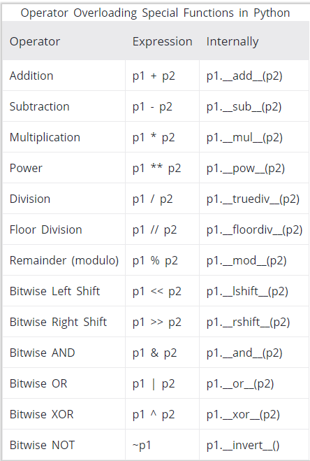
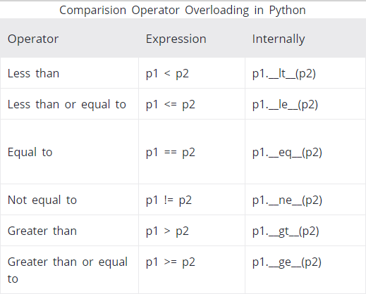

# Python Class, Modül ve Paketler <!-- omit in toc -->

## İçerikler <!-- omit in toc -->

- [Class](#Class)
  - [Class Anahtar Kelimeleri](#Class-Anahtar-Kelimeleri)
  - [Inheritence (Miras)](#Inheritence-Miras)
  - [Class Örnekleri](#Class-%C3%96rnekleri)
  - [Enumeration](#Enumeration)
    - [Basit Kullanım](#Basit-Kullan%C4%B1m)
    - [Fonksiyon API ile Kullanım](#Fonksiyon-API-ile-Kullan%C4%B1m)
    - [Enum Özellikleri](#Enum-%C3%96zellikleri)
      - [Benzersin Enum Tanımlaması](#Benzersin-Enum-Tan%C4%B1mlamas%C4%B1)
- [Modüller](#Mod%C3%BCller)
  - [Modül Kullanım Örnekleri](#Mod%C3%BCl-Kullan%C4%B1m-%C3%96rnekleri)
  - [Sık Kullanılan Modüller](#S%C4%B1k-Kullan%C4%B1lan-Mod%C3%BCller)
    - [Random Modülü](#Random-Mod%C3%BCl%C3%BC)
  - [Python Modül Dosyaları](#Python-Mod%C3%BCl-Dosyalar%C4%B1)
    - [Sistemin Python Modüllerine Bakma](#Sistemin-Python-Mod%C3%BCllerine-Bakma)
  - [Modül İçinde Tanımlanan İsimleri Alma](#Mod%C3%BCl-%C4%B0%C3%A7inde-Tan%C4%B1mlanan-%C4%B0simleri-Alma)
- [Paketler (Package)](#Paketler-Package)
  - [Paketten ve Modül Örnekleri](#Paketten-ve-Mod%C3%BCl-%C3%96rnekleri)
  - [Sık Kullanılan Paketler](#S%C4%B1k-Kullan%C4%B1lan-Paketler)
    - [Windows Paketleri](#Windows-Paketleri)
    - [Görüntü İşleme Paketleri](#G%C3%B6r%C3%BCnt%C3%BC-%C4%B0%C5%9Fleme-Paketleri)
    - [Giriş Çıkış (I/O) Kontrol Paketleri](#Giri%C5%9F-%C3%87%C4%B1k%C4%B1%C5%9F-IO-Kontrol-Paketleri)
  - [Paketler için Harici Bağlantıları](#Paketler-i%C3%A7in-Harici-Ba%C4%9Flant%C4%B1lar%C4%B1)

## Class

### Class Anahtar Kelimeleri

- Tip işlemleri yapmak için `print(dir(<tip>))` yazıp çıkan metodalardan kullanacaklarımızı tanımlamamız gerekir
  - Örn: `int` işlemlerini yapmak için `print(dir(int))`
  - `__add__`, `__sub__` ...
- Çoklu işlemler için `if isinstance(number, int):` yapısı kullanılır

> [Python Operator Overloading](https://www.programiz.com/python-programming/operator-overloading)

| Anahtar                | Açıklama                               | Örnek                                                 |
| ---------------------- | -------------------------------------- | ----------------------------------------------------- |
| `self`                 | Diğer dillerdeki `this` anlamına gelir | Basit Class Örneği                                    |
| `__init__`             | Constructer fonksiyonudur              | Basit Class Örneği                                    |
| `__repr__`             | Ekrana ne yazılacağı (`print`)         | `return "a"`                                          |
| `__rmul__`             | Ters `*` işlemi                        | [Ters işlemler](https://stackoverflow.com/a/39029175) |
| `__contains__`         | Dahiliyet işlemi                       |
| `def function(param):` | Fonksiyon tanımalama                   | Metodlu Class Örneği                                  |
| `del p1.age`, `del p1` | Obje ya da class silme                 |

<details>
<summary>Tüm operatör işlemleri</summary>



</details>

<details>
<summary>Kıyaslama operatörleri</summary>



</details>

### Inheritence (Miras)

Miras işlemlerinde `object` yerine miras alınacak **class**'ın adı yazılır.

- Üst sınıfın metodlarını ve değişkenlerini barındırır (_yani özelliklerine sahip_)
- Karmaşık programlama mimarilerinde oldukça faydalıdır, düzenli olmalayı sağlar

<details>
<summary>Kodu göster</summary>

```python
class Rectangle(object):
    def __init__(self, height, length):
        self.height = height
        self.length = length

    def area(self): # Alan
        return self.height * self.length

    def perimeter(self): # Çevre
        return 2 * (self.height + self.length)

class Square(Rectangle):
    def __init__(self, length):
        super(Square, self).__init__(length, length)

s = Square(5)
s.area(), s.perimeter() # (25, 20)

type(s) == Square # False
type(s) == Rectangle # True
isinstance(s, Rectangle) # True
```

</details>

### Class Örnekleri

<details>
<summary>Basit Class Örneği</summary>

```python
class Person:
  def __init__(self, name, age):
    self.name = name
    self.age = age

p1 = Person("John", 36)

print(p1.name) # John
print(p1.age) # 36
```

</details>

<details>
<summary>Yazdırılabilir class örneği</summary>

```python
class Rational(object):

    def __init__(self, numerator, denominator):
        self.numerator = numerator
        self.denominator = denominator

    def __repr__(self):
        return '%d/%d' % (self.numerator, self.denominator)

fraction = Rational(4, 3)
print(fraction) # 4/3
```

```python
def dist_result(points):
    points = [Point(*point) for point in points]
    return [points[0].distance(point) for point in points]
```

</details>

<details>
<summary>Toplama / Çıkarma destekli class örneği</summary>

```python
class Point(object):

    def __init__(self, x, y):
        self.x = x
        self.y = y

    def __repr__(self):
        return "Point(%d, %d)" % (self.x, self.y)

    def __add__(self, point):
        return Point(self.x + point.x, self.y + point.y)

    def __sub__(self, point):
        return Point(self.x - point.x, self.y - point.y)
```

```python
from functools import reduce
def add_sub_results(points):
    points = [Point(*point) for point in points]
    return [str(reduce(lambda x, y: x + y, points)),
            str(reduce(lambda x, y: x - y, points))]

```

</details>

<details>
<summary>Çok tipli işlemleri destekleyen class örneği</summary>

```python
class Rational(object):

    def __init__(self, numerator, denominator):
        self.numerator = numerator
        self.denominator = denominator

    def __repr__(self):
        return '%d/%d' % (self.numerator, self.denominator)

    def __mul__(self, number):
        if isinstance(number, int): # Int destekler
            return Rational(self.numerator * number, self.denominator)
        elif isinstance(number, Rational): # Rational destekler
            return Rational(self.numerator * number.numerator, self.denominator * number.denominator)
        else:
            raise TypeError('Expected number to be int or Rational. Got %s' % type(number))

    def _gcd(self):
        smaller = min(self.numerator, self.denominator)
        small_divisors = {i for i in range(1, smaller + 1) if smaller % i == 0}
        larger = max(self.numerator, self.denominator)
        common_divisors = {i for i in small_divisors if larger % i == 0}
        return max(common_divisors)

    def reduce(self):
        gcd = self._gcd()
        self.numerator = self.numerator / gcd
        self.denominator = self.denominator / gcd
        return self
```

</details>

<details>
<summary>Metodlu class örneği</summary>

```python
class Person:
  def __init__(self, name, age):
    self.name = name
    self.age = age

  def myfunc(self):
    print("Hello my name is " + self.name)

p1 = Person("John", 36)
p1.myfunc() # Hello my name is John
```

</details>

<details>
<summary>Metotlu operatörlü class örneği</summary>

```python
from math import sqrt

class Point(object):

    def __init__(self, x, y):
        self.x = x
        self.y = y

    def __repr__(self):
        return "Point(%d, %d)" % (self.x, self.y)

    def __add__(self, point):
        return Point(self.x + point.x, self.y + point.y)

    def __sub__(self, point):
        return Point(self.x - point.x, self.y - point.y)

    def distance(self, point):
        return sqrt((self.x - point.x) ** 2 + (self.y - point.y) ** 2)
```

</details>

<details>
<summary>Karmaşık class örneği</summary>

```python
class DataFrame(NDFrame):

    def __init__(self, data=None, index=None, columns=None, dtype=None,
                 copy=False):
        if data is None:
            data = {}
        if dtype is not None:
            dtype = self._validate_dtype(dtype)

        if isinstance(data, DataFrame):
            data = data._data

        if isinstance(data, BlockManager):
            mgr = self._init_mgr(data, axes=dict(index=index, columns=columns),
                                 dtype=dtype, copy=copy)
        elif isinstance(data, dict):
            mgr = self._init_dict(data, index, columns, dtype=dtype)
        elif isinstance(data, ma.MaskedArray):
            import numpy.ma.mrecords as mrecords
            # masked recarray
            if isinstance(data, mrecords.MaskedRecords):
                mgr = _masked_rec_array_to_mgr(data, index, columns, dtype,
                                               copy)

            # a masked array
            else:
                mask = ma.getmaskarray(data)
                if mask.any():
                    data, fill_value = maybe_upcast(data, copy=True)
                    data[mask] = fill_value
                else:
                    data = data.copy()
                mgr = self._init_ndarray(data, index, columns, dtype=dtype,
                                         copy=copy)

        elif isinstance(data, (np.ndarray, Series, Index)):
            if data.dtype.names:
                data_columns = list(data.dtype.names)
                data = dict((k, data[k]) for k in data_columns)
                if columns is None:
                    columns = data_columns
                mgr = self._init_dict(data, index, columns, dtype=dtype)
            elif getattr(data, 'name', None) is not None:
                mgr = self._init_dict({data.name: data}, index, columns,
                                      dtype=dtype)
            else:
                mgr = self._init_ndarray(data, index, columns, dtype=dtype,
                                         copy=copy)
        elif isinstance(data, (list, types.GeneratorType)):
            if isinstance(data, types.GeneratorType):
                data = list(data)
            if len(data) > 0:
                if is_list_like(data[0]) and getattr(data[0], 'ndim', 1) == 1:
                    if is_named_tuple(data[0]) and columns is None:
                        columns = data[0]._fields
                    arrays, columns = _to_arrays(data, columns, dtype=dtype)
                    columns = _ensure_index(columns)

                    # set the index
                    if index is None:
                        if isinstance(data[0], Series):
                            index = _get_names_from_index(data)
                        elif isinstance(data[0], Categorical):
                            index = _default_index(len(data[0]))
                        else:
                            index = _default_index(len(data))

                    mgr = _arrays_to_mgr(arrays, columns, index, columns,
                                         dtype=dtype)
                else:
                    mgr = self._init_ndarray(data, index, columns, dtype=dtype,
                                             copy=copy)
            else:
                mgr = self._init_dict({}, index, columns, dtype=dtype)
        elif isinstance(data, collections.Iterator):
            raise TypeError("data argument can't be an iterator")
        else:
            try:
                arr = np.array(data, dtype=dtype, copy=copy)
            except (ValueError, TypeError) as e:
                exc = TypeError('DataFrame constructor called with '
                                'incompatible data and dtype: %s' % e)
                raise_with_traceback(exc)

            if arr.ndim == 0 and index is not None and columns is not None:
                values = cast_scalar_to_array((len(index), len(columns)),
                                              data, dtype=dtype)
                mgr = self._init_ndarray(values, index, columns,
                                         dtype=values.dtype, copy=False)
            else:
                raise ValueError('DataFrame constructor not properly called!')

        NDFrame.__init__(self, mgr, fastpath=True)
```

</details>

### Enumeration

Resmi dökümantasyon için [buraya](https://docs.python.org/3/library/enum.html) bakabilirsin.

- Sıralı ve sabit veriler oluşturmak için kullanılır
- `from enum import Enum` ile projeye dahil edilir

#### Basit Kullanım

```python
from enum import Enum

class Color(Enum):
    RED = 1
    GREEN = 2
    BLUE = 3

# Erişim şekli
Color # <enum 'Color'>
Color.RED.value # 1
Color.RED.name # RED
type(Color.RED) # <enum 'Color'>
Color(1) # <Color.RED: 1>
Color(3) # <Color.BLUE: 3>
isinstance(Color.GREEN, Color) # True

# Obje olarka kullanımı
color = Color.RED
color.value # 1
color.name # RED
```

#### Fonksiyon API ile Kullanım

```python
ornek = Enum('Color', 'ANT BEE CAT DOG')
print(ornek) # <enum 'Color'>
```

#### Enum Özellikleri

Aynı özelliklere sahip objeler oluşturulamaz

```python
# Oluşturulmaz!
class Shape(Enum):
    SQUARE = 2
    SQUARE = 3

# Oluşturabilir
class Shape(Enum):
    SQUARE = 2
    DIAMOND = 1
    CIRCLE = 3
    ALIAS_FOR_SQUARE = 2

Shape.SQUARE # <Shape.SQUARE: 2>
Shape.ALIAS_FOR_SQUARE # <Shape.SQUARE: 2>
Shape(2) # <Shape.SQUARE: 2>
```

##### Benzersin Enum Tanımlaması

`@unique` etiketi ile tanımlama yapılır

```python
from enum import Enum, unique
@unique
class Mistake(Enum):
    ONE = 1
    TWO = 2
    THREE = 3
    FOUR = 3

# Traceback (most recent call last):
# ValueError: duplicate values found in <enum 'Mistake'>: FOUR -> THREE
```

## Modüller

Her python dosyasına modül denir.

- `import` ile dahil edilirler
- `.` ile içlerindekilere erişilir

### Modül Kullanım Örnekleri

- Python aynı modülü birden fazla kez `import` etmez
  - Kullanıcı birden fazla `import` işlemi yaparsa tepki vermez
- Baştan `import` edilmek istenirse `imp.reload(modül)` şeklinde kullanılır

```python
import math # Doğrudan öodülü alma
print("Pi: ", math.pi) # Pi: 3.141592653589793
```

```python
import math as m # Modülü özel isimlendirme
print("Pi: ", m.pi) # Pi: 3.141592653589793
```

```python
from math import pi # Modül içinden özel değeri alma
print("Pi: ", pi) # Pi: 3.141592653589793
```

```python
from math import * # Modül içindeki her şeyi alma
print("Pi: ", pi) # Pi: 3.141592653589793
```

### Sık Kullanılan Modüller

| Modül                                                                   | Odaklantığı İşlemler                            |
| ----------------------------------------------------------------------- | ----------------------------------------------- |
| math                                                                    | Matematiksel                                    |
| random                                                                  | Rastgele                                        |
| Numpy                                                                   | Vektör işlemleri ve üst seviye matematik        |
| Pandas                                                                  | Veri işlemleri                                  |
| Scipy                                                                   |                                                 |
| Scikit-Learn                                                            |                                                 |
| Matplotlib                                                              | Grafik, çizim ve tablo işlemleri                |
| Seaborn                                                                 |                                                 |
| TensorFlow                                                              | Makine Öğrenimi ve Deep Learning                |
| [tqdm](https://tqdm.github.io/)                                         | Progress Bar (Yüklenyior vs gibi işlemler için) |
| [colorama](https://www.geeksforgeeks.org/print-colors-python-terminal/) | Terminal renklendirme                           |

#### Random Modülü

| Fonksiyon                         | Açıklama                                    |
| --------------------------------- | ------------------------------------------- |
| `random()`                        | 0 <= sayı <= 1 kesirli sayı                 |
| `randrange(<max>)`                | sayı <= `max`                               |
| `randrange(<min>, <max>, <adım>)` | `min` <= sayı <= `max` (`adım` kadar artar) |

### Python Modül Dosyaları

Modül dosyalarının aranma yerleri:

- Çalışılan dizin
- Ortam değişkenlerindeki `PYTHONPATH` değişkeni değeri
- Kuruluma bağlı varsayılan dizin

#### Sistemin Python Modüllerine Bakma

```python
>>> import sys
>>> sys.path
['',
'C:\\Python33\\Lib\\idlelib',
'C:\\Windows\\system32\\python33.zip',
'C:\\Python33\\DLLs',
'C:\\Python33\\lib',
'C:\\Python33',
'C:\\Python33\\lib\\site-packages']
```

### Modül İçinde Tanımlanan İsimleri Alma

```python
>>> dir(example)
['__builtins__',
'__cached__',
'__doc__',
'__file__',
'__initializing__',
'__loader__',
'__name__',
'__package__',
'add']
```

```python
>>> import example
>>> example.__name__
'example'
```

```python
>>> a = 1 # Modül değişkenlerine ekleniyor
>>> b = "hello" # Modül değişkenlerine ekleniyor
>>> import math # Modül değişkenlerine ekleniyor
>>> dir()
['__builtins__', '__doc__', '__name__', 'a', 'b', 'math', 'pyscripter']
```

## Paketler (Package)

- Birden fazla modülü içinde barındırır
- `.` ile modüllere erişilir
  - Tekrar `.` atılırsa modülün içindekilere erişilir

### Paketten ve Modül Örnekleri

```python
import Game.Level.start
```

```python
from Game.Level import start
```

```python
from Game.Level.start import select_difficulty
```

### Sık Kullanılan Paketler

| Paket                                                                                          | Odaklantığı İşlemler                    |
| ---------------------------------------------------------------------------------------------- | --------------------------------------- |
| [os](https://www.pythonforbeginners.com/os/pythons-os-module)                                  | İşletim sistemi                         |
| time                                                                                           | Zaman                                   |
| [datetime](https://www.pythonforbeginners.com/basics/python-datetime-timedelta)                | Tarih                                   |
| [numpy](https://s3.amazonaws.com/assets.datacamp.com/blog_assets/Numpy_Python_Cheat_Sheet.pdf) | Matematiksel                            |
| [openCV](https://docs.opencv.org/3.0-last-rst/opencv_cheatsheet.pdf)                           | Görüntü                                 |
| [pillow](https://pillow.readthedocs.io/en/stable/)                                             | Resim                                   |
| [Tensorflow]                                                                                   | Makine öğrenimi                         |
| [PyHook]                                                                                       | Klavye dinleme işlemleri                |
| [PyGame]                                                                                       | Klavye dinlemek için pipeline oluşturma |
| [Colorama](https://pypi.org/project/colorama/)                                                 | Ekrana renkli yazı bastırma             |

#### Windows Paketleri

| Modül       | Odaklandığı İşlemler                                                | Dökümanlar                                                                                                                                                                                         |
| ----------- | ------------------------------------------------------------------- | -------------------------------------------------------------------------------------------------------------------------------------------------------------------------------------------------- |
| pywinauto ☆ | Önplanda olmasalar dahi windows uygulamaları (pywin32'i barındırır) | [🌐](https://pywinauto.readthedocs.io/en/latest/index.html) [📺](https://www.youtube.com/watch?v=mhNIHgJPP3g) [📥](https://pywinauto.readthedocs.io/en/latest/#installation)                       |
| pygetwindow | Windows pencereleri (basit)                                         | [🌐](https://github.com/asweigart/PyGetWindow)                                                                                                                                                     |
| pywin32     | Resmi windows API (pencere dahil)                                   | [🌐](http://timgolden.me.uk/pywin32-docs/contents.html) [📺](<[https://www.youtube.com/watch?v=o-k6l6ea3Lg](https://www.youtube.com/watch?v=o-k6l6ea3Lg)>) [📥](https://pypi.org/project/pywin32/) |
| pyautogui   | Arayüz, fare, klavye ...                                            | [📃](https://media.readthedocs.org/pdf/pyautogui/latest/pyautogui.pdf) [📺](https://www.youtube.com/watch?v=xOfBezEDZ24)                                                                           |

#### Görüntü İşleme Paketleri

| Modül       | Açılkama                 | Dökümanlar                                                       |
| ----------- | ------------------------ | ---------------------------------------------------------------- |
| pillow      | Python resim kütüphanesi |                                                                  |
| opencv      | Görüntü işleme           | [📃](https://docs.opencv.org/3.0-last-rst/opencv_cheatsheet.pdf) |
| pytesseract | Görüntüdeki yazıyı bulma | [🌐](https://pypi.org/project/pytesseract/)                      |

#### Giriş Çıkış (I/O) Kontrol Paketleri

| Paket  | Odaklanığı İşlemler | Dökümanlar                                                                                                                                                                  |
| ------ | ------------------- | --------------------------------------------------------------------------------------------------------------------------------------------------------------------------- |
| pynput | Fare, klavye vs...  | [🌐](https://pynput.readthedocs.io/en/latest/index.html) [📃](https://media.readthedocs.org/pdf/pynput/latest/pynput.pdf) [📺](https://www.youtube.com/watch?v=kJshtCfqCsY) |

### Paketler için Harici Bağlantıları

- [Python Kütüphaneleri](https://docs.python.org/3/library/)
- [Argparse Tutorial](https://docs.python.org/3/howto/argparse.html)
- [PyAutoGUI vs Pywinauto](https://www.reddit.com/r/Python/comments/8bymeo/pyautogui_vs_pywinauto/)

[çıkarma işlemi]: https://stackoverflow.com/a/3428637/9770490
[pygame]: https://pypi.org/project/pygame/
[pyhook]: https://www.lfd.uci.edu/~gohlke/pythonlibs/#pyhook
[tensorflow]: https://pypi.org/project/tensorflow/
