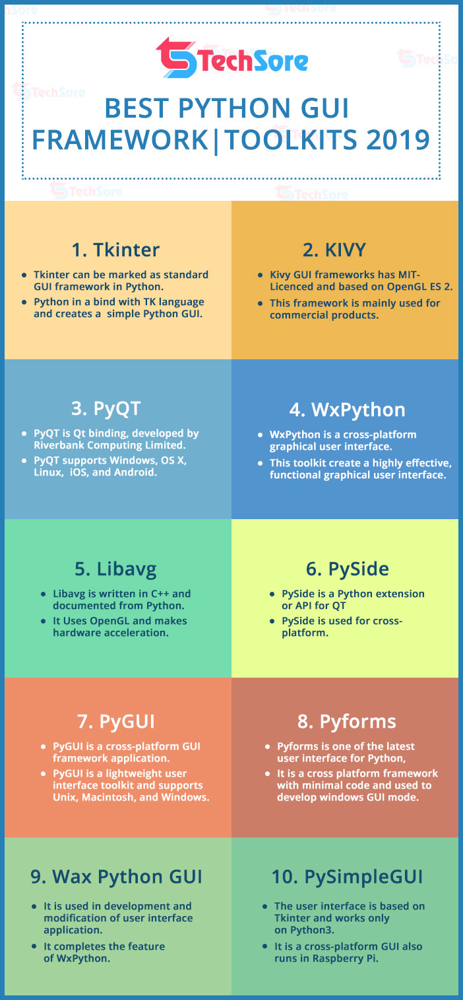

# Python CLI GUI <!-- omit in toc -->

## İçerikler <!-- omit in toc -->

- [Komut İsteminden Python (CLI)](#Komut-%C4%B0steminden-Python-CLI)
  - [Argparse Modülü Detayları](#Argparse-Mod%C3%BCl%C3%BC-Detaylar%C4%B1)
  - [Argüman Ekleme](#Arg%C3%BCman-Ekleme)
  - [Argüman Action Özelliği](#Arg%C3%BCman-Action-%C3%96zelli%C4%9Fi)
  - [Örnek CLI Kodu](#%C3%96rnek-CLI-Kodu)
- [Python Görsel Programlama (GUI)](#Python-G%C3%B6rsel-Programlama-GUI)
- [PyQT5](#PyQT5)
  - [PyQt5 Kurulumu](#PyQt5-Kurulumu)
  - [Basit GUI Yapımı](#Basit-GUI-Yap%C4%B1m%C4%B1)
  - [PyQt Widgets](#PyQt-Widgets)
- [PyInstaller ile Executable Dosya Oluşturma](#PyInstaller-ile-Executable-Dosya-Olu%C5%9Fturma)

## Komut İsteminden Python (CLI)

- Komut isteminden gelen argümanları **argparse** adlı modül ile yönetmekteyiz
- Otomatik kod tamamlaması için [buraya](https://stackoverflow.com/a/15289025/9770490) bakmanda fayda var.
- Kullanıcı cmd üzerinden `python <dosya_adı> <argümanlar>` gibi komutlarla programımızı kullanabilir

> Terminali komumtları yazmak için `os.system('<komut>')`

### Argparse Modülü Detayları

- Argüman ekleme işlemi `parser = argparse.ArgumentParser(...)` ile yapılmaktadır.
- Parametrelerin kullanımı `argparse.ArgumentParser(description='yok')` şeklindedir.

| Parametre     | Açıklama                               |
| ------------- | -------------------------------------- |
| `description` | Uygulama ile alakalı açıklama metnidir |

### Argüman Ekleme

- Argüman ekleme işlemi `parser.add_argument(...)` ile yapılmaktadır.

| Parametre    | Açıklama                                    |
| ------------ | ------------------------------------------- |
| 1. parametre | Kısa kullanım komutunu içerir               |
| 2. Parametre | Orjinal kullanım komutunu içerir            |
| `help`       | `-h` yazıldığında çıkacak olan yardım metni |
| `action`     | Davranışı belirler                          |
| `type`       | Tip bilgisini içerir (int, string ...)      |
| `default`    | Varsayılan değer                            |

### Argüman Action Özelliği

| Parametre      | Açıklama                                                                |
| -------------- | ----------------------------------------------------------------------- |
| `'store_true'` | Flag\* değeri olur ve komutta içerilirse `True` değeri alır (`-h` gibi) |
| `count`        | Kaç kere yazıldığı bilgisini tutar (-vvv için 3)                        |

```py
import argparse
parser = argparse.ArgumentParser()
parser.add_argument("--verbose", help="increase output verbosity",
                    action="store_true")
args = parser.parse_args()
if args.verbose:
    print("verbosity turned on")
```

**Çıktısı:**

```sh
$ python3 prog.py --verbose
verbosity turned on

$ python3 prog.py --verbose 1
usage: prog.py [-h] [--verbose]
prog.py: error: unrecognized arguments: 1

$ python3 prog.py --help
usage: prog.py [-h] [--verbose]

optional arguments:
  -h, --help  show this help message and exit
  --verbose   increase output verbosity
```

### Örnek CLI Kodu

```py
parser = ArgumentParser(description='A simple CLI.')
parser.add_argument(
        '--log-file',
        '-o',
        default=os.path.join(os.getcwd(), 'output.log'),
        help='Save the output in this file.',
        type=str,
        )
parser.add_argument(
        '--clean-file',
        action='store_true',
        default=False,
        help='Clear the log file on startup.Default is No',
        )
parser.add_argument(
        '--cancel-key',
        help='A single key that use as the cancel key, Default is ` (backtick)',
        )

args = parser.parse_args()
```

## Python Görsel Programlama (GUI)

Python görsel programlama araçları:

- PyQt5
- Tkintrer (zaten yüklü olarak gelir)
- WxPython
- Kivy (opensource)
- PyForms



## PyQT5

Python görsel programlama **PyQt API**'ı ile yapılmaktadır.

- Bu yazıyı oluştururken yararlandığım kaynak için [buraya](https://build-system.fman.io/pyqt5-tutorial) bakabilirsin.
- Türkçe eğitim serisi için [buraya](https://www.youtube.com/playlist?list=PLOl6SW8nLgJx9guRvfylVwrMXIginZhin) bakabilirsin.
- Hızlıca göz atmak için [buraya](https://www.youtube.com/watch?v=GLqrzLIIW2E) bakabilirsin

### PyQt5 Kurulumu

GUI için _cross development_ desteği olan **pyqt** kullanılmaktadır.

- `pip install pyqt5`
- `conda install pyqt`

> 💡 _Cross development_: Birden çok işletiim sisteminde çalışabilen yazılım geliştirmesi: PC, Mac, linux vs..

### Basit GUI Yapımı

GUI oluşturma yardımcı olan **QTDesigner** oldukça faydalı olacaktır. (💡 Çek-bırak mantığında çalışır. )

```py
from PyQt5.QtWidgets import QApplication, QLabel

# Uygulamayı tanımlama
# - [] objesi içine aktarılacak argümanları ifade eder
app = QApplication([])

# Pencernein içine yazı yazma ve görünür kılma
label = QLabel('~ YEmreAk')
label.show()

# Uygulamayı kullanıcı kapatana kadar çalıştırma (exec olursa arkaplanda da çalışır)
app.exec_()
```

### PyQt Widgets

PyQt deki her bir obje widget olarak adlandırılmakta


Yukarıdan-aşağı, soldan-sağa olmak üzere sırayla:

- [QLabel](http://doc.qt.io/qt-5/qlabel.html)
- [QComboBox](http://doc.qt.io/qt-5/qcombobox.html)
- [QCheckBox](http://doc.qt.io/qt-5/qcheckbox.html)
- [QRadioButton](http://doc.qt.io/qt-5/qradiobutton.html)
- [QPushButton](http://doc.qt.io/qt-5/qpushbutton.html)
- [QTableWidget](http://doc.qt.io/qt-5/qtablewidget.html)
- [QLineEdit](http://doc.qt.io/qt-5/qlineedit.html)
- [QSlider](http://doc.qt.io/qt-5/qslider.html)
- [QProgressBar](http://doc.qt.io/qt-5/qprogressbar.html)

> Ekran görüntüsündeki kodu [buraya](https://build-system.fman.io/static/public/files/widgets_example.py) tıklayarak indirebilirsin.

## PyInstaller ile Executable Dosya Oluşturma

Video açıklaması için [buraya](https://youtu.be/lOIJIk_maO4) bakabilirsin.
