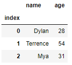
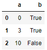
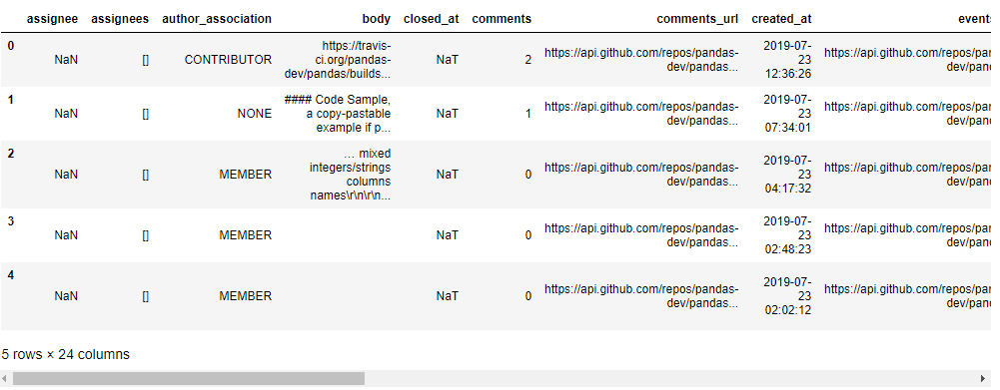

# Python ile İleri Dosya İşlemleri <!-- omit in toc -->

## İçerikler <!-- omit in toc -->

- [Önemli Bilgiler](#%c3%96nemli-bilgiler)
- [DataFrame Metodları](#dataframe-metodlar%c4%b1)
- [CSV İşlemlerine Giriş](#csv-%c4%b0%c5%9flemlerine-giri%c5%9f)
- [Pandas ile CSV Oluşturma](#pandas-ile-csv-olu%c5%9fturma)
- [Webteki JavaScript Verileri (`json`)](#webteki-javascript-verileri-json)
  - [JSON Yapısı](#json-yap%c4%b1s%c4%b1)
  - [JSON Okuma](#json-okuma)
- [Sıkıştırılmış Veriler (`gzip`)](#s%c4%b1k%c4%b1%c5%9ft%c4%b1r%c4%b1lm%c4%b1%c5%9f-veriler-gzip)
  - [Gzip Metodları](#gzip-metodlar%c4%b1)
  - [Gzip Örnekleri](#gzip-%c3%96rnekleri)
- [Serileştirme (`pickle`)](#serile%c5%9ftirme-pickle)
  - [Pickle Metodları](#pickle-metodlar%c4%b1)
  - [Pickle Örnekleri](#pickle-%c3%96rnekleri)
- [NumPy Dosya Formatı](#numpy-dosya-format%c4%b1)
  - [NumPy Metodları](#numpy-metodlar%c4%b1)
  - [Numpy Örnekleri](#numpy-%c3%96rnekleri)

## Önemli Bilgiler

- CSV, JSON işlemleri için `pandas` _package_'ı kullanılır
- `DataFrame`, `pandas` paketinin bir objesidir

## DataFrame Metodları

| Metod                            | Açıklama                                        |
| -------------------------------- | ----------------------------------------------- |
| `df.head()`                      | Verilerin başlangıç kısmından birazını gösterme |
| `df.read_csv(<dosya yolu>)`      | CSV dosyasını okuma                             |
| `df.to_csv(<dosya yolu>)`        | CSV dosyası oluşturma                           |
| `df.read_json(<dosya yolu>)`     | JSON dosyasını okuma                            |
| `df.to_json(<dosya yolu | url>)` | JSON dosyası oluşturma                          |

## CSV İşlemlerine Giriş

- Csv en sade tablo verisi formatıdır
- `,` karakteri ile veriler ayrılır
- `pandas` moduülü ile ele alınır

<details>
<summary>Temel csv dosyası okuma</summary>

```python
list_table = []
with open('./data/csv_sample.txt', 'r') as f:
    for line in f.readlines():
        list_table.append(line.strip().split(','))

list_table
```

```bash
[['index', 'name', 'age'],
 ['0', 'Dylan', '28'],
 ['1', 'Terrence', '54'],
 ['2', 'Mya', '31']]
```

</details>

<details>
<summary>pandas ile csv okuma</summary>

```python
import pandas as pd

df = pd.read_csv('./data/csv_sample.txt', index_col=0)
df
```



</details>

## Pandas ile CSV Oluşturma

- CSV dosyalarında veriler `,` karaterine göre sütunlara yerleşir
- Tanımlanmayan alanlara `NaN` yazılır

<details>
<summary>Basit CSV dosyası oluşturma</summary>

```python
pd.DataFrame({'a': [0, 3, 10], 'b': [True, True, False]})\
    .to_csv('./data/pd_write.csv')

pd.read_csv('./data/pd_write.csv', index_col=0)
```



</details>

## Webteki JavaScript Verileri (`json`)

- Internet üzeriindenki çoğu veri JSON tipindedir
  - Web üzeride Javascript çok fazla kullanılmaktadır
  - Google, Twitter vs.
- JavaScript Object Notation olarak açılır
- JavaScript'te bilgileri aktarmak için kullanılır

### JSON Yapısı

- `dict` ve `list`'in harmanlanmış hali denebilir

<details>
<summary>JSON örneği</summary>

```python
book1 = {'title': 'The Prophet',
         'author': 'Khalil Gibran',
         'genre': 'poetry',
         'tags': ['religion', 'spirituality', 'philosophy', 'Lebanon', 'Arabic', 'Middle East'],
         'book_id': '811.19',
         'copies': [{'edition_year': 1996,
                     'checkouts': 486,
                     'borrowed': False},
                    {'edition_year': 1996,
                     'checkouts': 443,
                     'borrowed': False}]
         }

book2 = {'title': 'The Little Prince',
         'author': 'Antoine de Saint-Exupery',
         'genre': 'children',
         'tags': ['fantasy', 'France', 'philosophy', 'illustrated', 'fable'],
         'id': '843.912',
         'copies': [{'edition_year': 1983,
                     'checkouts': 634,
                     'borrowed': True,
                     'due_date': '2017/02/02'},
                    {'edition_year': 2015,
                     'checkouts': 41,
                     'borrowed': False}]
         }

library = [book1, book2]
library
```

```bash
[{'title': 'The Prophet',
  'author': 'Khalil Gibran',
  'genre': 'poetry',
  'tags': ['religion',
   'spirituality',
   'philosophy',
   'Lebanon',
   'Arabic',
   'Middle East'],
  'book_id': '811.19',
  'copies': [{'edition_year': 1996, 'checkouts': 486, 'borrowed': False},
   {'edition_year': 1996, 'checkouts': 443, 'borrowed': False}]},
 {'title': 'The Little Prince',
  'author': 'Antoine de Saint-Exupery',
  'genre': 'children',
  'tags': ['fantasy', 'France', 'philosophy', 'illustrated', 'fable'],
  'id': '843.912',
  'copies': [{'edition_year': 1983,
    'checkouts': 634,
    'borrowed': True,
    'due_date': '2017/02/02'},
   {'edition_year': 2015, 'checkouts': 41, 'borrowed': False}]}]
```

</details>

### JSON Okuma

- JSON dosyaları `f.read()` şeklinde değil, `json.load(f)` şekinde okunur

> `f`, dosya objesi

<details>
<summary>JSON'ı f.read ile okuma</summary>

```python
# note that if we loaded it in without JSON
# the file would be interpreted as plain text

with open('./data/library.json', 'r') as f:
    library_string = f.read()

# this isn't what we want
library_string
```

```bash
'[\n  {\n    "title": "The Prophet",\n    "author": "Khalil Gibran",\n    "genre": "poetry",\n    "tags": [\n      "religion",\n      "spirituality",\n      "philosophy",\n      "Lebanon",\n      "Arabic",\n      "Middle East"\n    ],\n    "book_id": "811.19",\n    "copies": [\n      {\n        "edition_year": 1996,\n        "checkouts": 486,\n        "borrowed": false\n      },\n      {\n        "edition_year": 1996,\n        "checkouts": 443,\n        "borrowed": false\n      }\n    ]\n  },\n  {\n    "title": "The Little Prince",\n    "author": "Antoine de Saint-Exupery",\n    "genre": "children",\n    "tags": [\n      "fantasy",\n      "France",\n      "philosophy",\n      "illustrated",\n      "fable"\n    ],\n    "id": "843.912",\n    "copies": [\n      {\n        "edition_year": 1983,\n        "checkouts": 634,\n        "borrowed": true,\n        "due_date": "2017/02/02"\n      },\n      {\n        "edition_year": 2015,\n        "checkouts": 41,\n        "borrowed": false\n      }\n    ]\n  }\n]'
```

</details>

<details>
<summary>JSON'ı json.load(f) ile okuma</summary>

```python
with open('./data/library.json', 'r') as f:
    reloaded_library = json.load(f)

reloaded_library
```

```bash
[{'title': 'The Prophet',
  'author': 'Khalil Gibran',
  'genre': 'poetry',
  'tags': ['religion',
   'spirituality',
   'philosophy',
   'Lebanon',
   'Arabic',
   'Middle East'],
  'book_id': '811.19',
  'copies': [{'edition_year': 1996, 'checkouts': 486, 'borrowed': False},
   {'edition_year': 1996, 'checkouts': 443, 'borrowed': False}]},
 {'title': 'The Little Prince',
  'author': 'Antoine de Saint-Exupery',
  'genre': 'children',
  'tags': ['fantasy', 'France', 'philosophy', 'illustrated', 'fable'],
  'id': '843.912',
  'copies': [{'edition_year': 1983,
    'checkouts': 634,
    'borrowed': True,
    'due_date': '2017/02/02'},
   {'edition_year': 2015, 'checkouts': 41, 'borrowed': False}]}]
```

</details>

<details>
<summary>URL ile JSON okuma</summary>

```python
pd.read_json('https://api.github.com/repos/pydata/pandas/issues?per_page=5')
```



</details>

## Sıkıştırılmış Veriler (`gzip`)

- Çok sık kullanılan sıkıştırma tipidir
- [deflate algorithm](http://www.infinitepartitions.com/art001.html) yöntemini kullanır
  - `10, 10, 10, 2, 3, 3, 3, 3, 3, 50, 50, 1, 1, 50, 10, 10, 10, 10` (18 sayı) yerine
  - `(3, 10), (1, 2), (5, 3), (2, 50), (2, 1), (1, 50), (4, 10)` (14 sayı) yazılır
  - 3 tane 10, 1 tane 2, 5 tane 3 ...
- Düşük verili dosyalarda verimli çalışmaz 😢
  - Başlık bilgisi fazladan yer kaplar
  - Sıkıştırma algoritması için çok fazla tekrarlı bitler gerekir
- Sade metin yerine kodlanmış metin barındırır
- Dosya işlemlerinde `w` değil `wb` kullanılır

> `w` plaint text, `wb` binary text şeklinde yazar

### Gzip Metodları

| Metod                               | Açıklama       |
| ----------------------------------- | -------------- |
| `gzip.open(<dosya>, <erişim modu>)` | Dosyaya erişim |

### Gzip Örnekleri

<details>
<summary>Detaylı açıklama</summary>

Another way we save storage and network resources is by using **compression**. Many times data sets will contain patterns that can be used to reduce the amount of space needed to store the information.

A simple example is the following list of numbers: 10, 10, 10, 2, 3, 3, 3, 3, 3, 50, 50, 1, 1, 50, 10, 10, 10, 10

Rather than writing out the full list of numbers (18 integers), we can represent the same information with only 14 numbers: (3, 10), (1, 2), (5, 3), (2, 50), (2, 1), (1, 50), (4, 10)

Here the first number in each pair is the number of repetitions, and the second number in the pair is the actual value. We've successfully reduced the amount of numbers we need to represent the same data. Most forms of compression use a similar idea, although actual implementations are usually more complex.

In the world of data science, the most common compression is Gzip (which uses the ). Gzip files end with the extension `.gz`.

</details>

<details>
<summary>GZIP ile dosya işlemleri</summary>

```python
with gzip.open('./data/short_text.txt.gz', 'wb') as f:
    f.write(short_text.encode('utf-8'))
```

</details>

## Serileştirme (`pickle`)

- Uygulamanın oluşturduğu verileri dosyaya kaydedip, tekrardan kullanmayı sağlar
  - Karmaşık uygulamalarda sıklıkla yapılır
- Kaydetme işlemi text formatında değil , **binary** formatında olur
  - `w` yerine `wb` kullanılır
- Sıklıkla `pickle` paketi kullanılır

### Pickle Metodları

| Metod                    | Açıklama                         |
| ------------------------ | -------------------------------- |
| `dump(<pickle>, <file>)` | `pickle` objesini dosyaya yazma  |
| `pickle = load(<file>)`  | `pickle` objesini dosyadan okuma |

### Pickle Örnekleri

<details>
<summary>Pickle objesi örneği</summary>

```python
pickle_example = ['hello', {'a': 23, 'b': True}, (1, 2, 3), [['dogs', 'cats'], None]]
```

</details>

<details>
<summary>Pickle text tipinde yazılamaz</summary>

```python
# we can't save this as text
with open('./data/pickle_example.txt', 'w') as f:
    f.write(pickle_example)

# TypeError: write() argument must be str, not list
```

</details>

<details>
<summary>Pickle kullanım örneği</summary>

```python
import pickle

# we can save it as a pickle
with open('./data/pickle_example.pkl', 'wb') as f:
    pickle.dump(pickle_example, f)

with open('./data/pickle_example.pkl', 'rb') as f:
    reloaded_example = pickle.load(f)

reloaded_example # ['hello', {'a': 23, 'b': True}, (1, 2, 3), [['dogs', 'cats'], None]]
reloaded_example == pickle_example # True
```

</details>

## NumPy Dosya Formatı

- Makine öğrenimin oldukça kullanılan bir pakettir
- Kendisine özel basit kullanımlı dosya işlemleri vardır

### NumPy Metodları

| Metod                        | Açıklama                                     |
| ---------------------------- | -------------------------------------------- |
| `savetxt(<file.txt>, <obj>)` | Metni dosyaya **text** formatında kaydetme   |
| `save(<file.npy>, <obj>)`    | Metni dosyaya **binary** formatında kaydetme |
| `obj = loadtxt(<file.txt>)`  | Dosyadan **text** formatındaki metni okuma   |
| `obj = load(<file.npy>)`     | Dosyadan **binary** formatındaki metni okuma |

### Numpy Örnekleri

<details>
<summary>Numpy objesi örneği</summary>

```python
sample_array = np.random.random((4, 4))
# [[0.02573499 0.82494109 0.89756743 0.84206605]
# [0.70146385 0.1468585  0.45772617 0.23692087]
# [0.005141   0.22425271 0.29602516 0.64871444]
# [0.15156162 0.46722448 0.37752783 0.10490116]]
```

</details>

<details>
<summary>Dosyaya objeyi kaydetme</summary>

```python
# Metin olarak kaydetme (verimsiz)
np.savetxt('./data/sample_array.txt', sample_array)

# Binary olarak kaydetme (Verimli)
np.save('./data/sample_array.npy', sample_array)
```

```bash
# ./data/sample_array.txt
2.573499304710569202e-02 8.249410915227861629e-01 8.975674256604490031e-01 8.420660467417920847e-01
7.014638530667735017e-01 1.468584962112742254e-01 4.577261675584743950e-01 2.369208677107362826e-01
5.140998044749989226e-03 2.242527110614195296e-01 2.960251573689319793e-01 6.487144382421085043e-01
1.515616208846672919e-01 4.672244790863220310e-01 3.775278308063384491e-01 1.049011560631800677e-01

# ./data/sample_array.npy
�NUMPYv{'descr': '<f8', 'fortran_order': False, 'shape': (4, 4), }
�&FZ�?��&��e�?KTeR߸�?z~4��?#�Rdr�?0�.[B��?���bK�?�]GIlS�?�8�'�u?D)P��?Wl���?�+�D��?���_f�?�?d���?�'�}j)�?���Z�ں?
```

</details>

<details>
<summary>Dosyadan numpy objesi okuma</summary>

```python
# Metin olarak kaydetme (verimsiz)
print(np.loadtxt('./data/sample_array.txt'))

# Binary olarak kaydetme (Verimli)
print(np.load('./data/sample_array.npy'))
```

```bash
# Her iki kullanım için de aynıdır
[[0.02573499 0.82494109 0.89756743 0.84206605]
 [0.70146385 0.1468585  0.45772617 0.23692087]
 [0.005141   0.22425271 0.29602516 0.64871444]
 [0.15156162 0.46722448 0.37752783 0.10490116]]
```

</details>
