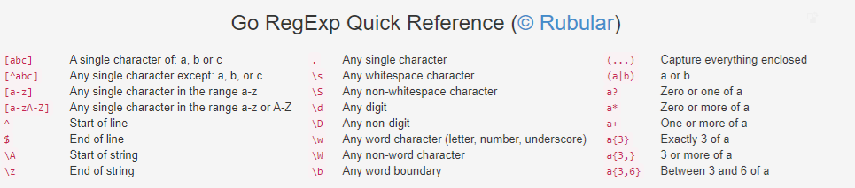

# ⛩ Regex

## 🤸‍ Hızlı Bakış

Kullanım formatı `r""` (python) veya `/ /` (javascript) şeklindedir.

## 🦥 Temel İşlemler

| RegEx       | Açıklama                                    |
| ----------- | ------------------------------------------- |
| `|`         | Or işlemi veya anlamına gelir               |
| `[ab]`      | `a` veya `b` demektir                       |
| `(ab)`      | `ab` demektir                               |
| `(ab )`     | `ab ` anlamına gelir (⚠ ` ` boşluğa dikkat) |
| `[ab]|(ab)` | `a` veya `ab`, `b` veya `ab` demektir       |
| `[aA]nkara` | `Ankara` veya `ankara` metinlerini bulur    |

## 💯 Sayısal İşlemler

| Greedy   | Reluctant | Possessive | Meaning                                 |
| -------- | --------- | ---------- | --------------------------------------- |
| `X?`     | `X??`     | `X?+`      | X, once or not at all                   |
| `X\*`    | `X\*?`    | `X\*+`     | X, zero or more times                   |
| `X+`     | `X+?`     | `X++`      | X, one or more times                    |
| `X{n}`   | `X{n}?`   | `X{n}+`    | X, exactly n times                      |
| `X{n,}`  | `X{n,}?`  | `X{n,}+`   | X, at least n times                     |
| `X{n,m}` | `X{n,m}?` | `X{n,m}+`  | X, at least n but not more than m times |

> Kaynak için [buraya](https://docs.oracle.com/javase/tutorial/essential/regex/quant.html) bakabilirsin.

## 🔍 Kelime Arama

| Regex            | Açıklama                                                                  | Link                                  |
| ---------------- | ------------------------------------------------------------------------- | ------------------------------------- |
| `\wab\w`         | `ab` geçen **4 harfli** kelimeleri bulur (özel karakterleri desteklemez)  | [🔗](https://regex101.com/r/TxuXuH/2) |
| `\baş`           | Metin içerisinde `aş` olanları bulur (özel karakterleri (`ş`) destekler ) | [🔗](https://regex101.com/r/TxuXuH/3) |
| `(\baş )`        | İçerisinde `aş ` geçen cümleleri bulur                                    | [🔗](https://regex101.com/r/TxuXuH/5) |
| `\byunus|\bemre` | `yunus` veya `emre` olan kelimeleri bulur                                 | [🔗](https://regex101.com/r/TxuXuH/6) |

## 🎡 Karışık İşlemler

| İşlem      | Açıklama                           |
| ---------- | ---------------------------------- |
| `": \\s+"` | `": "` göre ayırma                 |
| `\\.`      | `.` ya göre ayırma (`"."` çalışmaz |
