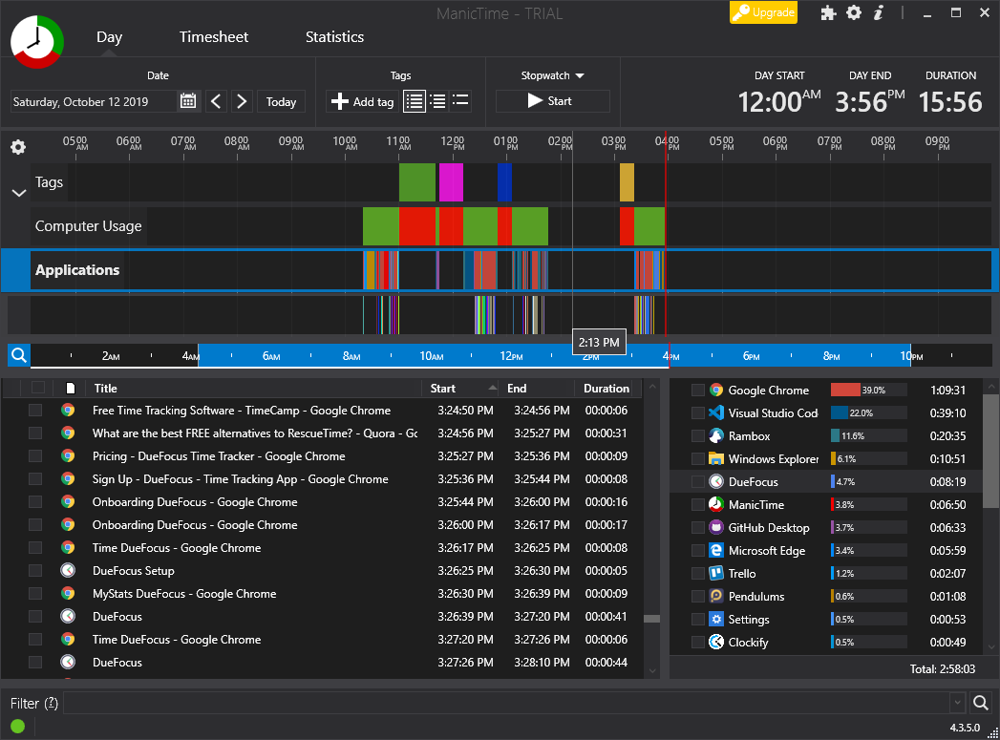
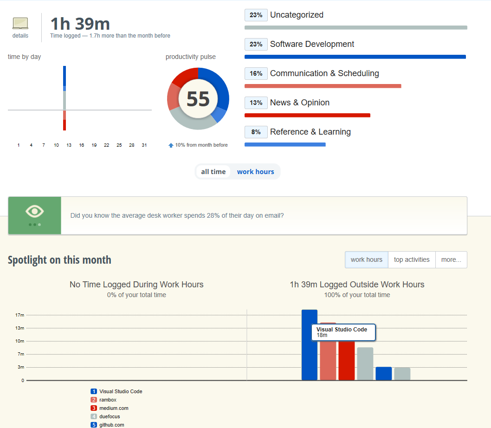
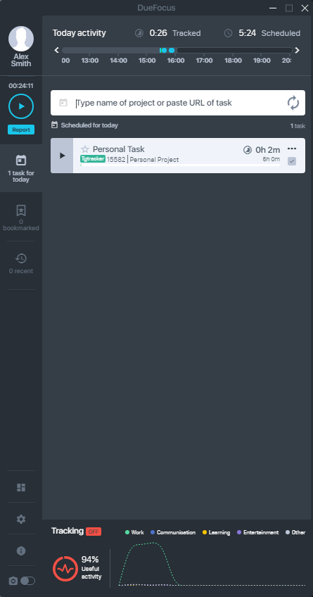
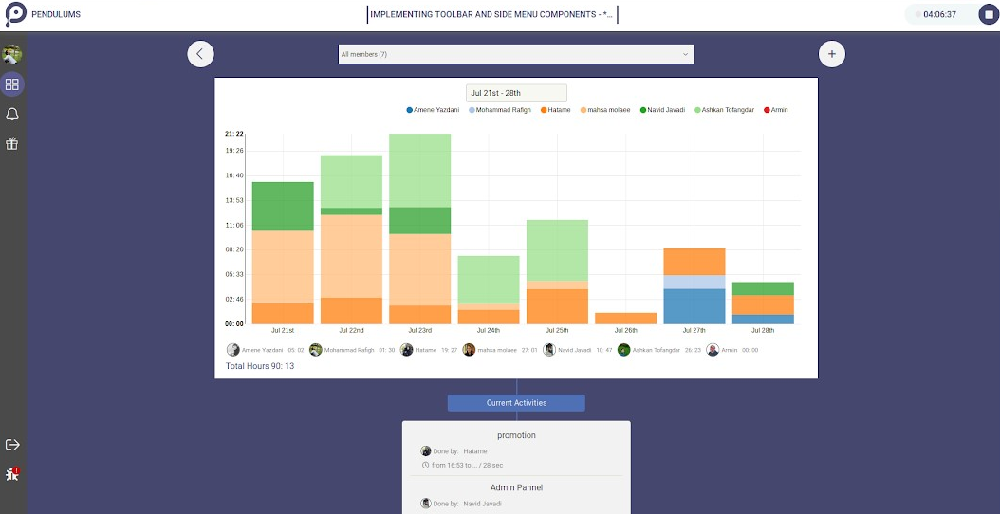

# ⏳ Zaman Yönetimi

## 🗽 Açıklama

Zaman yönetimi için **Time Tracking** uygulamaları kullanılmaktadır.

- Belli başlı programlardaki faaileyetlerinizi takip eder
- Arkaplanda sistemi yormadan çalışır
- Grafikler ve çeşitli görselleştirme teknikleriyle sonuçları sunar

> Alttaki uygulamlar hakkındaki yorumlarım, **tamamıyla kişisel görüşlerimdir**.

## 🕵️‍ Time Tracking Uygulamaları

Alttaki uygulamalar Windows 10 üzerinde çalışan uygulamalardır, diğer işletim sistemlerini desteklemeyebilir.

> MacOs için [TimingApp](https://timingapp.com/)'ı deneyebilirsiin.

### ⏱ [ActivityWatch](https://github.com/yedhrab/activitywatch)

Tüm pencereleri kaydeden ve loglayan zaman yönetim uygulamasıdır

- Github üzerinde **açık kaynaklıdır**
  - Güvenilir, ücretsiz.
  - Pyton ve PyQt ile kodlanmıştır
- Kendi arayüzü yoktur, sade bir uygulamadır
  - **Locahost** üzerinde **web arayüzü** sunmaktadır
  - İnternet bağlantısı gerektirmez
- Verileri **JSON formatında indirmenize** olanak sağlar

### 🕓 [ManicTime](https://www.manictime.com/)

Tüm pencereleri kaydeden ve loglayan zaman yönetim uygulamasıdır

- Uygulamaları açılış ve kullanım saatleri ile takip eder
- Bilgisayardan uzaklaştığınızda onu algılar ve takibi bırakır
- Geri geldiğinizde ne yaptığınızı soran sistemi ile günü analiz etmeye çalışır
- Toplam bilgisayar kullanım saatinizi belirleminizi sağlar

> Çoğu hizmeti **pro** üyelik gerektirir, 15 günlüğüne **pro** sürümünü sunmaktadır

### ➕ [RescueTime](https://www.rescuetime.com/)

🕓 ManicTime ile benzer görevleri yapar.

- Takip edilen uygulamaları katogerilere ayırır
- Grafik gösterimleri ile görselleştirme imkanı sunar
- Yerel arayüzü yoktur tüm bilgileri online ortamda saklanır
- Web arayüzü akıcı ve kullanışlıdır

> Uygulamalar hakkında detaylı bilgiyi sadece **pro** sürümünde vermektedir.

## 😒 Beğenmediklerim

### [DueFocus](https://duefocus.com)

**Avantajlar**: 

- Arayüzü çok güzel ve sade
- Freelancer'ların sizin için günde kaç saat çalıştığını kontrol edebilrisiniz
  - Tabi onları sayacı başlatması lazım
  
**Dejavantajlar**:

- Pencere Yönetimi yok
- Kronometre mantığı ile çalışmakta
    
> Çeşitli entegrasyon destekleri mevcut lakin denemedim

### [Pendulums](https://pendulums.io/)

**Avantajlar**:

- OpenSource ve güvenilir

**Dejavantajlar**:

- Kötü ve itici arayüz
- Pencere aktivitelerini takip etmiyor
- Sadece sayaç ile takip söz konusu

### Diğerleri

- [TimeCamp](https://www.timecamp.com/)
- [Clockify](https://clockify.me/)

**Dejavantajlar**:

- Pencere aktivitelerini takip etmiyor
