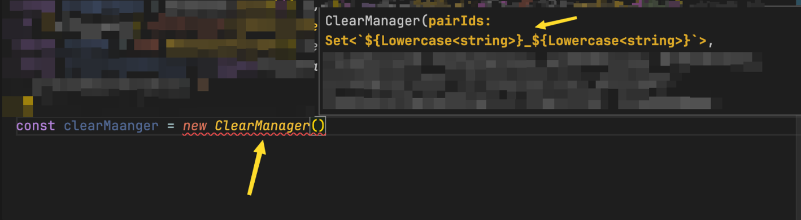

# 📖 Kişisel Kütüphanem

## 🎙️ Merhabalar

* Bu sayfamda, öğrendiklerime ve kişisel gelişimime sizleri de ortak etmeyi amaçlamaktayım
* Herhangi bir alanda öğrendiğim ve düzenli olarak aldığım notları burada sergilemekteyim
* Genel olarak ilgi alanlarım; yazılım, psikoloji, felsefe, insanı tanıma vb. hususlar olduğunda bu alanlar öncelikli olacaktır


Eski ziyaretçilerim için; tüm notlarım artık tek bir sayfa içerisinde derlenmiştir


## 🔍 Notlarımda Arama

<figure><figcaption></figcaption></figure>

* Site üzerinde çok fazla veri olacağından sol yukarıdaki arama butonunu kullanmanızı öneririm
* ⌘K kısayolu ile de aramayı aktif edebilirsiniz
* Lens özelliği ile siteye soru sorabilirsiniz
  * Başına "türkçe araştır" diye eklerseniz daha verimli olacaktır

## 🌟 Tepkinizi Gösterin

* İçeriklerimin size faydalı olması durumunda tepki gösterirseniz, o alandaki notlarımı daha çok paylaşmaya çalışabilirim
* Ek olarak eski notlarım da yer alacağından onları güncellememi sağlayabilirsiniz
* Site üzerindeki etkileşime göre odağımı daha çok buraya aktarabilirim
