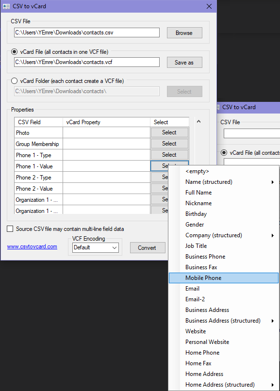

# Telefon Rehberini Taşıma

## Google Rehberini Aktarma

- Google Contact sayfasını [buraya](https://contacts.google.com/) tıklayarak açın
- Sol kısımdaki sekmelerden `Daha fazla` ardıdan `Dışa aktar` kısmını seçin
- Çıkan ekranda `Google CSV` seçeniğini seçip, dışarı aktarın

### CSV Dosyaysını VCard Dosyasına Dönüştürme

Csv dosyasını vcard uygulmasına dönüştürdek sonra `.vcf` uzantılı dosayayı açtığımızda rehberimize eklenecektir.

- Harici bir uygulama olarak [bu uygulamayı](http://www.csvtovcard.com/) indirin
- Uygulamayı çalıştırın ve csv dosyasının yolunu seçiniz
- Properties kısmından gerekli alanlara vCard oluşumu için belirleyin
- Convert yazısına tıklayın
- Dosyayı telefonuza atın ve telefonuz üzerinden dosyayı açın
  - Dosyayı açma seçeneklerinden rehberi seçin

> Yeni `.vcf` dosyası `.csv` dosyasının yanına oluşacaktır.

