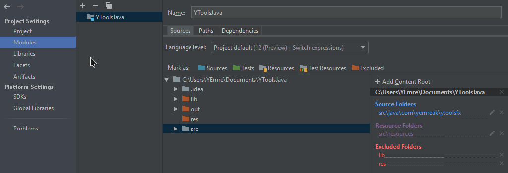

# Jetbrains IDEs 

## Proje Dizinlerini yapılandırma

Projeledeki dizinlerin ne işe yaradığını derleyiciye bildiren ayardır.

- `Project Structure` - `Project Settings` - `Modules`
- `Source` sekmesinden dizinleri yapılandırabilirsin
  - `Sources` Modül ya da paketlerin dizinlerinin tanımlandığı yerdir
    - `src/java/com/yemreak` dizini kaynak kod dizini olsun:
    - `package controllers` yazıldığın `src/java/com/yemreak/controllers` dizinine bakılır
  - `Resources` kaynak dosyaları (resim vs.)
    - `Resources` dizinleri `Sources` dizinlerinin alt dizinleri olamaz
    - `src/resources` kaynak dizini olsun:
    - `getResource("/images/yemreak.jpg")` yazıldığında `src/resources/images/yemreak.jpg` yoluna bakılır
- `Excluded` dışlanan, bağımsız dosyalar

## Kısayolar

Detaylar için [buraya](https://www.jetbrains.com/help/idea/mastering-keyboard-shortcuts.html) tıklayabilirsin.

> VsCode kısayollarını aktarmak için [buraya](https://plugins.jetbrains.com/plugin/12062-vs-code-keymap/versions) bakabilirsin.

- <kbd>✲ Ctrl</kbd> + <kbd>✲ Ctrl</kbd> Komut çalıştırma
- <kbd>⇧ Shift</kbd> + <kbd>⇧ Shift</kbd> Kod içerisinde arama yapma
- <kbd>✲ Ctrl</kbd> + <kbd>⇧ Shift</kbd> + <kbd>⎇ Alt</kbd> + `L` Code formatlama diyaloğu
- <kbd>✲ Ctrl</kbd> + <kbd>⎇ Alt</kbd> + `L` Tüm kodu otamatik formatlama
- <kbd>✲ Ctrl</kbd> + <kbd>⎇ Alt</kbd> `O` Import'ları optimize etme
- <kbd>✲ Ctrl</kbd> + `N` Classlar arasında dolanma
- <kbd>✲ Ctrl</kbd> + `F12` Üzerinde bulunduğumuz dosya üzerinde dolanma

### Kod Kısayolları

- <kbd>✲ Ctrl</kbd> + `SPACE` Kod tamamlama
  - 2 kez ard arda basılırsa **import edilmemiş** değişkenleri de gösterir ve otomatik dahil eder
- <kbd>✲ Ctrl</kbd> + <kbd>⇧ Shift</kbd> + `SPACE` İle akıllı kod önerileri sunar
- <kbd>⎇ Alt</kbd> + `F7` Projedeki kullanım alanını gösterir
- <kbd>✲ Ctrl</kbd> + `Q` Dökümanı hızlı önizleme
  - **import** edilen modüller için kullanışlıdır
- <kbd>✲ Ctrl</kbd> + `B` ya da <kbd>✲ Ctrl</kbd>'ye basılı tutup fare ile tıklama, tanımlandığı alana gönderir
- <kbd>✲ Ctrl</kbd> + <kbd>⎇ Alt</kbd> + `V` Seçilen kısmı değişkene atama

### Metin Kısayolları

- <kbd>✲ Ctrl</kbd> + `X` Satırı kesme
- <kbd>✲ Ctrl</kbd> + `D` Satırı hemen altına kopyalam (dublicate)
- <kbd>✲ Ctrl</kbd> + <kbd>⇧ Shift</kbd> + `/` Yorum satırına çevirme
- <kbd>✲ Ctrl</kbd> + <kbd>⇧ Shift</kbd> + `YON TUSLARI` İmlecin üzerinde durduğu metni taşıma
- <kbd>⇧ Shift</kbd> + `F6` Yeniden adlandırma

### Debug Kısayolları

- <kbd>⎇ Alt</kbd> + `F8` Dobug modunda iken kod derleme arayüzü
- <kbd>✲ Ctrl</kbd> + <kbd>ENTER</kbd>, Sonucu derleme

### Git Kısayolları

- <kbd>✲ Ctrl</kbd> + `K` Commit
- <kbd>✲ Ctrl</kbd> + <kbd>⇧ Shift</kbd> + `K` Push

### VsCode KeyMap

- <kbd>✲ Ctrl</kbd> + <kbd>P</kbd>, Dosyalarda arama
  - <kbd>✲ Ctrl</kbd> + <kbd>⭾ Tab</kbd>, Arama ekranındaki sekmeyi değiştirme
- <kbd>⎇ Alt</kbd> + <kbd>⇧ Shift</kbd> + <kbd>A</kbd>, Seçilen alanı yorum satırına alma

## Git Yönetimi

- `JetBrain IDE` - `Check out from Version Control` - `Git`
  - _Url:_ Proje URL'idir. (Adress çubuğunda yazan metin)
  - _Directory:_ Proje yolunudur. (projenin/konumu)
- `Test` & `Clone`

## Pluginler (Eklenti gibi)

Plugin kurma detayı için [buraya](https://www.jetbrains.com/help/idea/managing-plugins.html) tıklayabilirsin.

- <kbd>✲ Ctrl</kbd> + <kbd>⎇ Alt</kbd> + `S` kısmından `Plugin` sekmesinde istediğiniz iklentileri bulabilirsiniz.

## Proje Yapılandırma

### Interpreter (Derleyici) Değiştirme

Sanal environment gibi durumlarda system yerine onların derleyicisini kullanma

- <kbd>✲ Ctrl</kbd> + <kbd>⎇ Alt</kbd> + `S` yaptıktan sonra `Project: <project name> | Project Interpreter` sayfasında `Ayarlar Butonu | Add` kısmına basarak derleyicinizi değiştirebilirsiniz.

### Configuration (Yapılandırma) Ayarları

> Projenizi IDE üzerinde çalıştırabilmek için bu ayarı yapmanız gerekmekte.

- Sağ üst kısımdaki yeşin `Run` butonunun solundaki alandan `Edit Configuration`ı seçin.
- Sol üst köşedeki `+` butonuna basın
- Derlemek istediğiniz dili | uygulamayı seçin (_Örn: Python | PyCharm için_)
- Dosya derleyeceksiniz _Script_ kısmına `dosyanın yolunu` yazın.
- _Python Interpreter_ kısmında yorumlayıcıyı seçin, ayarlanmadıysa `Interpreter (Derleyici) Değiştirme` aşamasında (üst aşamada) nasıl ayarlayacağınıza bakabilirsiniz.

### Kaynak Kod Dosyalarını Belirtme

- `Project` kısmından dizine sağ tıklayın
- `Mark Directory as` alanından `Source` yazısına tıklayın

> Otomatik olarak dizin yolu, ortam değişkenlerine eklenecektir

#### Ek Ortam Değşkenleri Tanımlama

- Üst sekmeden `Run` kısmına gelin
- `Edit Configuration` yazısına tıklaıyn
- Yapılandırma ayarınızı seçin
  - Yoksa `+` ile yeni bir tane oluşturun
- `Environment Variables` kısmında en sağdaki dosya simgesine tıklayın
- `+` ile yeni ortam değişkeninizi ekletin

> Windows için cmd ortam değişkeni ayarlama yapısı `set name=value;value` şeklindedir.

#### Ortam Değişkenleri Ayarlama Eklentisi

Eklenti sitesi için [buraya](https://github.com/ashald/EnvFile/blob/develop/README.md) bakabilirsin.

## Faydalı Ayarlar

### Font Ayarları

- <kbd>✲ Ctrl</kbd> + <kbd>⎇ Alt</kbd> + `S` yaptıktan sonra `Editor | Font` kısmında
  - _Font:_ `Consolas`
  - _Size:_ `12`
  - _Line spacing:_ `1.0`

### Dökümantasyon Önizle

Fareyle kodun üzerinize geldiğiniz _açıklamalarını_ ve dökümantasyonlarını gösterecektir.

- <kbd>✲ Ctrl</kbd> + <kbd>⎇ Alt</kbd> + `S` yaptıktan sonra `Editor | General | Other` başlığı altında `Show quick documentation on mouse move` kısmını seçin ve süreyi `500` yapın.

### Dictionaries

Dillere özgü sözlükleri indirmek için [buraya](https://drive.google.com/open?id=1UAGLGvwv_zLBzH7zH1oGRvYhzzP67M4k) tıklayabilirsin.

- <kbd>✲ Ctrl</kbd> + <kbd>⎇ Alt</kbd> + `S` yaptıktan sonra `Editor | Spelling | Dictionaries | Custom Dictionaries` başlığı altında `+` butonuna basıp `.dic` uzantılı sözlük dosyanı ekleyin.

> Sözlüğün çalışabilmesi için `hunspell` plugin'ini indirmeniz gerekmekte. Plugin kurma detayı için [buraya](https://www.jetbrains.com/help/idea/managing-plugins.html) tıklayabilirsin.

### Spellcheck Kaldırma

- <kbd>✲ Ctrl</kbd> + <kbd>⎇ Alt</kbd> + `S` yaptıktan sonra `Editor | Inspection | Spelling | Typo | Process comments` ile yorum satırlarını kontrol etmesini kaldırabilirsin.

## Karma Notlar

- [Şifre değiştirme](https://stackoverflow.com/a/37959112)
- [DataGrip](https://www.jetbrains.com/datagrip/)

> Sayfa başındaki işaretçilere yönlenmek için [buraya](#Y%C3%B6nlendirme) tıklayabilirsin.

## Yapılacaklar

- [x] PyCharm Env Variable
  - [Link1](https://stackoverflow.com/a/42708476/9770490)

## Keymap (Kısayollar)

- Comment with line Comment, <kbd>⎇ Alt</kbd> + <kbd>⇧ Shift</kbd> + <kbd>A</kbd>
- Extend Selection, <kbd>✲ Ctrl</kbd> + <kbd>D</kbd> (Kelime ve daha fazlasını seçme)
- Editör Tab - Close, <kbd>✲ Ctrl</kbd> + <kbd>W</kbd>
- Toggle Distraction Free mode, <kbd>CLTR</kbd> + <kbd>K</kbd>, <kbd>Z</kbd>

## IDE Ortam Değişkenleri

- Oluşturmak için: `Preferences (File -> Settings) -> Appearance & Behavior -> Path Variables`
- Kullanmak için: `${<değişken_ismi>}`
- `$MODULE_DIR$`, projenin dizini
  - src, out vs.. içeren dizin
