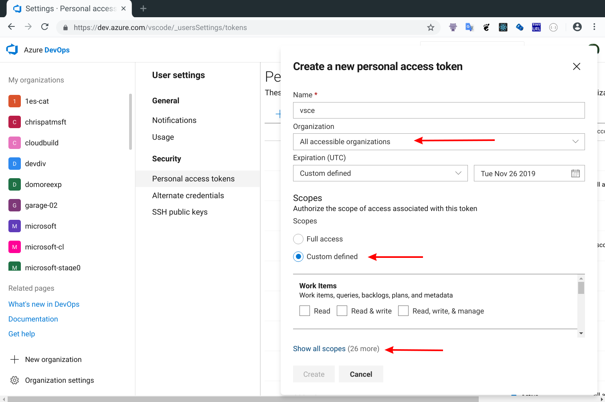
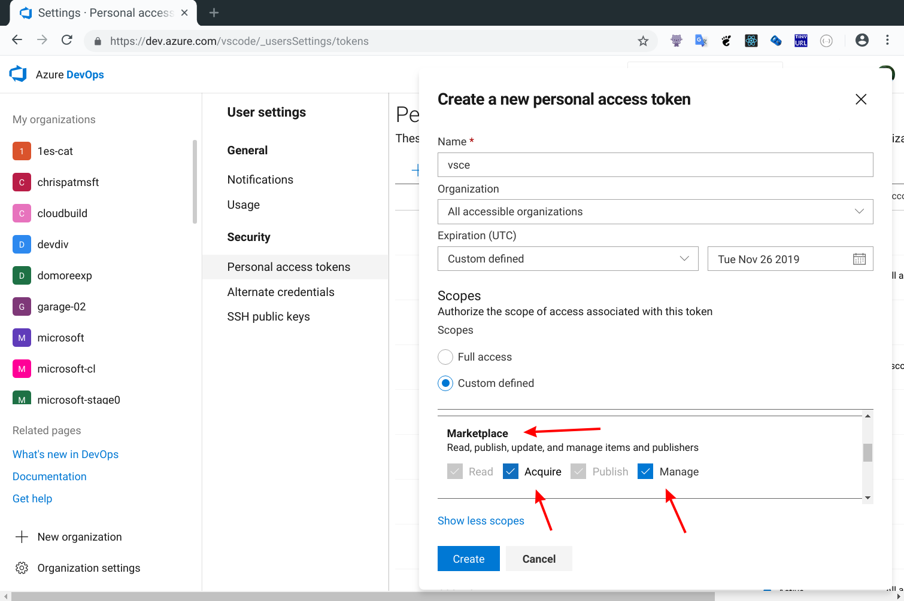

# 👨‍💻 Vscode Eklentisi VSIX Programlama

## 🧱 Temel Gereksinimler

- Nodejs
- Javascript bilgisi

## 🧃 Giriş Kalıbını Oluşturma

Video anlatımı için [buraya][vscode create theme extension in 1 min - shows all steps] bakabilirsin.

- Terminal'i yada cmd'yi açın
- `npm i -g yo generator-code` ile kalıp oluşturucuyu indirin
- Kalıbın oluşmasını istediğiniz dizine `cd` ile gidin
- `yo code` ile gerekli seçenekleri işaretleyerek kalıbı oluşturun
- Tüm kalıp otomatik olarak kurulacaktır, kalıp içerisinde otomatik tanımlananlar:
  - Debug aracı
  - Ek açıklamalar
  - Package.json

## 🔀 Eklenti Oluşturma ve Paylaşma

- `npm install -g vsce` ile `vsix` oluşturucuyu indirin
- `vsce package` ile `.vsix` uzantılı eklentiyi oluşturun
- [VsCode Marketplace](https://marketplace.visualstudio.com/manage/publishers/)'den `vsix` uzantılı dosyanızı sunucuya yükleyin

> VSCode'un resmi sitesindeki [Publishing Extension](https://code.visualstudio.com/api/working-with-extensions/publishing-extension) açıklamasına bakmanda fayda var.

## 🖤 Eklentiyi Komut İsteminden Paylaşma

- Token'iniz yoksa, [Token Oluşturma](#Token-Olu%C5%9Fturma) adımından token oluşturun
- `vsce login <id>`
  - Kopyaladığınız **ID**'yi yapıştırın
- Package json'u [Package JSON Örneği](#Package-JSON-%C3%96rne%C4%9Fi) gibi ayarların
- `vsce publish` ile eklentiyi [VsCode Marketplace](https://marketplace.visualstudio.com/manage/publishers/)'e gönderebilirsiniz
  - `vscode publish minor` ile versiyonu arttırarak gönderirsiniz

> VSCode'un resmi sitesindeki [Publishing Extension](https://code.visualstudio.com/api/working-with-extensions/publishing-extension) açıklamasına bakmanda fayda var.


### 🔑 Token Oluşturma

- Öncelikle [buradan][token oluşturma] token oluşturmanız gerekmekte
  - `New Token` -> Organizatin **All accessiable organization**'ı seçin
  - `Scopes` altında `Marketplace` kısmından `Acquire` ve `Manage` kutucuklarını seçin
  - Tokeni oluşturup, verilen **ID**'yi kopyalayın





### 📜 Package JSON Örneği

```json
{
  "publisher": "Buraya vsce ile girdiğiniz hesabı yazın",
  "icon": "resim yolu",
  "license": "SEE LICENSE IN LICENSE.txt",
  "keywords": ["anahtar", "helimeler"],
  "repository": {
    "type": "git",
    "url": "github_proje urli"
  }
}
```

## 🔗 Harici Bağlantılar

- [VsCdode Publishing Extension](https://code.visualstudio.com/api/working-with-extensions/publishing-extension)
- [VsCode Eklentileri Sık Sorulan Sorular](https://code.visualstudio.com/api/>working-with-extensions/publishing-extension#common-questions)

[özel tema oluşturma]: https://www.youtube.com/watch?v=3Ju74i1MyBg
[token oluşturma]: https://dev.azure.com/yedhrab/_usersSettings/tokens
[vscode create theme extension in 1 min - shows all steps]: https://youtu.be/z_D_86WjXg4
