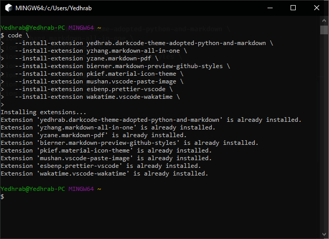

# VsCode Özelleştirmem <!-- omit in toc -->

## İçerikler <!-- omit in toc -->

- [Snippets](#Snippets)
- [Editör Ayarlarım](#Edit%C3%B6r-Ayarlar%C4%B1m)
- [Klavye Kısayolları Ayarım](#Klavye-K%C4%B1sayollar%C4%B1-Ayar%C4%B1m)
- [Eklentirlerim](#Eklentirlerim)
- [Harici Bağlantılar](#Harici-Ba%C4%9Flant%C4%B1lar)

## Snippets

Verimli çalışmak için kod parçaları

<details>
<summary>Markdown snippets</summary>

````json
{
  // Place your snippets for markdown here. Each snippet is defined under a snippet name and has a prefix, body and
  // description. The prefix is what is used to trigger the snippet and the body will be expanded and inserted. Possible variables are:
  // $1, $2 for tab stops, $0 for the final cursor position, and ${1:label}, ${2:another} for placeholders. Placeholders with the
  // same ids are connected.
  // Example:
  // "Print to console": {
  // 	"prefix": "log",
  // 	"body": [
  // 		"console.log('$1');",
  // 		"$2"
  // 	],
  // 	"description": "Log output to console"
  // }
  "Insert head": {
    "prefix": "head",
    "body": [
      "# $1 <!-- omit in toc -->",
      "",
      "$2",
      "## İçerikler <!-- omit in toc -->",
      "",
      "$0"
    ],
    "description": "Markdown üst bilgisi ekleme"
  },
  "Omit": {
    "prefix": "om",
    "body": ["<!-- omit in toc -->"],
    "description": "Omit from ToC"
  },
  "Insert 1 button key": {
    "prefix": "k1",
    "body": ["<kbd>$1</kbd>$0"],
    "description": "1 Buton anahtarı oluşturur"
  },
  "Insert 2 button key": {
    "prefix": "k2",
    "body": ["<kbd>$1</kbd> + <kbd>$2</kbd>$0"],
    "description": "2 Buton anahtarı oluşturur"
  },
  "Insert 3 button key": {
    "prefix": "k3",
    "body": ["<kbd>$1</kbd> + <kbd>$2</kbd> + <kbd>$3</kbd>$0"],
    "description": "3 Buton anahtarı oluşturur"
  },
  "Insert toggle menu": {
    "prefix": "menu",
    "body": [
      "<details>",
      "<summary>$1</summary>",
      "",
      "$1",
      "",
      "</details>",
      "",
      "$0"
    ],
    "description": "3 Buton anahtarı oluşturur"
  },
  "Insert code": {
    "prefix": "code",
    "body": ["```$1", "$2", "```", "$0"],
    "description": "Kod parçası ekler"
  },
  "Insert toggle code menu": {
    "prefix": "code-menu",
    "body": [
      "<details>",
      "<summary>$1</summary>",
      "",
      "```$2",
      "$3",
      "```",
      "",
      "</details>",
      "",
      "$0"
    ],
    "description": "Açılır kod menüsü ekler"
  },
  "Insert code block": {
    "prefix": "code-block",
    "body": [
      "##$1",
      "",
      "$2",
      "",
      "<details>",
      "<summary>$3</summary>",
      "",
      "```$4",
      "$5",
      "```",
      "",
      "</details>",
      "",
      "$0"
    ],
    "description": "Kod bloğu oluşturur"
  }
}
````

</details>

## Editör Ayarlarım

<details>
<summary>Ayaları göster</summary>

```json
{
  // Tasarım ve arayüz ayarları
  "workbench.iconTheme": "material-icon-theme",
  "workbench.colorTheme": "DarkCode Theme Adopted Python and Markdown",
  "window.menuBarVisibility": "toggle",
  // Terminal ayarları
  "terminal.integrated.cursorStyle": "line",
  // Gizlilik ayarları
  "telemetry.enableTelemetry": false,
  "telemetry.enableCrashReporter": false,
  // Editör ayarları
  "editor.defaultFormatter": "esbenp.prettier-vscode",
  "editor.formatOnSave": true,
  "editor.minimap.enabled": false,
  "editor.cursorBlinking": "phase", // İmleç yanıp sönmesi
  "files.insertFinalNewline": true, // Dosyaların sonuna boş satır koyar
  // Font Ayarları https://github.com/tonsky/FiraCode/releases/download/1.206/FiraCode_1.206.zip
  "editor.fontFamily": "Fira Code Retina, 'Droid Sans Mono', 'monospace', monospace, 'Droid Sans Fallback'", // Linux fontu: Droid Sans Mono
  "editor.fontLigatures": true,
  "editor.fontSize": 13.1,
  // Terminal ayarlarım
  "terminal.integrated.fontSize": 13,
  "terminal.integrated.fontFamily": "Consolas",
  "terminal.integrated.shell.windows": "C:\\Program Files\\Git\\usr\\bin\\bash.exe",
  // Satır uzunluğu ayarı
  "editor.wordWrap": "bounded",
  "editor.wordWrapColumn": 200,
  // Dosya işlemleri ayarları
  "explorer.confirmDragAndDrop": false,
  "explorer.confirmDelete": false,
  // Git ayarları
  "git.confirmSync": false,
  "git.autofetch": false,
  // Github ayarları
  "github.username": "yedhrab",
  // Python ayarları
  "python.jediEnabled": false,
  // Javasciprt ayarları
  "javascript.updateImportsOnFileMove.enabled": "always",
  // Pano'dan resim kopyalam ayarı
  "pasteImage.path": "${projectRoot}/res",
  // Markdown PDF ayarları
  "markdown.extension.toc.downcaseLink": false,
  "markdown-pdf.outputDirectory": "Dökümanlar",
  "markdown-pdf.styles": ["http://tiny.cc/yek86y"],
  "markdown-pdf.headerTemplate": "<div style=\"width: 100%; font-size: 7px; margin: 0 auto; font: Segoe UI Light; text-align: center;\"><div style=\"float: left; width: 33.33%;\"><a style='text-decoration: none; font: Risque; color: red;' href='https://gogetfunding.com/yemreak/'>Destek ❤</a></div><div style=\"float: left; width: 33.33%;\"><a style='text-decoration: none; color: navy;' href='https://www.yemreak.com'>The MIT License Copyright &copy; Yunus Emre Ak</a></div><div style=\"float: left; font-size: 7px; width: 33.33%; color: gainsboro;\"><span class='date'></span></div></div>",
  "markdown-pdf.footerTemplate": "<div style=\"width: 100%; font-size: 7px; margin: 0 auto; font: Segoe UI Light\"> <div style=\"float: left; width: 20%; text-align: center\"><a style=\"text-decoration: none; display: inline-block; color: dodgerblue;\" href=\"https://yemreak.com\">Website</a></div><div style=\"float: left; width: 20%; text-align: center\"><a style=\"text-decoration: none; display: inline-block; color: dodgerblue;\" href=\"https://github.com/yedhrab \">Github</a></div><div style=\"float: left; width: 20%; text-align: center\"><span class=\"pageNumber \">3 </span> / <span class=\"totalPages \"> 5</span></div><div style=\"float: left; width: 20%; text-align: center\"><a style=\"text-decoration: none; display: inline-block; color: dodgerblue;\" href=\"https://www.linkedin.com/in/yemreak/\">LinkedIn</a></div><div style=\"float: left; width: 20%; text-align: center\"><a style=\"text-decoration: none; display: inline-block; color: dodgerblue;\" href=\"mailto::yedhrab@gmail.com?subject=YPDF%20%7C%20Github\">İletişim</a></div></div>"
}
```

</details>

## Klavye Kısayolları Ayarım

<details>
<summary>Windows 10</summary>

```json
// Place your key bindings in this file to override the defaults
[
  {
    "key": "ctrl+oem_7 ctrl+oem_7",
    "command": "git.sync"
  },
  {
    "key": "ctrl+j",
    "command": "workbench.action.terminal.toggleTerminal"
  },
  {
    "key": "ctrl+j",
    "command": "-workbench.action.togglePanel"
  },
  {
    "key": "alt+v",
    "command": "extension.pasteImage",
    "when": "editorTextFocus"
  },
  {
    "key": "ctrl+alt+v",
    "command": "-extension.pasteImage",
    "when": "editorTextFocus"
  }
]
```

</details>

<details>
<summary>Linux</summary>

```json
[
  {
    "key": "ctrl+[KeyI] ctrl+[KeyI]",
    "command": "git.sync"
  },
  {
    "key": "ctrl+[KeyI] ctrl+p",
    "command": "git.pull"
  },
  {
    "key": "ctrl+shift+[KeyI] ctrl+shift+p",
    "command": "git.pullFrom"
  },
  {
    "key": "ctrl+[KeyI] ctrl+o",
    "command": "git.checkout"
  },
  {
    "key": "ctrl+j",
    "command": "workbench.action.terminal.toggleTerminal"
  },
  {
    "key": "ctrl+j",
    "command": "-workbench.action.togglePanel"
  },
  {
    "key": "ctrl+meta+left",
    "command": "workbench.action.moveEditorToLeftGroup"
  },
  {
    "key": "ctrl+meta+right",
    "command": "workbench.action.moveEditorToRightGroup"
  },
  {
    "key": "ctrl+meta+up",
    "command": "workbench.action.moveEditorToAboveGroup"
  },
  {
    "key": "ctrl+meta+down",
    "command": "workbench.action.moveEditorToBelowGroup"
  }
]
```

</details>

## Eklentirlerim

<details>
<summary>Eklenti indirme komutunu göster</summary>

```code
code \
  --install-extension yedhrab.darkcode-theme-adopted-python-and-markdown \
  --install-extension yzhang.markdown-all-in-one \
  --install-extension yzane.markdown-pdf \
  --install-extension bierner.markdown-preview-github-styles \
  --install-extension pkief.material-icon-theme \
  --install-extension mushan.vscode-paste-image \
  --install-extension esbenp.prettier-vscode \
  --install-extension wakatime.vscode-wakatime \
  --install-extension ms-vscode.github-issues-prs \
```



</details>

## Harici Bağlantılar

- [Faydalı eklentiler](https://nickjanetakis.com/blog/my-favorite-vscode-extensions-and-settings)
