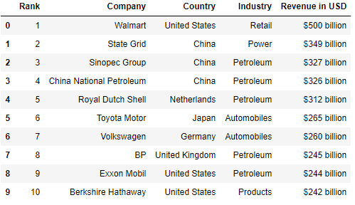
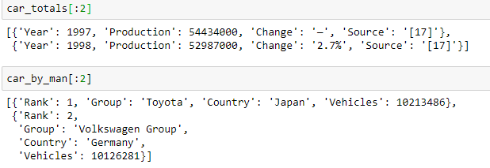

# 🕵️‍ İnternetten Veri Çekme İşlemi

## 🧱 Verilerin Sağlaması Gereken Özellikler

Günlük hayatta veriler istediğimiz kadar basit olmaz, bunlar üzerinde işlemler yaparak uygun hale getiririz

- Tek tablodan oluşan basit veya bağlantılı bir kaç tablodan oluşan
  - Farklı veriler için *mapping* ile veri tipleri birbirine benzetilir
- Kolay analiz edilebilir formatta olan
- Makine öğrenimine sokulabilecek veriler
- Düşük karmaşıklığa sahip
- Yüksek boyutlu veriler için optimizasyon

## 🗽 Veri Çekmeye Giriş

Web siteleri üzerindeki tabloları çekmek için `pd.read_html` kullanılır

### 🆔 Veri Çekme Sorunları Engellemek için `UserAgent` Ayarlama

Bazı websiteleri, isteklerin nereden geldiğini bilmeden hareket edemezler. Bu sebeple isteği detaylandırmamız gerekmektedir.

> `HTML` alanına bağlantıyı yazın, `pd.read_html(html)` şeklinde kullanın

```py
from urllib.request import urlopen, Request

HTML = "" # Örn: https://en.wikipedia.org/

headers = {'User-Agent': 'Mozilla/5.0 (Windows NT 6.1) AppleWebKit/537.36 (KHTML, like Gecko) Chrome/41.0.2228.0 Safari/537.3'}
reg_url = HTML
req = Request(url=reg_url, headers=headers) 
html = urlopen(req).read() # Pandas için kullanılacak html objesi
```

> ["[Python][Crawler]“HTTP Error 403: Forbidden”](https://medium.com/@speedforcerun/python-crawler-http-error-403-forbidden-1623ae9ba0f)

## 🌍 Internetten Tablo Çekme Örneği

Tüm tablo verileri arasında `0`, `1` ... değerleri ile gezinebiliriz.

```py
import pandas as pd
import json
df = pd.read_html('https://en.wikipedia.org/w/index.php?title=Fortune_Global_500&oldid=855890446', header=0)[1]
fortune_500 = json.loads(df.to_json(orient="records"))
df
```



```py
df_list = pd.read_html("https://en.wikipedia.org/w/index.php?title=Automotive_industry&oldid=875776152", header=0)
car_totals = json.loads(df_list[1].to_json(orient="records"))
car_by_man = json.loads(df_list[3].to_json(orient='records'))
```



## 📊 Verileri Kategorize Etme

Çok yüksek veriler 🗃 ile başa çıkmak zordur.

- Kategorize işlemleri için birebir aynı metin aranmaz
- `Fuzzy Match` olan yöntem ile çok benzeyen metinler aynı gruba alınır

### 🥴 Fuzzy Match

Kelimelerin birbirine çok yakın olanlarını bulur.

```py
def fuzzy_match(word, s):
    words = set(word.split(' '))
    overlaps = [(k, len(v.intersection(words))) for k, v in s.items()]
    return max(overlaps, key=lambda x : x[1])[0]
```

```py
split_names = {i: set(i.split(' ')) for i in shares.keys()}
for i in petro_companies:
    match = fuzzy_match(i, split_names)
    print("matched {} to {}".format(i, match))
    market_share[i] = shares[match]
```
