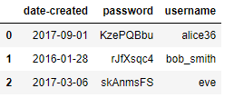
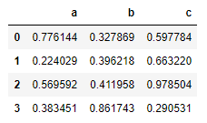

# Pandas 

Veri çekme işlemleri için kullanılır.

## Dict'i CSV'ye Çevirme

```python
df = pd.DataFrame({'name': ['Raphael', 'Donatello'],
                   'mask': ['red', 'purple'],
                   'weapon': ['sai', 'bo staff']})

df.to_csv(index=False)
# 'name,mask,weapon\nRaphael,red,sai\nDonatello,purple,bo staff\n'
```

## Temel İşlemler

| DataFrame İşlemi                                   | Açıklama                                         |
| -------------------------------------------------- | ------------------------------------------------ |
| `df.loc[<i>] = <list>`                             | i. **indekse** değer atama                       |
| `df.iloc[<i>] = <list>`                            | i. **satıra** değer atama (çok tercih etme)      |
| `df.drop(DATA_FRAME.index, inplace=True)`          | Tüm verileri silme                               |
| `df.to_csv(<file | filename>, header=f.tell()==0)` | CSV'ye ekleme (`tell` dosyanın başı ise 0 verir) |
| `len(pandas.read_csv(<path_to_csv>))`              | Veri sayısını bulma                              |

## Tablo İşlemleri

### Tablo Oluşturma

```py
import pandas as pd

 # List ile tablo oluşturma
df = pd.DataFrame(<list>, columns=<list>)
df = pd.DataFrame(list(zip(<col1>, <col2>, <col3>, <col4>)))
df = pd.DataFrame(list(zip(<val_list>, <val_list>)), columns=<col_list>, index = <iname_list>) #

# Dict ile tablo oluşturma
df = pd.DataFrame(<dict>, index=<iname_list>)
df = pd.DataFrame({<col>: <val_list>, ...}, index=<iname_list>)

# Sütun değiştirme
df.columns = <list>

# Index değiştirme (ve df'e uygulama)
df.set_index(<col>, inplace=True)
# Index sıfırlama (ve df'e uygulama)
df.reset_index(inplace=True)
# Birden fazla index belirleme
df.set_index(['username', 'email'])
```

<details>
<summary>Kullacı tablosu örneği</summary>

```py
from string import ascii_letters, digits
import numpy as np
import datetime

usernames = ['alice36', 'bob_smith', 'eve']

passwords = [''.join(np.random.choice(list(ascii_letters + digits), 8)) for x in range(3)]
creation_dates = [datetime.datetime.now().date() - datetime.timedelta(int(x)) for x in np.random.randint(0, 1500, 3)]

df = pd.DataFrame({'username': usernames, 'password': passwords, 'date-created': pd.to_datetime(creation_dates)})
df
```



</details>

<details>
<summary>Numpy'dan tablo oluşturma</summary>

```py
random_data = np.random.random((4,3))
df_random = pd.DataFrame(random_data, columns=['a', 'b', 'c'])
df
```



</details>

### Tablo Birleştirme

| İşlem                                                                               | Açıklama               |
| ----------------------------------------------------------------------------------- | ---------------------- |
| `pd.merge(left=<df1>,right=<df2>, left_on=<iname1>, right_on=<iname2>)`             | Kesişimi (Inner join)  |
| `pd.merge(left=<df1>,right=<df2>, how='left', left_on=<iname1>, right_on=<iname2>)` | A ve kesim (Left join) |
|                                                                                     |

> Kaynaklar: [Pandas Merging Data](https://datacarpentry.org/python-ecology-lesson/05-merging-data/index.html)

### Tabloyu Bölme

Ana yapı `df<işlem>`

| İşlem                               | Açıklama                                 |
| ----------------------------------- | ---------------------------------------- |
| `.dtypes`                           | Tablodaki özellikleri (attr) listeler    |
| `[<col>]`                           | Sütun alma (`pandas.core.series.Series`) |
| `mean()`                            | Sütunların ortalama değerlerini alma     |
| `loc[<iname>]`                      | İndex ismi ile veri okuma                |
| `.loc[[<iname>, ...], <col_list> ]` | Tabloyu parçalama                        |
| `.head()`                           | Tablonun başını görüntüleme              |
| `.tail()`                           | Tablonun sonunu görüntüleme              |

### Tablodan Veri Alma

| İşlem                | Açıklama                                                      |
| -------------------- | ------------------------------------------------------------- |
| `[<col>]`            | Sütun alma (`pandas.core.series.Series`)                      |
| `df[<col>][<i>]`     | `col` sütunundaki `i`. öğeye erişme                           |
| `df.loc[<i>, <col>]` | `i`. öğenin `col` verisine erişme                             |
| `df.describe()`      | İstatistiksel verileri alma (count mean std min 25 50 75 max) |

### Tabloda Arama

| İşlem                                                         | Açıklama                               |
| ------------------------------------------------------------- | -------------------------------------- |
| `df.loc[df[<column_name>] == <some_value>]`                   | Sütunun değeri eşit olanları listeleme |
| `df.loc[df['column_name'].isin(some_values)]`                 |
| `df.loc[(df['column_name'] >= A) & (df['column_name'] <= B)]` |

> ⚠ `df['column_name'] >= A & df['column_name'] <= B` yapısı parantez olmadığından `df['column_name'] >= (A & df['column_name']) <= B` şeklinde algılanır.

> Kaynak: [Stackoverflow](https://stackoverflow.com/a/17071908/9770490)

### Tablo ile İlgili Code Snippets

<!-- TODO: Düzenlenecek -->

```py
# Max / Sum yapıp verileri listeler
idx = pb_all_data.groupby(['post_code'])['items'].transform(max) == pb_all_data['items']
df_items_by_region = pb_all_data[idx]['items'] /  pb_all_data.groupby('post_code').sum()['items']

items_by_region = []
for i in range(100):
    x, y = df_items_by_region.index[i]
    z = df_items_by_region[i]
    items_by_region.append((x, y, z))
```

> Kaynak: [Stackoverflow](https://stackoverflow.com/a/15705958/9770490)

## Veri İşlemleri

### Verileri Okuma

Ana yapı `df.<metod>` şeklindedir.

> `<işlem>[<i>]` ile `i`. değer alınır

| Metod                               | Açıklama                                      |
| ----------------------------------- | --------------------------------------------- |
| `.loc[[<iname>, ...], <col_name> ]` | Birden fazla verinin özelliğini alma          |
| `.loc[<iname>:<iname>, <col_name>]` | İki index ismi arasındaki verileri alma       |
| `.iloc[<i>]`                        | İlk `i` veriyi alma                           |
| `.iloc[<i1>:<i2>, <col_i>]`         | `i1` ile `i2` arasındaki `col_i`. sütunu alma |

### Verileri Değiştirme

| İşlem                                        | Açıklama                                                      |
| -------------------------------------------- | ------------------------------------------------------------- |
| `df['<col_name'] = <val_list>`               | Sütun ekleme (`val_list` uzunluğu satır sayısına eşit olmalı) |
| `np.random.choice(<list>, size=len(df)`      | Örnek `<val_list>`                                            |
| `df[<iname>] = <list>`                       | `iname` isminde sütun oluşturma                               |
| `df.loc[<i>] = <list>`                       | `i`. satırda eleman oluşturma                                 |
| `df.loc[<iname>] = {<col_name>: <val>, ...}` | Satır ekleme                                                  |
| `df.drop(<iname>)`                           | Satır (veri) silme                                            |
| `df.drop(<i>, inplace=True)`                 | `i`. satırı silme                                             |
| `df.drop(<col_name>, axis=1)`                | Sütun silme                                                   |
| `df.drop(<col_name>, axis=1, inplace=True)`  | Değişikliği tablo üstünde uygulama                            |
| `df.index.<iname> = <name>`                  | `iname` ismindeki sütunun adını `name` yapma                  |

## Ek Bilgiler

- Rar dosyalarını çakarma `!unrar e keylogs.rar`
- [Looping over Pandas](https://www.polymorphe.org/index.php/looping-over-pandas-data-mkd) (Yüksek miktarda veri için)
- [Online CSV GÖrüntüleme](http://www.convertcsv.com/csv-viewer-editor.htm)
- [10dk'dan Pandas](https://pandas.pydata.org/pandas-docs/stable/getting_started/10min.html)
- [dataframe.append() & loc[] , iloc[]](https://thispointer.com/python-pandas-how-to-add-rows-in-a-dataframe-using-dataframe-append-loc-iloc/)
- [10 Python Pandas tricks that make your work more efficient](https://towardsdatascience.com/10-python-pandas-tricks-that-make-your-work-more-efficient-2e8e483808ba)
