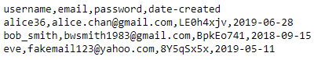
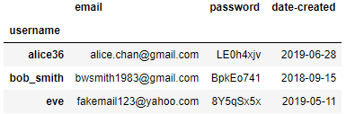
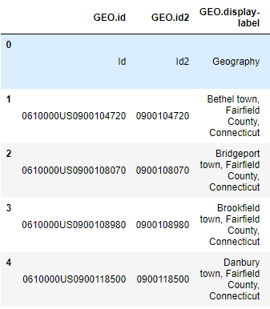

# Pandas Hızlı Notlar

## Dosyadan Verileri Okuma

Detaylar için [Pandas dökümanına](https://pandas.pydata.org/pandas-docs/stable/user_guide/io.html) bakabilirsin.

| Uzantı | Açıklama               | Açılımı         |
| ------ | ---------------------- | --------------- |
| `csv`  | `,` ile ayrılan notlar | Comma delimeted |
| `tsv`  | `\t` ile ayırma        | Tab delimeted   |

```py
import pandas as pd

# Basit olarak csv okuma
pd.read_csv(<path_to_csv>)

# Satırı atlayarak csv okuma
pd.read_csv(<path_to_csv>, skiprows=[1])

# Başlangıç indeksi belirleme
pd.read_csv(<path_to_csv>, index_col=0)

# Başlıksız verileri okuma
pd.read_csv(<path_to_csv>, names=<list>, header=None)

# Tab ile ayrılan verileri okuma
pd.read_csv(<path_to_tsv>, delimiter='\t')
```

<details>
<summary>Csv okuma yöntemleri</summary>

```py
csv = [','.join(map(lambda x: str(x), row)) for row in np.vstack([df.columns, df])]
with open('./data/read_csv_example.csv', 'w') as f:
    [f.write(line + '\n') for line in csv]

!cat ./data/read_csv_example.csv
```



```py
pd.read_csv('./data/read_csv_example.csv')
```



</details>

## Verileri Filtreleme

| Operatör              | Açıklama                 |
| --------------------- | ------------------------ |
| `~`                   | not                      |
| `&`                   | and                      |
| `|`                   | or                       |
| `str.contains(<str>)` | String'e göre filtreleme |

```py
df = pd.DataFrame()

# Verinin en tepesini gösterme
df.head()

# Koşulun sağlandığı verileri alma
df = df[df['state'] == 'AZ']

# Eşsiz verileri alma
df['state'].unique()

# Birden fazla koşula göre alma
# `()` kullanımlaıdır yoksa `&` işlemi beklendiği gibi çalışmaz
df[(df['state'] == 'AZ') & (df['review_count'] > 10)].head()

# Koşulun sonucuna göre `True - False` dizisi döndürür
(yelp_df['state'] == 'AZ').head()
(yelp_df['state'] == 'AZ').dtype # dtype('bool')

# El ile seçme (1. indexteki elemanı almaz)
df[[True, False, True]]

# Bool değeri alan sütuna göre listeleme (open = {True | False})
df[df['open']].head() # Açık olanları listeler
df[~df['open']].head() # Kapalı olanları listeler `~ = !`
df[df['open'].fillna(False)].head() # Nan değerlerini false sayarak listeleme

# Strig'e göre filtreleme (`vegas` içeren şehirleri alma)
df = df[df['city'].str.contains('Vegas')]

# Birden fazla değerde arama (regex aramasıdır. | veya demek)
df = df[df['city'].str.contains('|'.join(opioids), case=False)

# Listedeki elemanları içeriyor mu? (büyük-küçük harften bağımsız arama)
df[df['column'].str.lower().isin([x.lower() for x in mylist])]
```

## Fonksiyonlar ve Birleştirme İşlemleri

```py
# Log hesaplaması (her veri için log alır)
log_review_count = np.log(df['review_count'])

# Ortalama hesaplama (tek değer döndürür)
mean_review_count = yelp_df['review_count'].mean()

# DB'ye fonksiyon uygulama (parametre olarak `df['attributes']` almak zorundadır)
# True - False serisi döndürür
delivery_attr = df['attributes'].apply(<func_attr_dict>)
```

## GroupBy Kullanımı

Belirli bir öğeye göre gruplar, çakışanlara verilen işlemi uygular.

- Örn: `max()`, `mean()` gibi metodlarda en yüksek veya ortalama alınır

> [Group By: split-apply-combine](https://pandas.pydata.org/pandas-docs/stable/user_guide/groupby.html) dökümanına bakmanda fayda var.

```py
# Şehre göre birleştirme ve yıldızların ortalamasını alma
stars_by_city = yelp_df.groupby('city')['stars'].mean()

# Şehre göre gruplayıp, çakışan verilerde birden fazla metod kullanma
# Sırayla: Stars sütunu altında: ortalama, standart sapma, diğer sütunlarda toplam, miktar
agg_by_city = yelp_df.groupby('city').agg({'stars': {'mean': 'mean', 'std': 'std'}, 'review_count': 'sum', 'business_id': 'count'})

# Birleştirilmiş sütunları ayırma
new_columns = map(lambda x: '_'.join(x),
                  zip(agg_by_city.columns.get_level_values(0),
                      agg_by_city.columns.get_level_values(1)))
agg_by_city.columns = new_columns
agg_by_city.head()

# Gruplanmış verileri index dict'ine  çevirme
dict_city = by_city.groups

# Gruplanmış verilerden bir tanesini alma
by_city.get_group('Anthem').head()
```

## Sıralama İşlemleri

```py
# Yıldızlara göre veriyi sıralama
df.sort_values('stars').head()

# Bussiness_id'nin indexine göre sıralama
df.set_index('business_id').sort_index().head()

# Post_code göre sıralayıp, ilk post_code'u alma
unique_practices = practices.sort_values('post_code').groupby('code').first().reset_index()
```

## Veri Kümelerinin Birleştirilmesi

```py
# Şehir ve bölge olarak verileir ayırma
census['city'] = census['GEO.display-label'].apply(lambda x: x.split(', ')[0])
census['state'] = census['GEO.display-label'].apply(lambda x: x.split(', ')[2])

# Bölge isiimlerini değiştirme
state_abbr = dict(zip(census['state'].unique(), <list>))
census['state'] = census['state'].replace(state_abbr)

# ('town', 'village' gibi terimlerin olduğu son kelimeyi kaldırma)
census['city'] = census['city'].apply(lambda x: ' '.join(x.split(' ')[:-1]))
```

```py
# State ve city verilerine göre birleştirme (inner-join)
merged_df = yelp_df.merge(census, on=['state', 'city'])
merged_df = yelp_df.merge(census, on=['state', 'city'], how='left') # Left-join

# Veri kümelerini birleştirme (ucuna eklenir)
nov = pd.concat([nov18, nov11])
nov['DATE'].unique() # Eklenmeyi kontrol etme

# Şehirdeki toplam iş'leri bulma
city_counts = yelp_df.groupby('city')['business_id'].count().rename('city_counts')
# Bulunan satırı tablonun sonuna sütun olarak ekleme
# Önce indexler aynı yapılır, sonra index'e göre concat edilir, sonra index sıfırlanır
pd.concat([yelp_df.set_index('city'), city_counts], axis=1, join='inner').reset_index()
```

<details>
<summary>Dataset</summary>



</details>

## Zaman Serileri ile Çalışma

```py
# HTML'den veri alma
pop_growth = pd.read_html('https://web.archive.org/web/20170127165708/https://www.census.gov/population/international/data/worldpop/table_population.php', attrs={'class': 'query_table'}, parse_dates=[0])[0]
# null verilerini kaldırma
pop_growth.dropna(inplace=True)

# İndeksi yıla göre ayarlarsak, `resample` metodunu kullanabiliriz
pop_growth.set_index('Year', inplace=True)
# 10 yıllık olarak indexleniyor ve 10 yıllık ortalama listenecek
# İstersek mean, median, sum, last ve first de kullanıabilriiz
pop_growth.resample('10AS').mean()

# Kayıp veriler için ototmatik tamamlama yapma
# bfill() backward filling, ffill() forward filling (1Q 1. çeyrek demek (çeyrek yıl))
pop_growth.resample('1Q').bfill()
pop_growth.resample('1Q').ffill()
```

## Pandas Zaman Değişkeni (`Timestamp`)

```py
print(pd.Timestamp('January 8, 2017'))
print(pd.Timestamp('01/08/17 20:13'))
print(pd.Timestamp(1.4839*10**18))

# Zamanlar arasında çıkartma yapılabilir (191 days 09:16:00)
print(pd.Timestamp('Feb. 11 2016 2:30 am') - pd.Timestamp('2015-08-03 5:14 pm'))

# Zamanlar arasında gelişmiş hesaplamalar
from pandas.tseries.offsets import BDay, Day, BMonthEnd

print(pd.Timestamp('January 9, 2017') - Day(4)) # Gün
print(pd.Timestamp('January 9, 2017') - BDay(4)) # İş günü (Business day)
print(pd.Timestamp('January 9, 2017') + BMonthEnd(4)) # Aydaki iş bitiş günü

# Zaman aralıkları oluşturma (8 güner arayla zaman oluşturma)
pd.date_range(start='1/8/2017', end='3/2/2017', freq='B')

# Python datetime ile uyumludur
import datetime
pd.Timestamp('May 1, 2017') - datetime.datetime(2017, 1, 8) # Timedelta('113 days 00:00:00')
```

## Pandas ile Görselleştirme

```py
# 30 çubuklu histogram ile çizme
yelp_df['review_count'].apply(np.log).hist(bins=30)

# Çizgi grafiği çizdirme
pop_growth['Annual Growth Rate (%)'].plot()
```

## Egzersizler

<details>
<summary>dw3</summary>

```py
# Post_code göre sıralayıp, ilk post_code'u alma
unique_practices = practices.sort_values('post_code').groupby('code').first().reset_index()

# Verileri birleştirme
merged_data = scripts.merge(unique_practices[['code', 'post_code']], how='left', left_on='practice', right_on='code')

# Post_code ve bnf_name'e ait toplam items'ları hesaplama. Indeksi sıfırlama (post_code değil 0, 1, 2 ... diye olsun)
total_items_by_pc_bnf = merged_data.groupby(['post_code', 'bnf_name'])['items'].sum().reset_index()

# En yüksek `items`a sahip `post_code`ların index tablosunu alma
max_mask = total_items_by_pc_bnf.groupby('post_code')['items'].idxmax()

# Maskeden verileri alıp, `post_code`a göre sıralama ve ilk 100 veriyi alma
max_items_by_pc = total_items_by_pc_bnf.loc[max_mask].sort_values('post_code')[:100]

# `post_code` başına düşen toplam `items`ı hesaplama, indexi `post_code` yerine 0, 1, .. şekline çevirme ve `post_code`a göre sıralama
sum_items_by_pc = total_items_by_pc_bnf.groupby('post_code')['items'].sum().reset_index().sort_values('post_code')

# Toplam ve Max tablolarını setlerini birleştirme (left join)
merged_max_sum_items_by_pc = max_items_by_pc.merge(sum_items_by_pc, how="left", on='post_code')

# Toplam / Max oranını hesaplama ve sütuna atma
merged_max_sum_items_by_pc['ratio'] = merged_max_sum_items_by_pc['items_x'] / merged_max_sum_items_by_pc['items_y']

# Toplamları ve Max değerlerini kaldırma (axis=1 -> sütun'u kaldır, inplace=True -> Değişikliği uygula)
merged_max_sum_items_by_pc.drop(['items_x', 'items_y'], axis=1, inplace=True)

# Verileri listeye çevirme
items_by_region = merged_max_sum_items_by_pc.values.tolist()
```

</details>

<details>
<summary>dw3 old</summary>

```py
merged_data = scripts.merge(unique_practices[['code', 'post_code']], how='left', left_on='practice', right_on='code')

```py
all_data = pd.merge(left=scripts,right=practices, left_on='practice', right_on='code').filter(['post_code', 'bnf_name', 'items'])

# Bir bnf, birden fazla posta kodunda olmayacak
# all_data.loc[all_data.groupby('bnf_name')['post_code'].transform(min) == all_data['post_code']]

all_data = all_data.sort_values('post_code')

# Her ayrı post ve bnf için toplam item sayısı
pb_all_data = all_data.groupby(['post_code', 'bnf_name']).sum()

# Post kodlardaki max item hesaplama (eski item yerine gelir)
idx = pb_all_data.groupby(['post_code'])['items'].transform(max) == pb_all_data['items']
df_items_by_region = pb_all_data[idx]['items'] /  pb_all_data.groupby('post_code').sum()['items']

items_by_region = []
for i in range(100):
    x, y = df_items_by_region.index[i]
    z = df_items_by_region[i]
    items_by_region.append((x, y, z))
```

</details>

<details>
<summary>dw4</summary>

```py
opioids = ['morphine', 'oxycodone', 'methadone', 'fentanyl', 'pethidine', 'buprenorphine', 'propoxyphene', 'codeine']
unique_post_practices = practices.sort_values('post_code').drop_duplicates('code','first')
scripts_posts = scripts.merge(unique_post_practices, left_on='practice', right_on='code')
unique_chem = chem.drop_duplicates('CHEM SUB')
unique_chem['opioid'] = unique_chem['NAME'].str.contains('|'.join(opioids), case=False)

chem_scripts = scripts_posts.merge(unique_chem, left_on='bnf_code', right_on='CHEM SUB',how='left')
chem_scripts['opioid'].fillna(False, inplace=True)

opioids_per_practice = chem_scripts.groupby('practice')['opioid'].mean()
mean_opioids = chem_scripts['opioid'].mean()
relative_opioids_per_practice = opioids_per_practice - mean_opioids

standard_error_per_practice = chem_scripts['opioid'].std()/np.sqrt(chem_scripts['practice'].value_counts())
opioid_scores = relative_opioids_per_practice/standard_error_per_practice

opioid_scores = opioid_scores.sort_values(ascending=False)
opioid_scores.head()
df = opioid_scores.to_frame().reset_index()
df = df.rename(columns= {0: 'opioid_scores'})
df.index.name = 'index'

total_prescriptions = scripts.groupby('practice').size() 
df1 = total_prescriptions.to_frame().reset_index()
df1 = df1.rename(columns= {0: 'scripts_no'})
df1.index.name = 'index'
merged_chem_f = df.merge(df1,how='left' ,left_on='index', right_on='practice')
uniquepractice1=(practices.sort_values('name')
        .groupby('code').first().reset_index())
uniquepractice1.head()
merged_chem_f_final= merged_chem_f.merge(uniquepractice1,how='left' ,left_on='practice', right_on='code')
merged_chem_f_final.sort_values('opioid_scores',ascending=False)

subset = merged_chem_f_final[['name','opioid_scores','scripts_no']]
tuples = [tuple(x) for x in subset.values]
anomalies=[]
anomalies=tuples[0:100]
```

</details>

<details>
<summary>dw5</summary>

```py
scripts16 = pd.read_csv('./dw-data/201606scripts_sample.csv.gz',compression='gzip', delimiter=',')
drugs_16 = scripts16[['bnf_name', 'items']]
drugs_16 = drugs_16.groupby('bnf_name').count().reset_index()
drugs_16.columns = ['bnf_name', 'count16']

drugs_17 = scripts[['bnf_name', 'items']]
drugs_17 = drugs_17.groupby('bnf_name').count().reset_index()
drugs_17.columns = ['bnf_name', 'count17']

drugs = drugs_16.merge(drugs_17, on='bnf_name', how='inner')
drugs = drugs[drugs['count16']>=50]

drugs.is_copy=False
drugs['growth'] = ((drugs['count17']-drugs['count16'])/drugs['count16'])
drugs = drugs[['bnf_name', 'growth', 'count16']]
drugs.sort_values('growth', ascending=False, inplace=True)
drugs_final = pd.concat([drugs.iloc[:50], drugs.iloc[-50:]], axis=0)

script_growth=drugs_final
```

</details>


## Karma Linkler

- [Pandas ile string işlemleri](https://pandas.pydata.org/pandas-docs/stable/user_guide/text.html)
