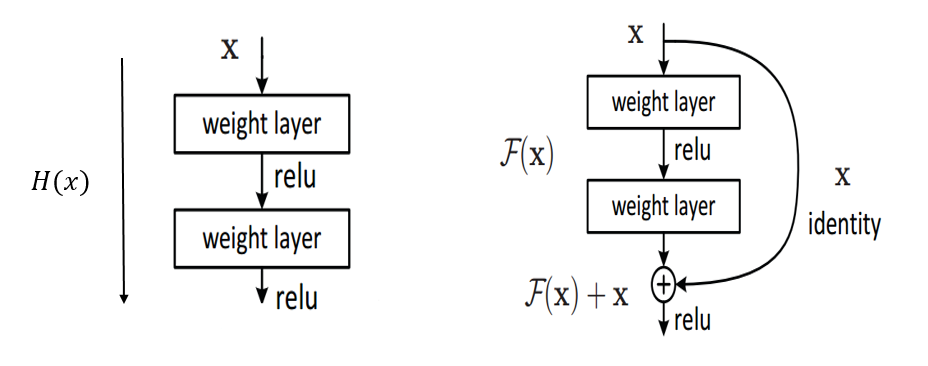

# Machine Learning <!-- omit in toc -->

## Terimler

### Ground truth

- Makineye öğrenmesi için veriler veri değeri
- Yanlış olabilir, veriyi yanlış ölçümlemiş olabiliriz
- Makine **ground truth** değerini tahmin ederse başarılı öğrenmiş demektir.

> ⚠ Ground truth yanlış dahi olsa makine bunu tahmin ediyorsa makine doğru öğrenmiş demektir. ([kaynak](https://datascience.stackexchange.com/questions/17839/what-is-ground-truth))

### Vanishing gradient

Derin katmanalara doğru gidildikçe meydana gelen nöron ölmesidir.

- _Backpropagation_'dan dolayı derinlerden geri gelirken bazı nöronların türevleri 0 olur
- Weight değeri 0'a yakın olması durumunda nöron çalışmaz (ölür)
- Ölen nöronlar işlevsizdir
- Bundan dolayıdır ki, derinlik tam olarak sağlanamamaktadır

## Convolutional Neural Network (CNN)

CNN'in temel olayı çok derin olmasıdır.

- Teoride katman sayısı (derinlik) _represential capacity_'i arttırmakta, yani daha başarılı ağ mimarilari oluşturur
- Pratikte 2 sorun oluşturur:
  - [Vanishing gradient]
  - Optimizasyonun zorlaşması, katmanın artması parametre sayısını da arttıracak

## Deep Residual Network (ResNet)

[CNN][convolutional neural network (cnn)] mimarisinde girdi verileri çıktıya eklenmiştir.

- Bbackpropagation ile kaybolan (ölen) nöronları kurtarması
- Derin ağın hızlı eğitilmesi
- Geniş yerine **derin** bir ağ yapısı sayesinde **daha az** parametre
- [Vanishing gradient] sorununa çözüm bulması
- _Image Classification_ alanında yüksek başarıya sahip olması

gibi faydaları vardır.

> [Microsoft Sunar : Deep Residual Network](https://medium.com/@bakiiii/microsoft-sunar-deep-residual-network-d2970003ad8b)

## CNN ve ResNet Gösterimleri

ResNet içerisinde X girdileri bir sonraki fonksiyona da aktarılır.

## PDF'ler

- [Derin öğrenme terimleri sözlüğü](https://drive.google.com/open?id=1NntBdnt6Zpcf_9XuNWKni22CXyl7V3Xe)

## Dataset Kaynakları

- [Berkeley]

## Yapılmış Projeler ve Makaleler

- [En iyi selfie'yi bulma](http://karpathy.github.io/2015/10/25/selfie/)

[berkeley]: https://www.berkeley.edu/
[vanishing gradient]: #Vanishing-gradient
[convolutional neural network (cnn)]: #Convolutional-Neural-Network-CNN
