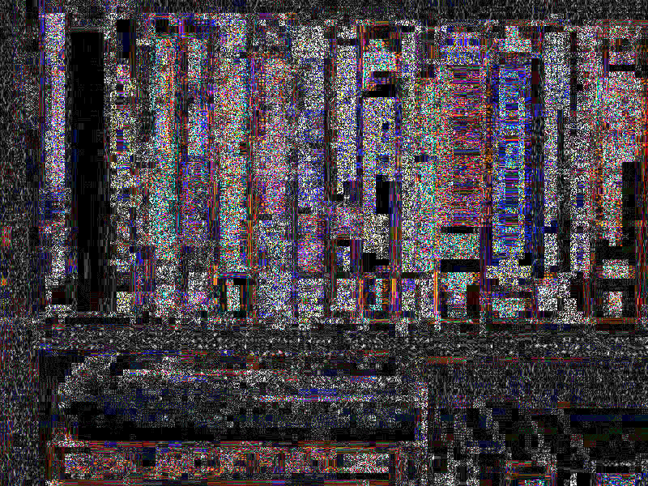
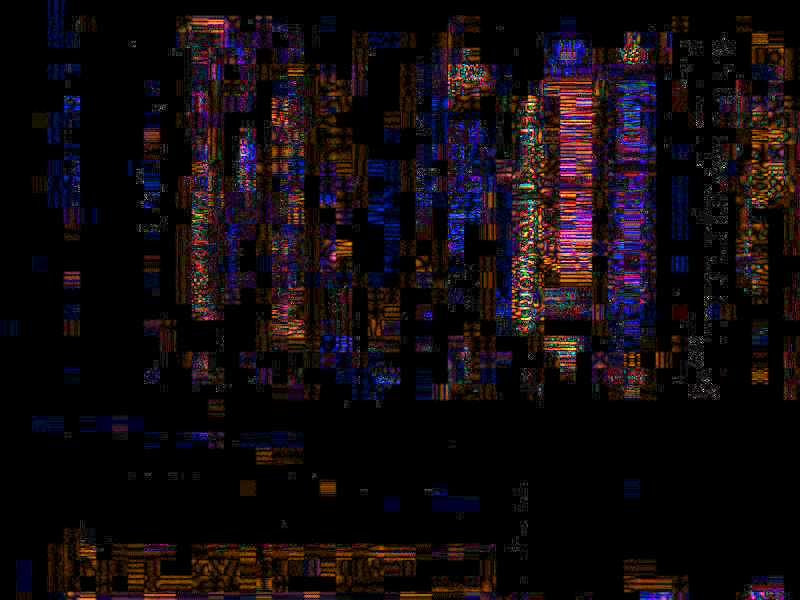
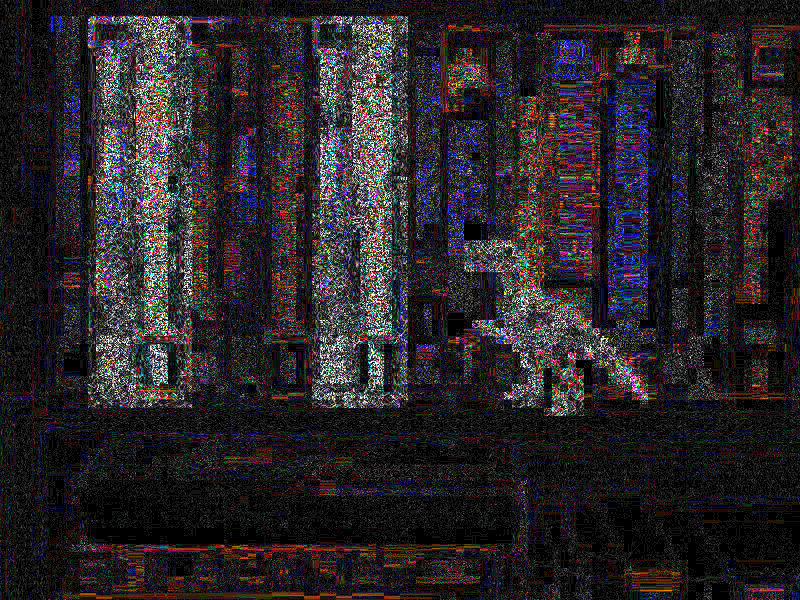

# Error Level Analysis (ELA) <!-- omit in toc -->

## ELA Nedir?

Resmin bellir bir karedeki (grid / ızgara) pixelleri ayrıştırılarak optimize edilip edilmediğini gösterir

- Siyah alananlar minimum, beyaz alanlar maksimum kusuru gösterir

> Kabaca resimdeki hataları gösterir

## Orjinal Resim ve ELA Değeri

Dijital kameralar resim çekerken optimize etmezler

> ELA seviyesi yüksek çıkar

 

## Yeniden Kaydedilmiş Resmin ELA Değeri

Resim her yeniden kaydedildiğinde optimize edilir (ela düşer)

> İnsan gözü değişikliliği anlamaz.

 

## Değiştirilmiş Resimin ELA Değeri

Eğer resim üzerinde tüm yüzeyler ve kenarlarda ELA değeri birbirine benzer, bir alanda çok farklı ise o alan değiştirilmiş anlamında gelir.

 

## Python'da ELA

> `src` dizininde kaynak kodu vardır.

## Referanslar

- [FotoFerensisc](https://fotoforensics.com/tutorial-ela.php)
- [Tineye - Resim değişikliliği arayıcı](https://tineye.com/)
