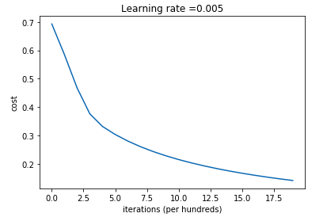
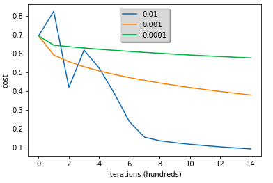

# Logistic Regression <!-- omit in toc -->

## İçerikler <!-- omit in toc -->

- [Temel Hiyerarşi](#temel-hiyerar%c5%9fi)
- [Kavramlar](#kavramlar)
  - [Learning Rate](#learning-rate)
- [Grafik Çizdirme](#grafik-%c3%87izdirme)
  - [Tek grafik çizdirm](#tek-grafik-%c3%a7izdirm)
  - [Çoklu Grafik Çizdirme](#%c3%87oklu-grafik-%c3%87izdirme)
  - [Deeplearning Frameworks](#deeplearning-frameworks)

## Temel Hiyerarşi

- Train, test verileri alınır
- Veriler 1D (_flatten_) yapılır
- Normalize edilir (0-1 arasına alma işlemi)
- Aktivasyon fonksiyonu tanımlanır (sigmoid, relu vs ...)
- `w` (_weight_) ve `b` (_bias_) değerleri oluşturulur
  - `w` Vektör (wx + wx ... )
  - `b` Sabit değer
- Propagation ve optimazson fonksiyonları tanımlanır
- Tün fonksiyonlar model içerisinde birleştirilir

> Detayalar için notebook'a bakabilirsin.

## Kavramlar

### Learning Rate

- Eğitimdeki ilerleme oranını belirtir (adım uzunluğu)
- Çok fazla olursa ileriye atlayabilir (_overshoot_)
- Çok küçük olursa çok fazla adımda doğru sonuca ulaşabiliriz
- Doğru boyutu bulmak gerekir

## Grafik Çizdirme

### Tek grafik çizdirm



```py
# Plot learning curve (with costs)
def show_graph(data, y_label, x_label, title):
    costs = np.squeeze()
    plt.plot(costs, label=label)
    plt.ylabel(y_label)
    plt.xlabel(x_label)
    plt.title(title)
    plt.show()

# Örnek kullanım
show_graph( \
    d['costs'], \ # d, tahmin sonucu gelen dict verisi
    'cost', \
    'iterations (per hundreds)', \
    "Learning rate =" + str(d["learning_rate"]) \
)
```

### Çoklu Grafik Çizdirme



```py
learning_rates = [0.01, 0.001, 0.0001]
models = {}
for i in learning_rates:
    print ("learning rate is: " + str(i))
    models[str(i)] = model(train_set_x, train_set_y, test_set_x, test_set_y, num_iterations = 1500, learning_rate = i, print_cost = False)
    print ('\n' + "-------------------------------------------------------" + '\n')

for i in learning_rates:
    plt.plot(np.squeeze(models[str(i)]["costs"]), label= str(models[str(i)]["learning_rate"]))

plt.ylabel('cost')
plt.xlabel('iterations (hundreds)')

legend = plt.legend(loc='upper center', shadow=True)
frame = legend.get_frame()
frame.set_facecolor('0.90')
plt.show()
```

### Deeplearning Frameworks

- Tensorflow
- Paddlepaddle
- Keras
- Caffe
