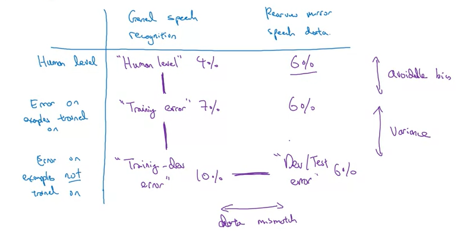

# Model Oluşturma Adımları

Hızlıca sistemi oluştur ve onu tekrarlı olarak eğit

- _dev_ , _test_ verilerini ve _metric_ oluştur
- Sistemi hızlıca hazırla, eğitime sok
  - Dandik olabilir, çok düşünme hemen yap
  - Her bir model için 50'den fazla seçenek ve işlem vardır, her birini düşünemek vakit kaybıdır
  - Üzerine çok fazla düşünüp vakit kaybetme, çıkmaza girersin
  - Analizler doğrultusunda ilerlemen gerekir
- _Bias / Variance_ ve _Error Analyses_ ile öncelikli olacak işlemleri ve sonraki adımını belirle
- Analiz sonucunda aldığın hata karşısında yapman gerekini uygula

> Eğer daha önceden yapılmış bir model eğitimek istiy orsan, makalelere bakıp onların üzerine düşünebilirsin. Özgün bir proje ise direkt olarak modeli oluştur ve test et.

## Error Analysis

Yukarıdan aşağı inildikçe hata oranı artar.

| Hata Tipi             | Açıklama                                                    |
| --------------------- | ----------------------------------------------------------- |
| _Bayes optimal error_ | Yapılabilecek en az hata oranı                              |
| _Human-level error_   | İnsanların yapmış olduğu hata oranı                         |
| _Train Error_         | Eğitimdeki hata oranı                                       |
| _Dev error_           | Eğitim kontrolündeki hata oranı                             |
| _Test error_          | Etiketlenmemiş veriler üzerinde test edildiğinde hata oranı |

### Error Analysis Örneği

| Dataset      | Contains                                                                                                | Error of the algorithm |
| ------------ | ------------------------------------------------------------------------------------------------------- | ---------------------- |
| Training     | 940,000 images randomly picked from (900,000 internet images + 60,000 car’s front-facing camera images) | 8.8%                   |
| Training-Dev | 20,000 images randomly picked from (900,000 internet images + 60,000 car’s front-facing camera images)  | 9.1%                   |
| Dev          | 20,000 images from your car’s front-facing camera                                                       | 14.3%                  |
| Test         | 20,000 images from the car’s front-facing camera                                                        | 14.8%                  |

### Bias & Avoidable Bias & Variance

| Terim                   | Açıklama                              |
| ----------------------- | ------------------------------------- |
| _Bias_                  | _Train error_                         |
| Avoidable Bias          | _Train error_ - _Bayes optimal error_ |
| _Variance_              | _Train-dev error_ - _Train error_     |
| _Data missmatch_        | _Dev error_ - _Train-dev error_       |
| _Degree of overfitting_ | _Test error_ - _Dev error_            |

> _Train error_ - _Bayes optimal error_, train ile bayes optimal error arasındaki hata farkını temsil eder.

### Genel Formül

