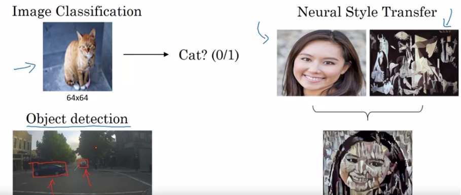
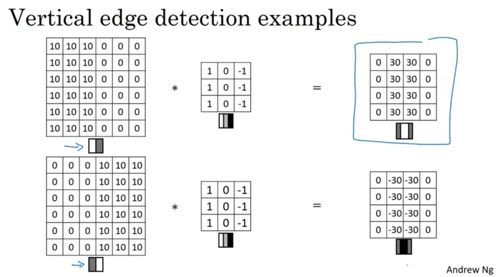
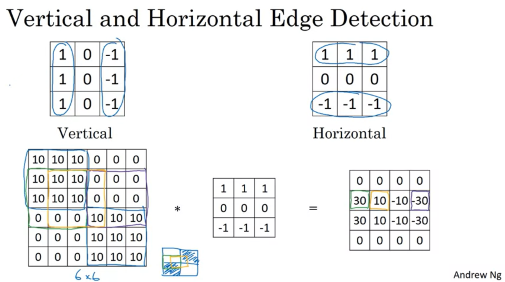
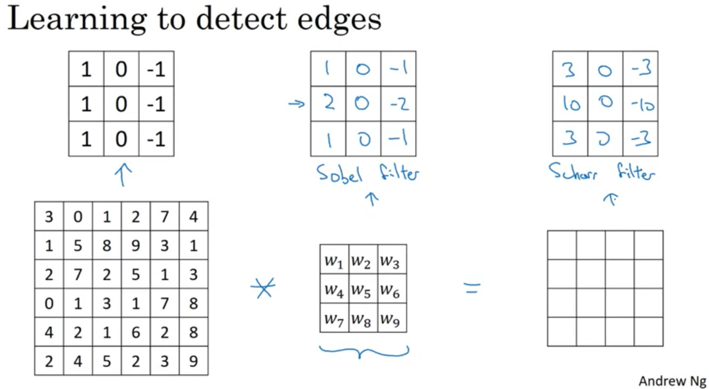

# CNN Giriş <!-- omit in toc -->

## İçerikler <!-- omit in toc -->

- [CNN Örnekleri](#cnn-%c3%96rnekleri)
- [Kenar Algılama (Filtreleme işlemleri)](#kenar-alg%c4%b1lama-filtreleme-i%c5%9flemleri)
- [CNN Filtreleme Siteleri](#cnn-filtreleme-siteleri)

## CNN Örnekleri

| Terim                 | Türkçe                 | Örnek                              |
| --------------------- | ---------------------- | ---------------------------------- |
| Image Classification  | Resim sınıflandırma    | Verilen resim kedi mi değil mi vs. |
| Object Detection      | Obje algılama          | Arabaları bulma                    |
| Neural Style Transfer | Artistik Stil Aktarımı | 2 resmi birleştirme                |

## Kenar Algılama (Filtreleme işlemleri)

Resmi filtre ile _"convolutional"_ operatöre (`*`) sokarız

- Çizgiler aydınlık (+ değerli) olur
- Filtre işlemi kenar ile aynı yapıda olmalı
  - Resim: 10 (aydınlık) 0 (karanlık)
  - Filtre: 1 (aydınlık) 0 (çizgi olduğundan önemsiz alan) -1 (karanlık)
- Resme göre ters filtre verilirse çizgiler karanlık (- değerli) olur

> Filtreleme sonucunda resim küçülük, bunu engellemek için **padding** kullanılır

## CNN Filtreleme Siteleri

- [Online Resim filtreleme](http://setosa.io/ev/image-kernels/)
- [CNN oluşturma ve örneği](https://towardsdatascience.com/build-your-own-convolution-neural-network-in-5-mins-4217c2cf964f)
