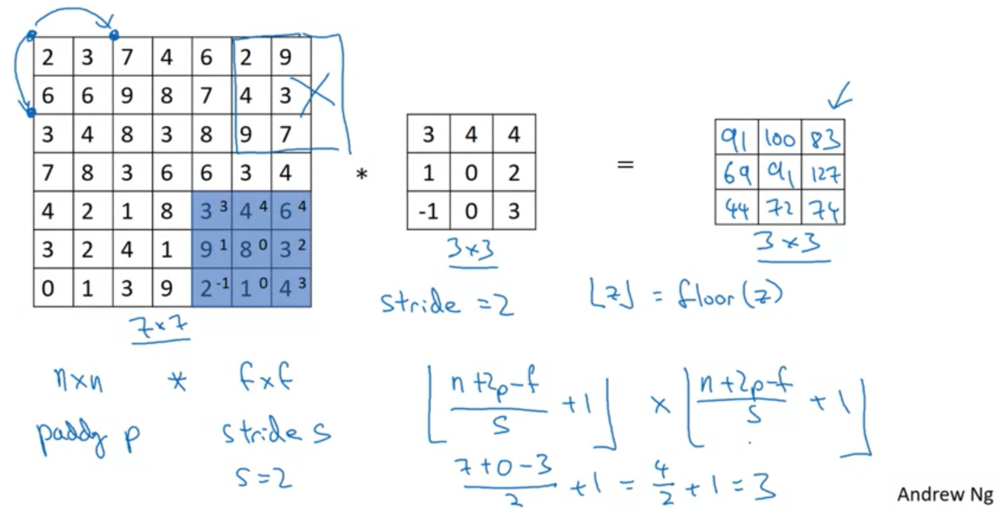
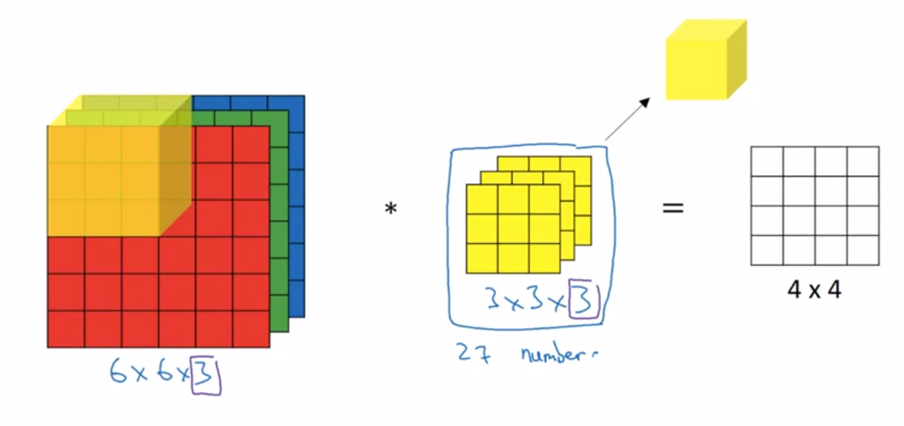
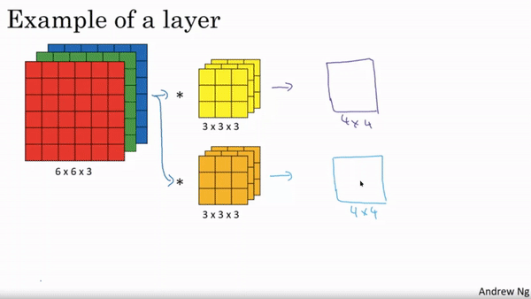

# CNN Ara İşlemleri <!-- omit in toc -->

## İçerikler <!-- omit in toc -->

- [Convoluiton İşlemlerindeki Sorunlar](#convoluiton-%c4%b0%c5%9flemlerindeki-sorunlar)
- [Padding](#padding)
- [Convolution Türleri](#convolution-t%c3%bcrleri)
- [Stride](#stride)
- [3D (Renkli Resimler) için Convolution](#3d-renkli-resimler-i%c3%a7in-convolution)
  - [Çoklu Filtre Kullanımı](#%c3%87oklu-filtre-kullan%c4%b1m%c4%b1)
  - [Tek katmanlı CNN Mimarisi](#tek-katmanl%c4%b1-cnn-mimarisi)

## Convoluiton İşlemlerindeki Sorunlar

- Kenarlardaki pixeller çok a kullanılır
  - Her pixel filtrenin merkezine gelemiyor
- Resmin boyutu küçülür

## Padding

- Kenarlara fazladan satır eklenir
- Satırların pixel değerleri `0` olur
- `padding = p` ise `p=1` için 0 değerler kenar eklenir
  - 4 kenar oldupundan 4 satır

## Convolution Türleri

| Özellik | Açıklama                                    | Girdi    | Çıktı boyutu           |
| ------- | ------------------------------------------- | -------- | ---------------------- |
| Valid   | _Padding_ olmadan işlem yapılır )           | $n$      | $n - f + 1$            |
| Same    | _Padding_ işlemini kulalnara boyutu koruma  | $n + 2p$ | $n$                    |
| Stripe  | _Stripe_ işlemi ile adım sayısını belirleme | $n + 2p$ | $(n + 2p + f) / s + 1$ |

> $p = (f - 1) / 2$ için çıktı değeri korunur.

| Harf | Temsil ettiği boyut |
| ---- | ------------------- |
| $n$  | Resim               |
| $f$  | Filtre              |
| $p$  | Padding             |
| $s$  | Stripe              |

## Stride

- Her adımda kaç birim ilerleneceğini belirtir

## 3D (Renkli Resimler) için Convolution

- Renkli resimlerin derinlik (_"depth", "channel"_) değeri 3'tür
  - `n x n x d`,`64 x 64 x 3`
- Filtre de **3D** olmak zorundadır
  - RGB için ayrı filterler
  - Toplamda 3 filtre olduğundan `f x f x 3` boyutlu olur
- Çıktı değeri hala **2D** olarak kalır

### Çoklu Filtre Kullanımı

- Her özellik için ayrı bir filtre kullanılır
- Sonrasın tüm filtreler birleştirilir
- `f x f x filtre çeşidi`, `4x4x2`

### Tek katmanlı CNN Mimarisi

| Değer            | Karşılığı                   |
| ---------------- | --------------------------- |
| $a ^ {[0]}  = X$ | Resim                       |
| $W$              | Filtreye değerleri          |
| $b$              | Filtreye eklenen sabit sayı |
| $Z$              | İşlenmiş filtre ($W.X + b$) |
| $g(Z)$           | Aktivasyon (_ReLU_ ...)     |
| $a ^ {[l]}$      | Son filtrelenmiş çıktı      |

