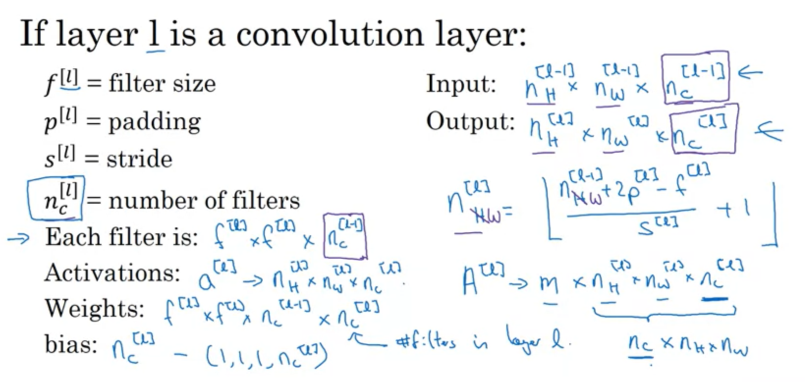
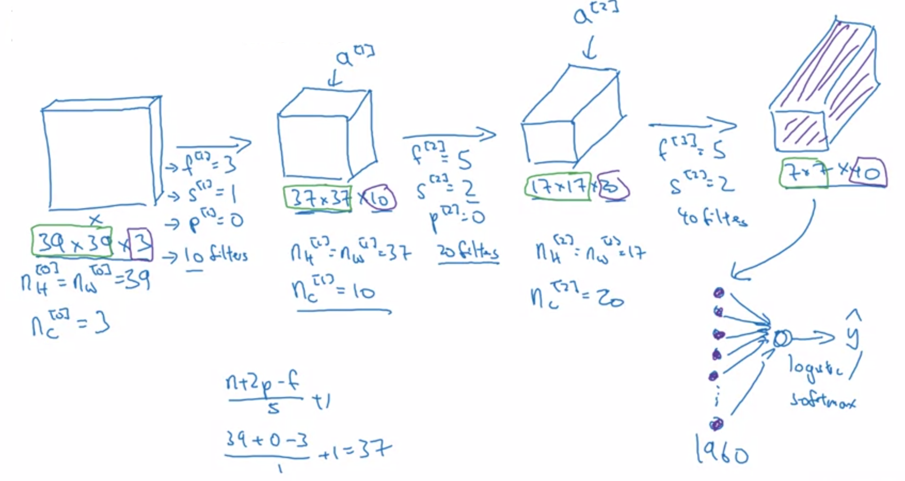
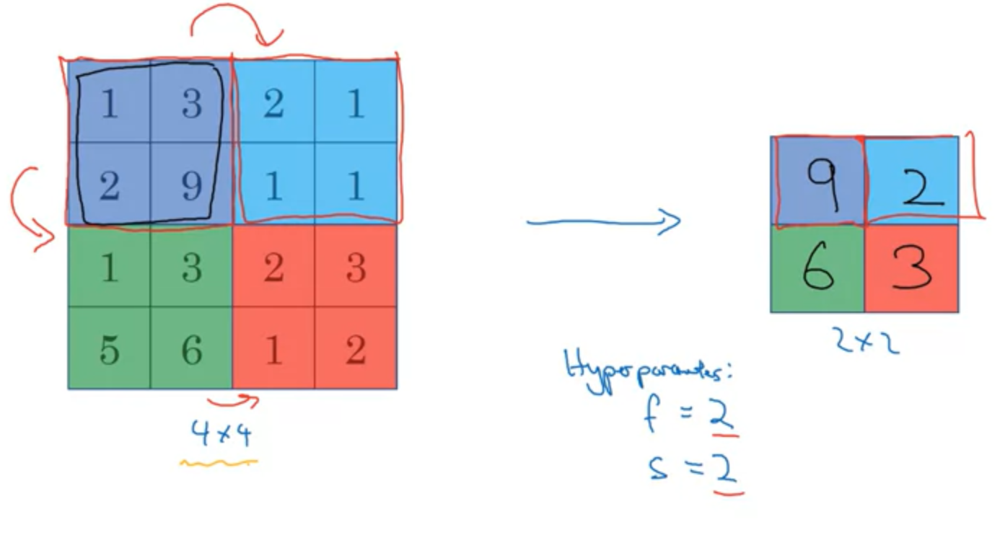
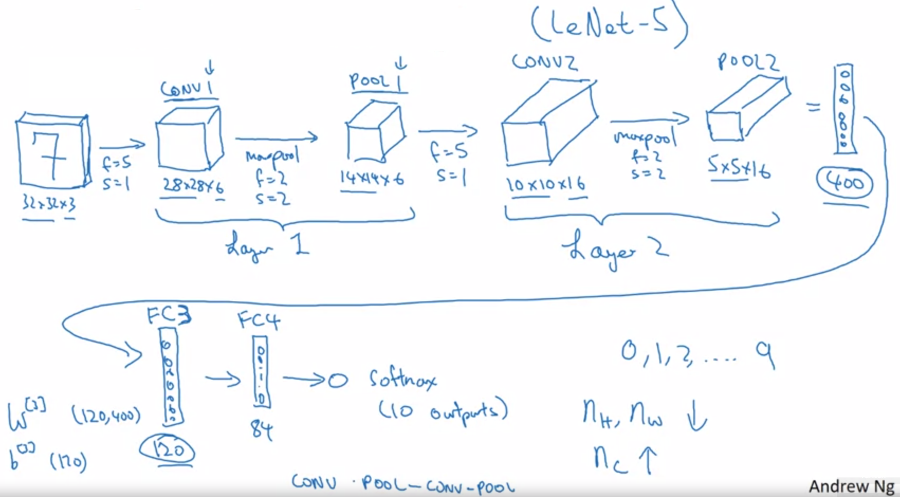
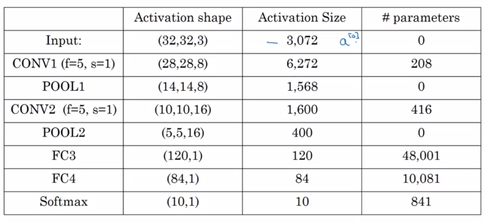

# CNN Mimarisi <!-- omit in toc -->

## İçerikler <!-- omit in toc -->

- [CNN Notasyonu](#cnn-notasyonu)
- [ConvNet](#convnet)
  - [ConvNet Hyperparametreleri](#convnet-hyperparametreleri)
- [ConvNet Örneği](#convnet-%c3%96rne%c4%9fi)
- [Pooling Layer](#pooling-layer)
  - [Max Pooling](#max-pooling)
- [Neural Network Örneği](#neural-network-%c3%96rne%c4%9fi)
  - [NN'de Katman Tablosu](#nnde-katman-tablosu)
- [Matematiksel Notasyon](#matematiksel-notasyon)

## CNN Notasyonu

## ConvNet

Convolutional Neural Network yerine bu kısaltılmış ad kullanılmakta

### ConvNet Hyperparametreleri

| Parametre    | Terim        | Açıklama         |
| ------------ | ------------ | ---------------- |
| $f$          | Filter       | Filtre boyutu    |
| $s$          | Stride       | Adım sayısı      |
| $p$          | Padding      | Doldurma miktarı |
| $n_{filter}$ | \# of filter | Filtre sayısı    |

## ConvNet Örneği

## Pooling Layer

Çok derin ağlarda `avg pooling` diğerlerinde `max pooling` kullanılır

| Pooling         | Açıklama                     |
| --------------- | ---------------------------- |
| Max Pooling     | En büyük pixel değerini alır |
| Avarage Pooling | Pixellerin ortalamasını alır |

### Max Pooling

- En belirgiin özellikleri ortaya çıkarır
- Filtredeki en büyük pixeli alır
- Öğrenme olmaz, sadece işlem hızını etkiler
  - Parametre ve _gradient descent_ yok
  - Sadece hyperparametreler var

> ⚠ Neden iyi çalıştığına dair net bir sebep bilinmiyor.

## Neural Network Örneği

- Parametrelerin (`w`, `b`) olmadığı alanlar katman olarak sayılmaz
  - Pooling alanları bir öncesindeki CONV ile ortak katman olarak ele alınır

### NN'de Katman Tablosu

- _Activation size_ ilerledikçe azalır
  - Convolutional işlemlerinin başladığı `CONV1` katmanında başlayarak azalır
- Çok hızlı azalırsa model verimli çalışmaz

## Matematiksel Notasyon

- Superscript $[l]$ denotes an object of the $l^{th}$ layer.
  - Example: $a^{[4]}$ is the $4^{th}$ layer activation. $W^{[5]}$ and $b^{[5]}$ are the $5^{th}$ layer parameters.

* Superscript $(i)$ denotes an object from the $i^{th}$ example.
  - Example: $x^{(i)}$ is the $i^{th}$ training example input.
* Lowerscript $i$ denotes the $i^{th}$ entry of a vector.
  - Example: $a^{[l]}_i$ denotes the $i^{th}$ entry of the activations in layer $l$, assuming this is a fully connected (FC) layer.
* $n_H$, $n_W$ and $n_C$ denote respectively the height, width and number of channels of a given layer. If you want to reference a specific layer $l$, you can also write $n_H^{[l]}$, $n_W^{[l]}$, $n_C^{[l]}$.
* $n_{H_{prev}}$, $n_{W_{prev}}$ and $n_{C_{prev}}$ denote respectively the height, width and number of channels of the previous layer. If referencing a specific layer $l$, this could also be denoted $n_H^{[l-1]}$, $n_W^{[l-1]}$, $n_C^{[l-1]}$.
