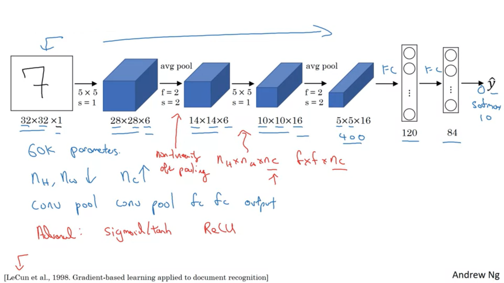
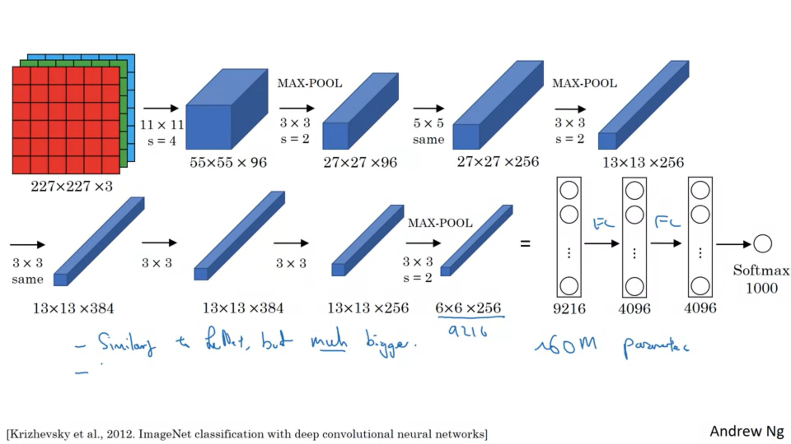
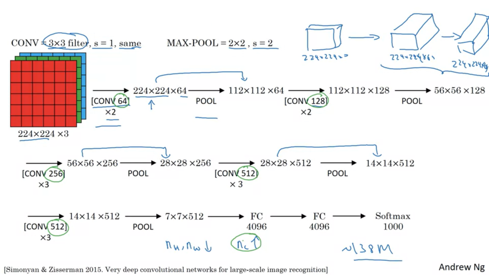

# Klasik CNN Modellerini İnceleme <!-- omit in toc -->

## İçerikler <!-- omit in toc -->

- [Klasik Sinir Ağları](#klasik-sinir-a%c4%9flar%c4%b1)
- [LeNet - 5](#lenet---5)
- [AlexNet](#alexnet)
- [VGG - 16](#vgg---16)

## Klasik Sinir Ağları

| Network   | Açıklama                                                     |
| --------- | ------------------------------------------------------------ |
| LeNet - 5 | Sayıları algılamak için kullanılan eski bir sistem           |
| AlexNet   | LeNet'e çok benzerdir ama çok daha büyüktür (çok hyperparam) |
| VGG - 16  | Oldukça sade bir sinir ağı sistemi vardır                    |

## LeNet - 5

- Artık kullanılmayan:
  - Pek işe yaramayan `softmax` algoritmasını kullanır
  - `avg pooling` (artık `max pooling` işlemi yapılıyor)
- 6'dan 16'a geçiş aşamasında boyut değişmekte, günümüzde _pooling_ işlemlerinde _channel_ **değiştirilmez**.
  - _Channel_ değiştirmek karmaşıklığı arttıracaktır
  - _Pooling_ işlemlerinde `sigmoid` / `tanh` kullandığından lineerliği bozar. (`ReLU` kullanılmalıydı)
  - _graph transfer network_ yapısı günümüzde yaygın olarak kullanılmamakta
- Makalesi okuması zor türdendir.
- 60k parametresi vardır

LeNet - 5 Mimarisi

## AlexNet

- LeNet'e çok benzemektedir ama çok daha büyüktür
- 60M parametresi vardır (çok fazla)
  - Dikkate değer alan üzerinde eğitim yapılmaktadır
- Çok daha fazla gizli birime ve çok daha fazla veri üzerinde eğitim alabildikleri gerçeğine dayanarak görüntü üzerinde sadece dikkate değer bir performansa sahip olmasına izin veren veri setini eğitmişlerdir.

> Orjinalinde (224,224) iken (227, 227) olarak kullanılması daha etkili imiş. ~ Andrew Ng

AlexNet mimarisi

## VGG - 16

- Çok fazla hyperparam yerine daha sade bir yapı kullanılır
- Sinir ağları mimarisini **sadeleştirir**
- 16 ifadesi parametreli 16 katmanı olduğu anlamına gelir
- 138M parametresi vardır
  - Normala göre oldukça fazladır
- VGG - 19 kadar iyi olduğundan çok fazla kullanılır

> V66'de her convolutinal işlemi 2'nin katları olarak ilerler. (Sistematiktir)

VGG - 16 Mimarisi

