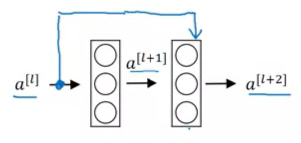
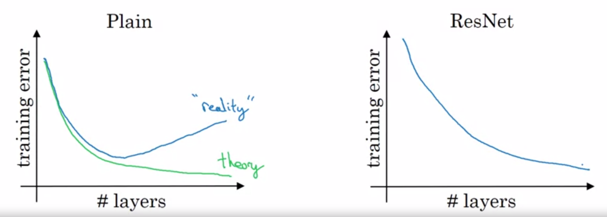
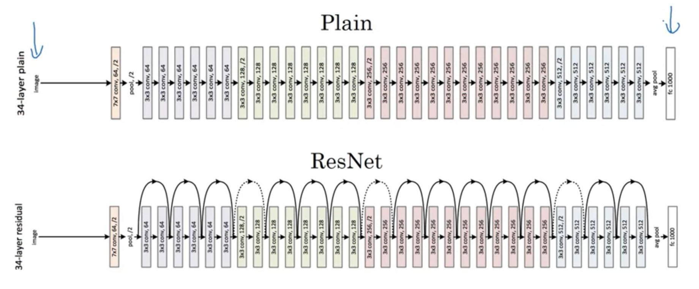
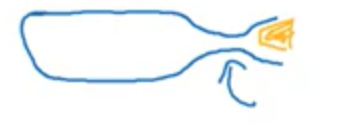
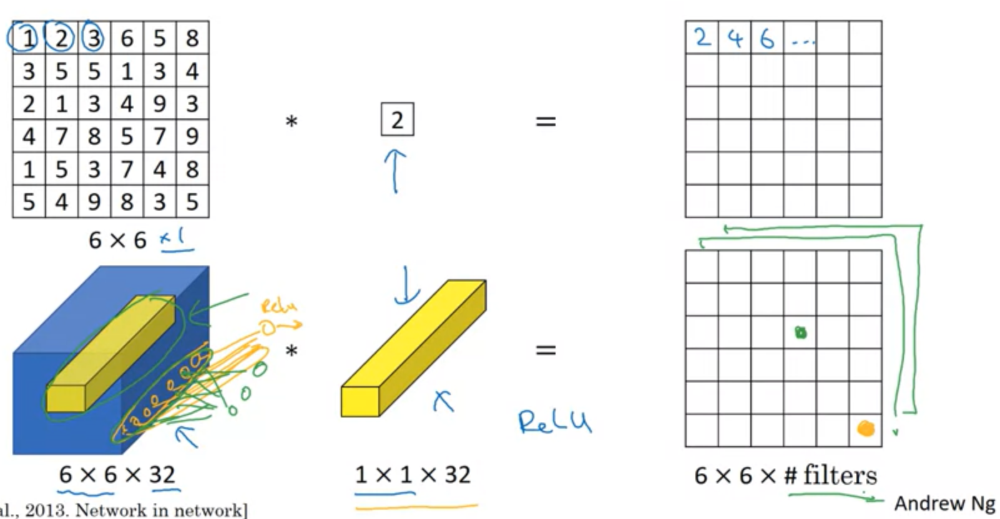
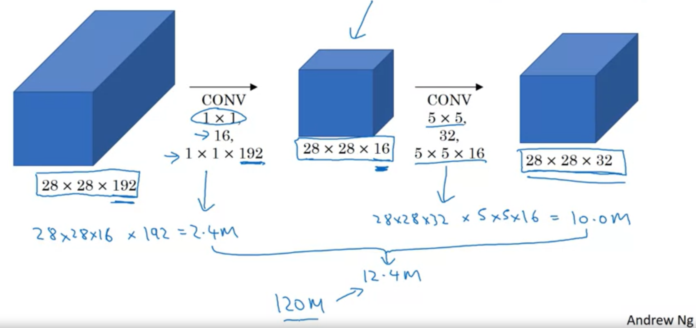
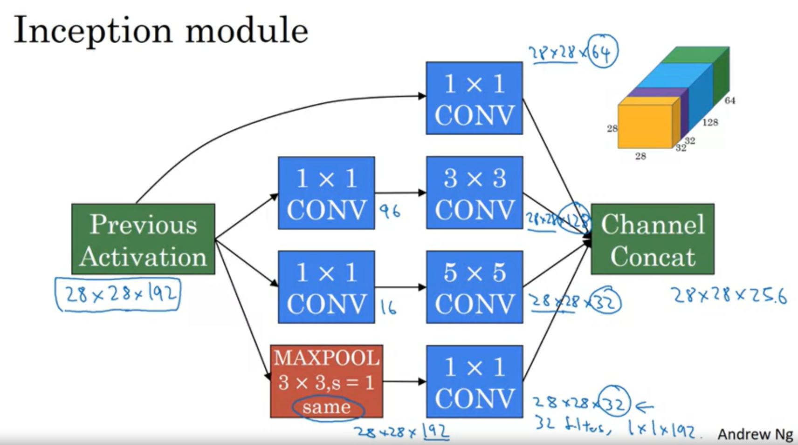
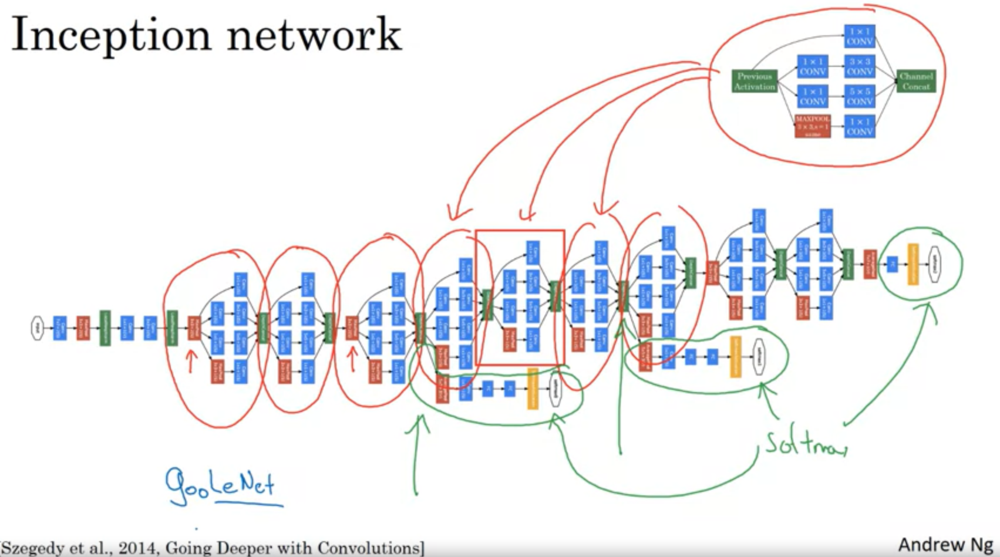

# Sık Kullanılan CNN Modelleri <!-- omit in toc -->

## İçerikler <!-- omit in toc -->

- [ResNet (Resudial Network)](#ResNet-Resudial-Network)
  - [Neden ResNet](#Neden-ResNet)
  - [Eğitim Grafiği (Loss)](#E%C4%9Fitim-Grafi%C4%9Fi-Loss)
  - [ResNet vs PlainNet](#ResNet-vs-PlainNet)
  - [ResNet için Önemli Husular](#ResNet-i%C3%A7in-%C3%96nemli-Husular)
- [1 x 1 Convolutional Nedir ve Neden Yapılır](#1-x-1-Convolutional-Nedir-ve-Neden-Yap%C4%B1l%C4%B1r)
- [Inception Network](#Inception-Network)

## ResNet (Resudial Network)

- Aktivasyon sonucu diğer katmana aktarır ve ekler. (`+`)
- $a^{[l+2]} = g(Z^{[l+2]} + a^{[l]})$
- Bu yapı sayesinde çok katmanlı veriler oluşturulabiliyor
- Başlarda verilerin etkisinin çok azalması engellenir (_"vanishing / exploding gradient"_)

### Neden ResNet

- Derinlere indikçe sinir ağı aşınır
- Öğrenme ve gelişme sürecinde kayıplara uğrar
- Düz yapıda (_plain net_):
  - $a_l$ değerlerinin parametreleri (`w`, `b`) 0'a yaklaşır
  - $a^{[l+1]} = g(W^{[l]} \times a^{[l]} + b_l)$ formülü $W=0$ için $0$ olur, yani **ölür**
  - Gradyanlar çalışmaz hale gelir (_no gradient descent_)
- ResNet yapısında:
  - $a^{[l+2]} = g(Z^{[l+2]} + a_l)$ ve $Z^{[l+2]} = g(W^{[l+2]} \times a^{[l+1]} + b^{[l+2]})$
  - $W=0$ için $a_l$ değeri aktarılır (eski aktivasyon sonucu kullanılır)
  - Sinir ağını etkilemesine izin verilmez

### Eğitim Grafiği (Loss)

### ResNet vs PlainNet

### ResNet için Önemli Husular

$(Conv \times 3 \rArr Pool) \rArr ... \rArr (Conv \times 3 \rArr Pool) \rArr Softmax$

- CNN için **"some"** padding yapısı tercih edilir
  - Boyutun değişmesini engellemek için seçilir
  - $dim(a^{[l]}) = dim(a^{[l+2]})$ olmak zorundadır ki matrix ataması gerçekleşebilsin
    - $dim(..)$ Boyut'u anlamına gelmektedir
- Some padding yerine **"vali"** kullanılırsa
  - Boyutlar eşit olmayacağından ekstra bir hyperparam ($W_s$) ile çarpılarak, boyutlar eşitlenir
  - $a^{[l+2]} = W_s \times a^{[ l]}$
    - $dim(W_s) = (a^{[l+2]}, a_{a})$

## 1 x 1 Convolutional Nedir ve Neden Yapılır

> Network in network olarak da bilinir.

- Temel amacı boyutu sıkıştırmak ve küçültmekdir. 
  - $n_c$ değerini küçültmek için kullanılır
  - $n_c \rArr n_f$ , $n_f$ = Filtre sayısı
- Sıkıştırılmış verinin olduğu katmana **bottleneck layer** denir
  - Şişenin dar kısmına verilen isim, bu katman CNN'in ufak kısmını ele alır
   
- Bazı ağlarda hesaplamadan tasarruf edilir
- 1 x 1 filtreye sokulup ardından ReLU'ya sokulma işlemidir
  - Aynı derinlik hizasında olanlar toplanır ve öyle aktarılır
- Eğer filtre ile kanal aynı ise katamana *non-linerity* (doğrusalsızlık) özelliği eklenir

## Inception Network

- 1x1 Convolution'dan oluşan bir sürü Inception Module'den oluşur

