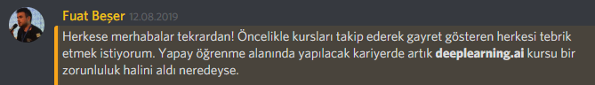

# Faydalı Kaynaklar

Faydalı olabilecek kaynakları ⛵ derlediğim yer.

## Coursera Üzerinden Eğitim

Kariyer hedefi için olmazsa olmaz olan kurstur. 🚀

- [Coursera Deeplearning.ai 🧠](https://www.coursera.org/specializations/deep-learning)
- [Deeplearning 🧠 Coursera Çözümleri ve Notları](https://github.com/Kulbear/deep-learning-coursera)
- Sertifika almak ile ilgilenmiyorsa, aynılarına [buradan][Youtube] erişebilirsin
- Maddi imkanın yok ise [Financial Aid][Financial Aid] ile ücretsiz satın almayı deneyebilirsin
  - Financial Aid başvurusu 2 hafta önceden yapılmalıdır.
- Yine aynı kişi (Andrew Ng) tarafından verilen videolara [buradaki][Artifical All in One - Youtube] linkten de erişebilirsin

> 
>
> [2019 Yılı Yapay Zeka Eğitim ve Uygulama Programı](https://medium.com/deep-learning-turkiye/2019-yapay-zeka-e%C4%9Fitim-ve-uygulama-program%C4%B1-add138988809)'da geçen bir mesajlaşmadır.

[Yapay zeka belgeseli]: https://www.youtube.com/watch?v=qh2ESbatq68
[Hackerrank]: https://www.hackerrank.com/domains/ai
[Türkçe yapay zeka kaynakları]: ..%2FYapay%20Zeka%20Notlar%C4%B1%2FT%C3%BCrk%C3%A7e%20Yapay%20Zeka%20Kaynaklar%C4%B1.md
[Deeplearning yapay zeka uygulması 2019]: https://medium.com/deep-learning-turkiye/2019-yapay-zeka-e%C4%9Fitim-ve-uygulama-program%C4%B1-add138988809
[Coursera]: https://medium.com/deep-learning-turkiye/t%C3%BCrk%C3%A7e-altyaz%C4%B1l%C4%B1-yapay-zeka-ve-derin-%C3%B6%C4%9Frenme-kursu-deeplearning-ai-85d60f4f29d7
[Financial Aid]: https://medium.com/deep-learning-turkiye/courseradaki-derin-%C3%B6%C4%9Frenme-kursuna-financial-aid-uygulamas%C4%B1-ile-%C3%BCcretsiz-kaydolmak-20ca52ff9b70
[Youtube]: https://www.youtube.com/channel/UCcIXc5mJsHVYTZR1maL5l9w
[Artifical All in One - Youtube]: https://www.youtube.com/channel/UC5zx8Owijmv-bbhAK6Z9apg/featured?disable_polymer=1

## Etkili Öğrenme Linkleri 🌟

- [Türkçe ☪ Yapay Zeka Kaynakları](https://github.com/deeplearningturkiye/turkce-yapay-zeka-kaynaklari)
- [Türkçe ☪ Yapay Zeka Terimleri](https://github.com/deeplearningturkiye/turkce-yapay-zeka-terimleri)
- [Kapsamlı Derin Öğrenme Rehberi 💫](https://github.com/ayyucekizrak/Kapsamli_Derin_Ogrenme_Rehberi)
- [Popüler Makine Öğrenimi Algoritmaları ve Açıklamaları](https://github.com/trekhleb/homemade-machine-learning)
- [Machine Learning makaleleri 📃](https://github.com/Swall0w/papers)
- [Deeplearning Modelleri 🤖](https://github.com/rasbt/deeplearning-models)
- [Tensorflow Kursu - Github](https://github.com/machinelearningmindset/TensorFlow-Course)

## Takip Edilmesi Gereken Kişiler veya Topluluklar

- [Siraj Raval 🤵🌟 - Youtube](https://www.youtube.com/channel/UCWN3xxRkmTPmbKwht9FuE5A)
- [Siraj Raval 🤵🌟 - Github](https://github.com/llSourcell)
- [Nabih Ibrahim Bawazir 🤵 - LinkedIn](https://www.linkedin.com/in/nabihbawazir/detail/recent-activity/shares/)
- [Deep Learning Türkiye ☪](https://medium.com/deep-learning-turkiye)

## Yönlendirici ve Eğitici aynaklar

- [ML Cheat Sheet]
- [Tutorial List]
- [Pandas nasıl çalışır](https://www.linkedin.com/feed/update/urn:li:activity:6541970455501336576)
- [Machine learning mastery]
- [Tensorflow vs PyTorch, Nereden Başlanmalı][tensorflow vs pytorch]
- [Keras Kursu][keras ~ datacamp]
- [How to Use Google Colaboratory for Video Processing](https://dzone.com/articles/how-to-use-google-colaboratory-for-video-processin)

## Yapılmış Model Çalışmaları

Başkaların yapmış olduğu çalışan modeller 🤖

- [Yüz algılama 👩](https://github.com/ageitgey/face_recognition)
- [Yüzden duygu ve cinsiyet algılama 😇](https://github.com/DiaaZiada/Faces)
- [Person-Detection-and-Tracking 🕵️‍](https://github.com/ambakick/Person-Detection-and-Tracking)
- [Multi Object Tracking 🔢](https://github.com/jguoaj/multi-object-tracking)
- [TensorFlow Object Counting API 🔢](https://github.com/ahmetozlu/tensorflow_object_counting_api)
- [DeepLeague - Lol AI](https://github.com/farzaa/DeepLeague)
- [Instagram Bot With AI](https://instabotai.com/)

### Eski Çalışma Kayıtları

- [Makine Öğrenimi ve Derin Öğrenme ile Müşteri Kayıp (Churn) Analizi-1]
- [TL'yi Bulma]
- [Gerçekçi Sinirsel Konuşan Kafa Modelleri]
- [Top 50 Machine Learning Interview]
- [ImageNet Training in PyTorch]

## Faydalı Yazılar

- [12 Things I Learned During My First Year as a Machine Learning Engineer](https://towardsdatascience.com/12-things-i-learned-during-my-first-year-as-a-machine-learning-engineer-2991573a9195)
- [The 5 Feature Selection Algorithms every Data Scientist should know](https://towardsdatascience.com/the-5-feature-selection-algorithms-every-data-scientist-need-to-know-3a6b566efd2)
- [An E-learning System With Multifacial Emotion]
- [Education 4.0 – Fostering Student’s Performance]
- [Importance of Including Practical Machine Learning]
- [Improving of Personal Educational Content Using]
- [Machine Learning Model for Analyzing Learning]

## Karışık

- [High level network definitions with pre-trained weights in TensorFlow](https://github.com/taehoonlee/tensornetss)

<!-- Yönlendirici ve Eğiti Kaynaklar -->

[ml cheat sheet]: ../res%2Fmicrosoft-machine-learning-algorithm-cheat-sheet-v7.pdf
[tutorial list]: https://www.linkedin.com/feed/update/urn:li:activity:6540145442783629313
[machine learning mastery]: https://machinelearningmastery.com/start-here/
[tensorflow vs pytorch]: https://towardsdatascience.com/which-deep-learning-framework-is-growing-fastest-3f77f14aa318
[keras ~ datacamp]: https://www.datacamp.com/courses/deep-learning-in-python

<!-- Yapılmış Çalışmalar -->

[makine öğrenimi ve derin öğrenme ile müşteri kayıp (churn) analizi-1]: https://medium.com/deep-learning-turkiye/makine-%C3%B6%C4%9Frenimi-ve-derin-%C3%B6%C4%9Frenme-ile-m%C3%BC%C5%9Fteri-kay%C4%B1p-churn-analizi-1-63a4513b8a6f
[tl'yi bulma]: https://www.linkedin.com/pulse/g%C3%B6r%C3%BCnt%C3%BC-tan%C4%B1yan-mobil-uygulama-nas%C4%B1l-geli%C5%9Ftirilir-%C3%B6zg%C3%BCr-%C5%9Fahin/
[gerçekçi sinirsel konuşan kafa modelleri]: https://www.youtube.com/watch?v=p1b5aiTrGzY&feature=youtu.be
[top 50 machine learning interview]: https://www.linkedin.com/feed/update/urn:li:activity:6540239772655419392
[imagenet training in pytorch]: https://github.com/diux-dev/cluster/tree/master/pytorch#data-preparation

<!-- PDF'ler -->

[an e-learning system with multifacial emotion]: ..%2Fpdfs%2FAn%20E-learning%20System%20With%20Multifacial%20Emotion.pdf
[education 4.0 – fostering student’s performance]: ..%2Fpdfs%2FEducation%204.0%20%E2%80%93%20Fostering%20Student%E2%80%99s%20Performance.pdf
[importance of including practical machine learning]: ..%2Fpdfs%2FImportance%20of%20Including%20Practical%20Machine%20Learning.pdf
[improving of personal educational content using]: ..%2Fpdfs%2FImproving%20of%20Personal%20Educational%20Content%20Using.pdf
[machine learning model for analyzing learning]: ..%2Fpdfs%2FMachine%20Learning%20Model%20for%20Analyzing%20Learning.pdf
