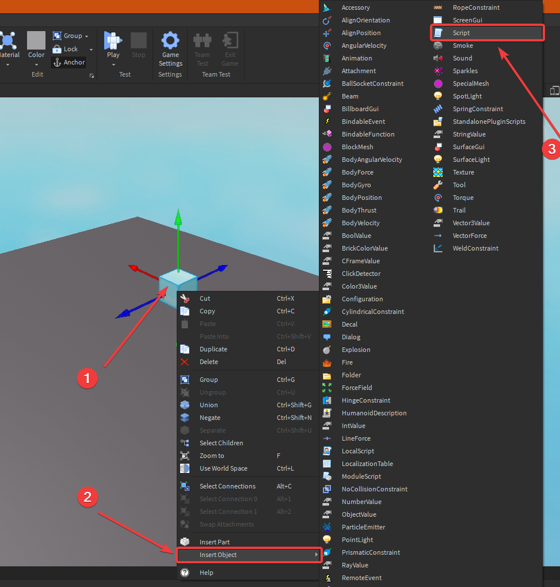

# ⏹ Roblox

## 🌃 Roblox Studio


## 📜 Script Ekleme



## 🐣 Spawn Point Ayarlama

* 🚄 Öldükten sonra en son değilen `spawnpoint` üzerinden doğmayı sağlar
* ➕ Eklemek için `🌍 Workspace` objesinin içindeki `scripts` dosyasına alttaki kodu kopyalayın

```lua
-- Oyunculara erişme
local Players = game:GetService("Players")
 
local function addSpawn(spawnLocation)
	-- listen for the spawn being touched
	spawnLocation.Touched:Connect(function(hit)
		local character = hit:FindFirstAncestorOfClass("Model")
		if character then
			local player = Players:GetPlayerFromCharacter(character)
			if player and player.RespawnLocation ~= spawnLocation then
				local humanoid = character:FindFirstChildOfClass("Humanoid")
				
				-- Oyuncu ölmediyse
				if humanoid and humanoid:GetState() ~= Enum.HumanoidStateType.Dead then
					print("spawn set")
					
					-- Spawnpoint'i ayarla
					player.RespawnLocation = spawnLocation
				end
			end
		end
	end)
end
 

local firstSpawn

-- Workspace üzerindeki tüm parçaları azalarak sıralama
for _, descendant in pairs(workspace:GetDescendants()) do
	-- Obje SpawnPoint öğesisi
	if descendant:IsA("SpawnLocation") then
		-- SpawnPoint'in ismi FirstSpawn ise
		if descendant.Name == "FirstSpawn" then
			--- İlk spawnpoint noktasını belirleme ve firstSpawn objesine atama
			firstSpawn = descendant
		end
		
		addSpawn(descendant)
	end
end

-- Her oyunucuyu ilk spawnpoint üzerinde doğurma
local function playerAdded(player)
	player.RespawnLocation = firstSpawn
end
 
-- Oyuncular oyuna bağlandığında metot çalıştırma
Players.PlayerAdded:Connect(playerAdded)
```


‍🧙‍♂ Detaylı bilgi için [Respawn Location](https://developer.roblox.com/en-us/api-reference/property/Player/RespawnLocation) alanına bakabilirsin.


## ☠️ Ölüm Script'i

* 🤵 Kullanıcı objeye değdiğinde anda ölür
* 🤵 `Humanoid` insan anlamına gelmektedir
* 🦄 `FindFirstChild` ile ilk değen obje bulunur
* 🩸 `BreakJoints` ile değen kişi öldürülür

```lua
script.Parent.Touched:Connect(function(hit)
	if hit.Parent:FindFirstChild("Humanoid") then 
		hit.Parent:BreakJoints()
	end
end)
```

## 🧩 Block Ayarları

| 💎 Özellik | 📝 Açıklama |
| :--- | :--- |
| `CanCollide` | ⤵ Blokların içinden geçilir |
| `Anchored` | 🕊️ Aşağı düşmesini engeller |

## 🔗 Faydalı Bağlantılar




