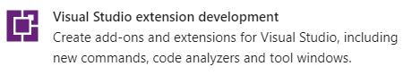
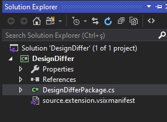
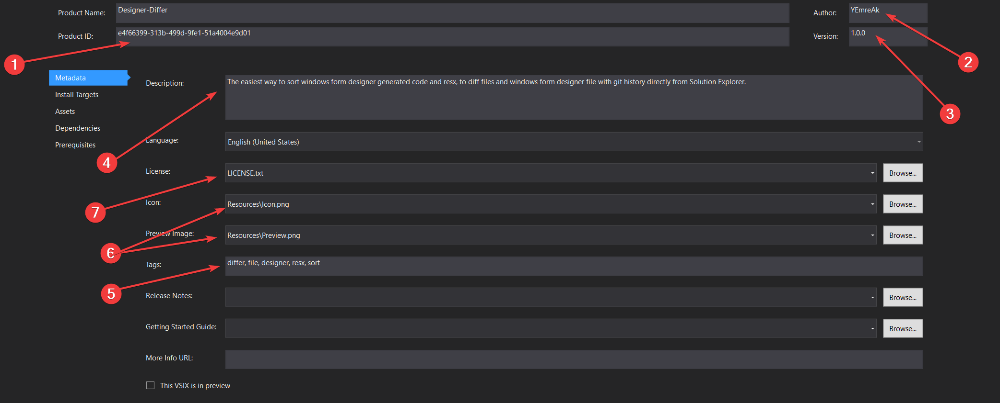
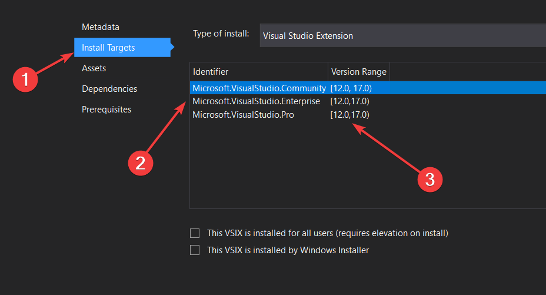
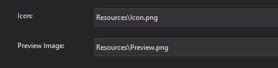
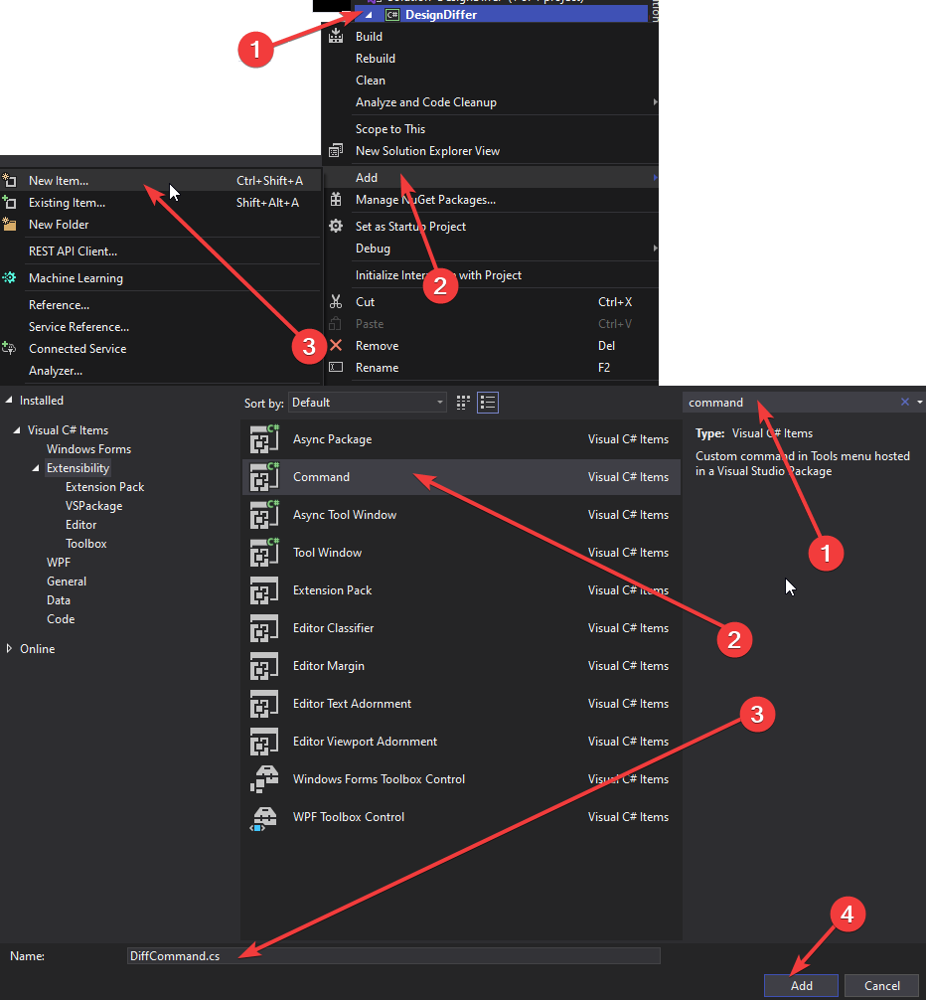
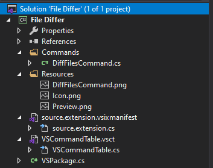

# 🚴‍♂️ İlk Projeyi Oluşturma \| VSIX

## 💎 Ön Gereksinimler

Eklentiyi Visual Studio için C\# ile programlayacağımızdan dolayı:

* ⏬ `Visual Studio` ve `Visual Studio extension development` iş yükü indirilmelidir
* 💁‍♂️ Eklenti için derinden bir C\# bilgisi yerine hızlı bir öğrenmeye odaklanılması kafidir
* 🏃‍♂️ Hızlıca C\# öğrenmek için [CSharp Quick Guide](https://www.tutorialspoint.com/csharp/csharp_quick_guide.htm) sayfasına bakmalısın
* 👮‍♂️ Yazım standartları için [CSharp Coding Standarts](https://www.dofactory.com/reference/csharp-coding-standards) alanına da bakabilirsin



## 🚩 Çalışma Yolu

* 👨‍💻 Eklenti programlanır, derlenir ve çalıştırılır
* 🐙 GitHub üzerinden versiyon kontrol sistemi ile ilerleme kontrol edilir
* ⚗️ Derlenme ve test işlemleri Continuous Integration \(CI\) ile otomatikleştirilir
* 📡 Herkese açık stabil bir sürümü üzerinden eklenti yayınlanır
  * 😅 Tabi bu sadece açık kaynak olmasını isterseniz yapılır
* ⏫ VS Gallery üzerine eklenti aktarılır



## 🔰 VSIX Yapımına Hazırlanma

* ☀️ `Create New Project` - `VSIX Project` alanından proje oluşturulur 

## 👨‍🔧 Proje İsmi Güncelleme

* 🤔 Proje isminden vazgeçmeniz veya ismini yanlış belirtmeniz durumunda projenin adını güncellemeniz gerekebilir
* 🔨 `Solution Explorer` üzerinden `Properties` alanından güncellenir

## 📜 Manifest Ayarları

* 📃 `*.vsix.manifest` dosyası mafisesto dosyasıdır ve projenin ayarlarını içerir
* 🆔 `Product ID` kısmında `<Projeİsmi>.<GUID>` şeklinde olan değerden `Projeİsmi` silinir
* 🤵 `Author` alanında eklentiyi geliştiren ekibin ve kişinin adı bulunur
* 🏷️ `Version` kısmı [Semantic Versionin](https://semver.org/) tarzı ile uygulama sürüm bilgisini tutar
* 📖 `Description` alanına eklentinin ne işe yaradığına dair bilgi verilir
* 🎫 `Tags` kısmında eklentinin hitap ettiği konulara `<konu>, <konu2>, ...` şeklinde yer verilir, aramalarda bu şekilde çıkar
* 🖼️ `Preview Image` 175x175 ve `Icon` ise 90x90 boyutunda eklentinin ikon resmini barındırır
* 🔐 `License` alanına kendi lisans dosyanızın yolunu eklersiniz \(örn. [Apache License 2](https://www.apache.org/licenses/LICENSE-2.0)\)

## 🎯 Hedef Uygulamaları ve Sürümleri Değiştirme

* 🌇 `Install Targets` alanından hangi sürümler üzerinde kullanabileceğinin tanımlaması yapılır
* 🆔 `Identifier` Visual Studio IDE türünün seçildiği alandır
* 🏷️ `Version Range` ise seçilen türde hangi sürümlere kadar desteklendiğini belirtir
* 📦 `Dependencies` kısmı eklentinin kullandığı veya bağlı olduğu framework veya kütüphanelerin belirtildiği kısımdır
* 🧰 `Prerequisites` ile gereksinimleri ve sürümlerini tanımlarız


🧙‍♂ Detaylı bilgi için [YEmoji - Bağlantılar](https://emoji.yemreak.com/kullanim/baglantilar) yapısına uygun oluşturulmuş:

* [📃 Visual Studio extensions and version ranges demystified](https://devblogs.microsoft.com/visualstudio/visual-studio-extensions-and-version-ranges-demystified/) 

alanlarına bakabilirsin.


## 🖼️ VSIX için ikon ekleme

* 🌟 PNG dışındaki formatları da destekler ama PNG kullan
* 📦 VSIX'de 3000 icon vardır bunları kullanabilmek için [Extensibility Essentials 2019](https://marketplace.visualstudio.com/items?itemName=MadsKristensen.ExtensibilityEssentials2019) eklentisini indir
* ⚙️ `View` -&gt; `Other Windows` -&gt; `KnownMonikers`

* 📝 Çıkan panelde seçilen ikonu Resource içerisine alttak özelliklerle eklemeliyiz:
  * `16 width` ile  `*Command.png` icon dosyasını overwrite ederek
  * `175 width` ile `Preview` isimle
  * `90 width` ile `Icon` isimle
* 💦 `*.vsct` dosyası içerisinde **silmen gereken** kısımlar
  * `Bitmap` alanında `usedList` kısmındaki değerlerden ilki hariç diğerlerini
  * `GuidSymbol` alanındaki `IDSymbol` satırlarından ilki hariç diğerlerini
* ➕ Son eklenen resimleri projeye dahil etmek için `Solution Explorer` alanında  sağdan 3. ikon `Show all files` ile resimleri bulup, onları seçip, sağ tıklayıp `Include From Project` demeliyiz

* 🔨 `*.vsixmanifest` dosyasına ikon ve ön izleme resmi eklenmeli

## 🔘 İlk Komut Butonunu Ekleme

* ➕ `Solution Explorer` üzerinden projeye sağ tıklayıp `Add` -&gt; `New Item`-&gt; `Command` ile ilk komutumuzu ekliyoruz

* 🗃️ Yukarıdaki işlem ile projeye eklenen dosyalar
  * `<dosya ismi>.cs` ve 
  * `<proje ismi>.vsct` ile butonları ve diğer fonksiyonelliklerin tanımlandığı dosya
  * `Resources` dizini içerisine eklenti ile ilgili görsel objeler
* 🌟 İlerleyen konularda da yöneleceğimiz ve önerilen proje yapısı aşağıdaki gibidir

