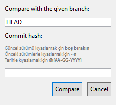

# 📜 XAML Notları \| VSIX

## 🎯 Odaklanma Ayarları

* `IsDefault="True"` ile ↩ Enter tuşuna basıldığında odaklanma
* `IsCancel="True"` ile ⎋ Esc tuşuna basıldığında odaklanma
* `<Component>.Focus()` ile `InitializeComponent` sonrası odaklanma işlemleri yapılır

> Detaylı bilgi için [How to set focus in a TextBox Control](https://docs.microsoft.com/en-us/dotnet/desktop/wpf/controls/how-to-set-focus-in-a-textbox-control?view=netframeworkdesktop-4.8)

## ⚡ Sabit değer ekleme ve kullanma

* `platformUi:DialogWindow` , xaml objesinin en üstteki tagını temsil eder \(sizde farklıdır\)

```markup
<platformUi:DialogWindow.Resources>
    <SolidColorBrush x:Key="brushWatermarkBackground" Color="White" />
</platformUi:DialogWindow.Resources>

<!--Title="Compare with history"-->
<Grid Background="{StaticResource brushWatermarkBackground}">
```

## 💬 `TextBox` Ayarları

* `IsReadOnly="True"` ile değiştirilmesi engellenir
* `AcceptsReturn="True"` ile ↩ Enter karakterini de kabul eder, çok satırlı metin girilebilir
* `ScrollViewer.VerticalScrollBarVisibility="Auto"` ile gerekirse kaydırma çubuğu gösterilir

## 🔘 Buton Tıklanma Eylemlerini Tanımlama

* `xaml` dosyası içerisinde aşağıdaki gibi tanımlanan butonlar için kaynak kod örneği verilmiştir

```markup
<Button Margin="5" Padding="5" Click="OnCompare">Save</Button>
<Button Margin="5" Padding="5" Click="OnCancel">Cancel</Button>
```

```csharp
public partial class <CLASS_NAME> : DialogWindow
{
    public <CLASS_NAME>(string helpTopic) : base(helpTopic)
    {
        InitializeComponent();
    }

    private void OnCancel(object sender, RoutedEventArgs e)
    {
        this.Close();
    }

    private void OnCompare(object sender, RoutedEventArgs e)
    {
        // TODO
        MessageBox.Show("Save");
    }
}
```

## 💭 `DialogBox` Oluşturma



### 📦 Bağımlılıkları Tanımlama

* ➕ `Add references` alanından gerekli bağımlılıkları ekliyoruz
  * PresentationCore
  * PresentationFramework
  * WindowsBase
  * System.Xaml


‍🧙‍♂ Detaylı bilgi için [📖 Create a dialog box derived from DialogWindow](https://docs.microsoft.com/en-us/visualstudio/extensibility/creating-and-managing-modal-dialog-boxes?view=vs-2019&redirectedfrom=MSDN#create-a-dialog-box-derived-from-dialogwindows) alanına bakabilirsin.


### 👷‍♂️ Dialog penceresini oluşturma

* `Add new folder` ile `Dialogs` adı altında dizin açın
* Dizine sağ tıklayıp `Add` - `New İtem` - `User Control (WPF)` ile `xaml` ve `xaml.cs` dosyaları oluşturuyoruz
* `*.xaml.cs` dosyasındaki `UserControl` -&gt; `DialogWindow` olarak güncellenecek
* `*.xaml` dosyasına aşağıdaki değişiklikler yapılmıştır
  * `xmlns:platformUi="clr-namespace:Microsoft.VisualStudio.PlatformUI;assembly=Microsoft.VisualStudio.Shell.15.0"` \(15 değeri güncel sürümlerde değişebilir\)
  * `platformUi:DialogWindow`
  * `WindowStartupLocation="CenterScreen" Width="500" Height="200"`

```markup
<platformUi:DialogWindow x:Class="<Namespace>.<Class>"
             xmlns="http://schemas.microsoft.com/winfx/2006/xaml/presentation"
             xmlns:x="http://schemas.microsoft.com/winfx/2006/xaml"
             xmlns:mc="http://schemas.openxmlformats.org/markup-compatibility/2006" 
             xmlns:d="http://schemas.microsoft.com/expression/blend/2008" 
             xmlns:platformUi="clr-namespace:Microsoft.VisualStudio.PlatformUI;assembly=Microsoft.VisualStudio.Shell.15.0"
             mc:Ignorable="d" 
             WindowStartupLocation="CenterScreen"
             Width="250" Height="250">

    <!--Title="Compare with history"-->
    <Border Margin="5" >
        <Grid>
            <Grid.RowDefinitions>
                <RowDefinition Height="Auto"/>
                <RowDefinition Height="Auto"/>
                <RowDefinition Height="Auto"/>
                <RowDefinition Height="Auto"/>
                <RowDefinition Height="Auto"/>
                <RowDefinition Height="Auto"/>
            </Grid.RowDefinitions>
            <TextBlock Text="Compare with the given branch: " Margin="5"/>
            <TextBox Grid.Row="1" x:Name="BranchTextBox" Margin="5" MaxHeight="100" Text="HEAD"
                     ScrollViewer.VerticalScrollBarVisibility="Auto"
                     />
            <TextBlock Grid.Row="2" Margin="5">Commit hash:</TextBlock>
            <TextBlock Grid.Row="3" Margin="5" Opacity="0.5" FontSize="9">
                Güncel sürümü kıyaslamak için <Bold>boş bırakın </Bold><LineBreak></LineBreak>
                Önceki sürümlerle kıyaslamak için <Bold>~n</Bold> <LineBreak></LineBreak>
                Tarihle kıyaslamak için <Bold>@{AA-GG-YYYY}</Bold>
            </TextBlock>
            <TextBox Grid.Row="4" x:Name="CommitHashTextBox" TextWrapping="Wrap" HorizontalAlignment="Stretch" Margin="5"/>

            <StackPanel Orientation="Horizontal" HorizontalAlignment="Right" Grid.Row="5">
                <Button Margin="5" Padding="5" Click="OnCompare" IsDefault="True">Compare</Button>
                <Button Margin="5" Padding="5" Click="OnCancel" IsCancel="True">Cancel</Button>
            </StackPanel>
        </Grid>
    </Border>
</platformUi:DialogWindow>
```

* Code tarafında aşağıdaki method ile diyalog penceresini gösteriyoruz

```csharp
private void ShowCustomDialog()
{
    var customDialog = new <Class>("Microsoft.VisualStudio.PlatformUI.DialogWindow")
    {
        HasMinimizeButton = false,
        HasMaximizeButton = false
    };
    customDialog.ShowDialog();
}
```


‍🧙‍♂  Detaylı bilgi için [YEmoji](https://emoji.yemreak.com/kullanim/baglantilar) yapısına uygun oluşturulmuş:

* [📃 Options for displaying modal dialogs in Visual Studio extensions](https://www.visualstudiogeeks.com/extensibility/visual%20studio/options-for-displaying-modal-dialogs-in-visual-studio-extensions#use-vs-sdk)
* [👨‍💻 Options for displaying modal dialogs in Visual Studio extensions - GitHub Changes](https://github.com/onlyutkarsh/XamlDialogInVSExtensionDemo/commit/616a945e3399e4869c6cd4ef28cb5b377495559b)
* [📃 Part 4: Show a popup Window](https://michaelscodingspot.com/visual-studio-2017-extension-development-tutorial-part-4-show-a-popup-window/)
* [👨‍💻 Part 4: Show a popup Window - Github Source Code](https://github.com/michaelscodingspot/CodyDocs/tree/Part4/CodyDocs)

alanına bakabilirsin


### ✨ `OnClick` ve `OnCompare` eylemleri tanımlama

* `xaml` dosyası içerisinde aşağıdaki gibi tanımlanan butonlar için kaynak kod örneği verilmiştir

```markup
<Button Margin="5" Padding="5" Click="OnCompare">Save</Button>
<Button Margin="5" Padding="5" Click="OnCancel">Cancel</Button>
```

```csharp
public partial class <CLASS_NAME> : DialogWindow
{
    public <CLASS_NAME>(string helpTopic) : base(helpTopic)
    {
        InitializeComponent();
    }

    private void OnCancel(object sender, RoutedEventArgs e)
    {
        this.Close();
    }

    private void OnCompare(object sender, RoutedEventArgs e)
    {
        // TODO
        MessageBox.Show("Save");
    }
}
```


‍🧙‍♂ Detaylı bilgi için [YEmoji](https://emoji.yemreak.com/kullanim/baglantilar) yapısına uygun oluşturulmuş: 

* [ 📃 Part 4: Show a popup Window](https://michaelscodingspot.com/visual-studio-2017-extension-development-tutorial-part-4-show-a-popup-window/)

alanlarına bakabilirsin


