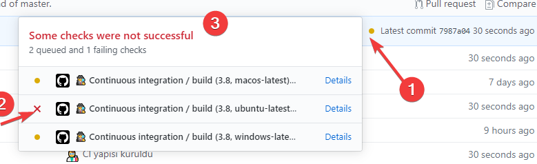
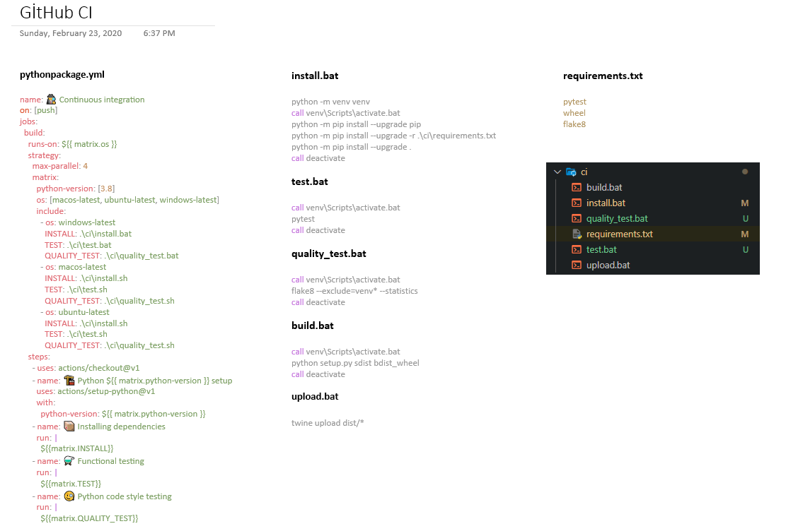
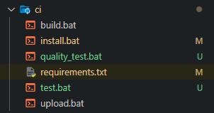

# 🔄 Continuous İntegration \| GitHub

## 👀 Hızlı Bakış





## 📂 CI Dizini Oluşturma

* 👨‍💼 Daha verimli çalışma adına CI dosyaları aynı dizinde toplanır



### 📃 Gereksinimleri tanımlama


```yaml
pytest
wheel
flake8
```


### 🏗️ Kurulum işlemlerini tanımlama




```bash
python -m venv venv
call venv\Scripts\activate.bat
python -m pip install --upgrade pip
python -m pip install --upgrade -r .\ci\requirements.txt
python -m pip install --upgrade .
call deactivate

```





```bash
python3 -m pip install --upgrade pip 
python3 -m pip install --upgrade -r ./ci/requirements.txt
python3 -m pip install --upgrade .

```




### ⚗️ Test işlemlerini tanımlama




```text
call venv\Scripts\activate.bat
pytest
call deactivate

```





```
pytest

```




### 🧪 Kod kalitesini test etme




```text
call venv\Scripts\activate.bat
flake8 --exclude=venv* --statistics
call deactivate

```





```
flake8 --exclude=venv* --statistics

```




### 👷‍♂️ Derleme işlemleri




```text
call venv\Scripts\activate.bat
python setup.py sdist bdist_wheel
call deactivate

```





```
python3 setup.py sdist bdist_wheel

```




### 🛰️ Yayınlama işlemleri




```text
call venv\Scripts\activate.bat
twine upload dist/*
call deactivate

```





```
twine upload dist/*

```




## 🔀 GitHub Workflow Oluşturma


```yaml
name: 🕵️‍♂️ Continuous integration

on: [pull_request]

jobs:
  build:
    runs-on: ${{ matrix.os }}
    strategy:
      max-parallel: 4
      fail-fast: false # 1 test başarısız olursa diğerleri kapanmaz
      matrix:
        python-version: [3.8]
        os: [windows-latest, ubuntu-latest, macos-latest]
        include:
          - os: windows-latest
            INSTALL: .\ci\install.bat
            TEST: .\ci\test.bat
            QUALITY_TEST: .\ci\quality_test.bat

          - os: macos-latest
            INSTALL: |
              chmod u+x ./ci/install.sh &&
              ./ci/install.sh
            TEST: |
              chmod u+x ./ci/test.sh &&
              ./ci/test.sh
            QUALITY_TEST: |
              chmod u+x ./ci/quality_test.sh &&
              ./ci/quality_test.sh

          - os: ubuntu-latest
            INSTALL: |
              chmod u+x ./ci/install.sh &&
              ./ci/install.sh
            TEST: |
              chmod u+x ./ci/test.sh &&
              ./ci/test.sh
            QUALITY_TEST: |
              chmod u+x ./ci/quality_test.sh &&
              ./ci/quality_test.sh

    steps:
      - uses: actions/checkout@v1

      - name: 🏗️ Python ${{ matrix.python-version }} setup
        uses: actions/setup-python@v1
        with:
          python-version: ${{ matrix.python-version }}

      - name: 📦 Installing dependencies
        run: |
          ${{matrix.INSTALL}}

      - name: ⚗️ Functional testing
        run: |
          ${{matrix.TEST}}

      - name: 🧐 Python code style testing
        run: |
          ${{matrix.QUALITY_TEST}}

```


## 🔗 Faydalı Linkler

* [📖 Good Integration Practices](https://docs.pytest.org/en/latest/goodpractices.html)
* [📃 Continuous integration with python](https://realpython.com/python-continuous-integration/)
* [📖 Workflow syntax for GitHub Actions](https://help.github.com/en/actions/reference/workflow-syntax-for-github-actions)
* [📖 Virtual environments for GitHub-hosted runners](https://help.github.com/en/actions/reference/virtual-environments-for-github-hosted-runners)
* [👪 Create matrix with multiple OS and env for each one](https://github.community/t5/GitHub-Actions/Create-matrix-with-multiple-OS-and-env-for-each-one/td-p/38339)


🚀 Bu alandaki bağlantılar [YEmoji ~Bağlantılar](https://emoji.yemreak.com/kullanim/baglantilar) yapısına uygundur


