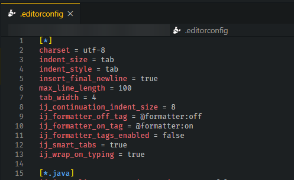

# 👨‍💻 Kodlama Düzeni

## 🐇 EditorConfig Yapılandırması

* 👨‍💻 EditorConfig ile kodların formatlanma yapısı belirlenir
* 💁‍♂️ Her IDE için çalışan ortak bir yapılandırma dosyasıdır
* 🚀 Versiyon kontrol sistemleri ile çok sık kullanılır


‍🧙‍♂ Detaylı bilgi için [EditorConfig Wiki](https://github.com/editorconfig/editorconfig/wiki/EditorConfig-Properties) alanına bakabilirsin.


## 💎 Değişken Adlandırması

* 📈 Adlandırma şekli `<ön_ek><isim>` şeklinde daha verimlidir.
* 👮‍♂️ Tanımlanmayanlar için genel kural baş harflerini almaktır
* ⭐ ImageButton için `ìb` \(image button\)

| 💞 Ön Ek | 💁‍♂ Değişken |
| :--- | :--- |
| btn | button |
| img | Image |
| ib | ImageButton |
| tv | TextView |
| rv | RecyleView |

