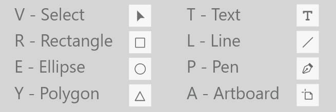
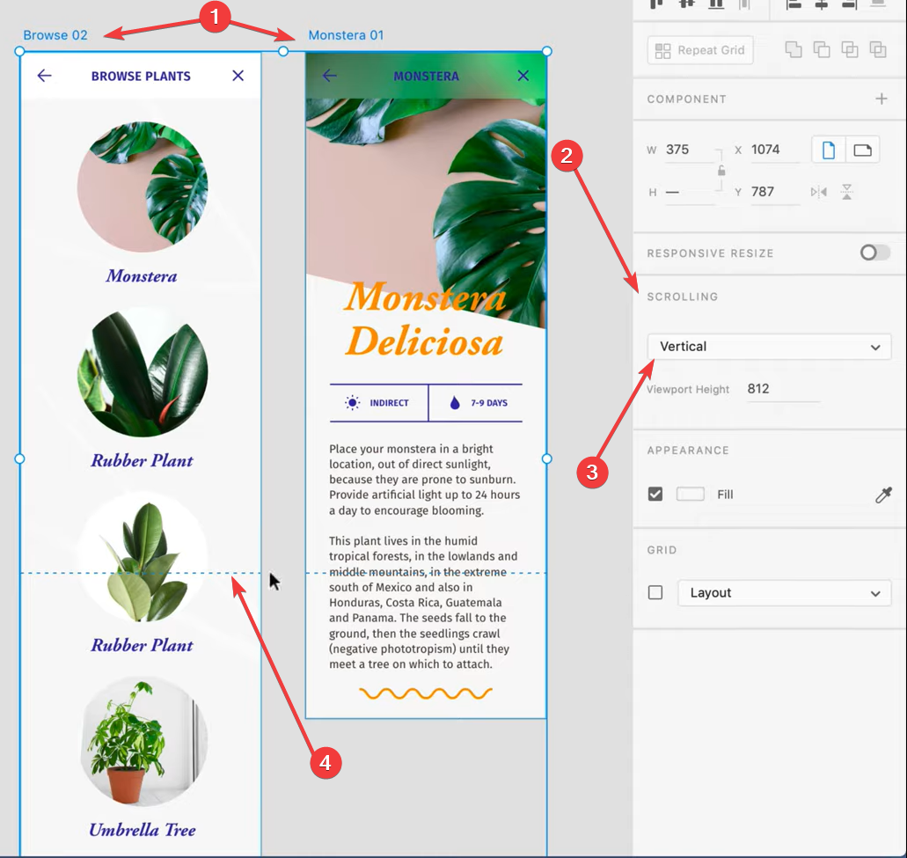
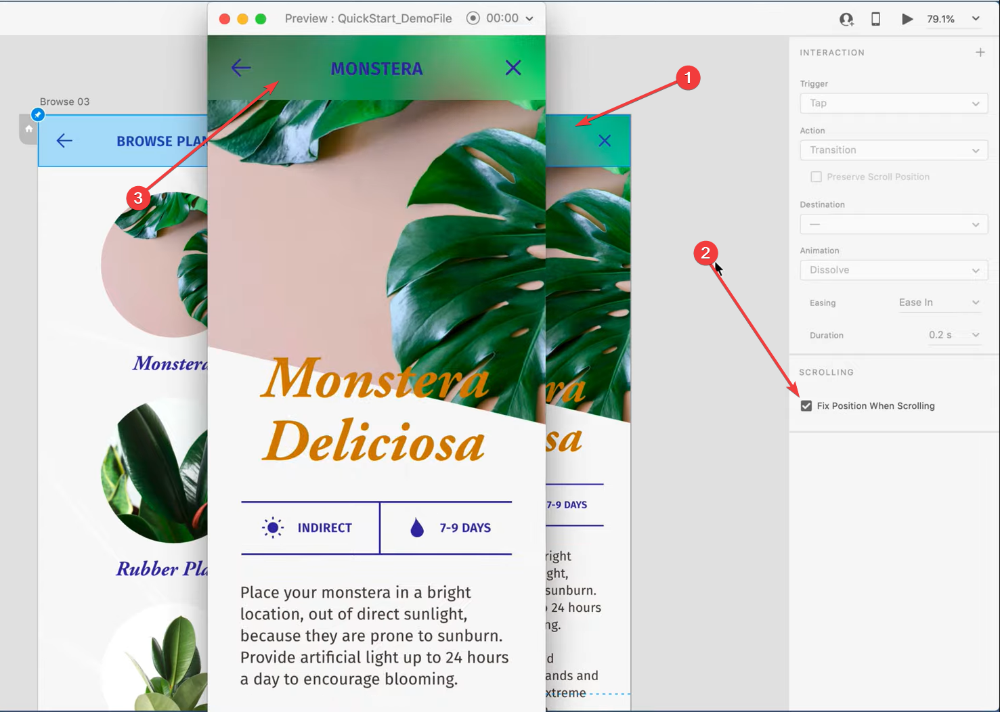
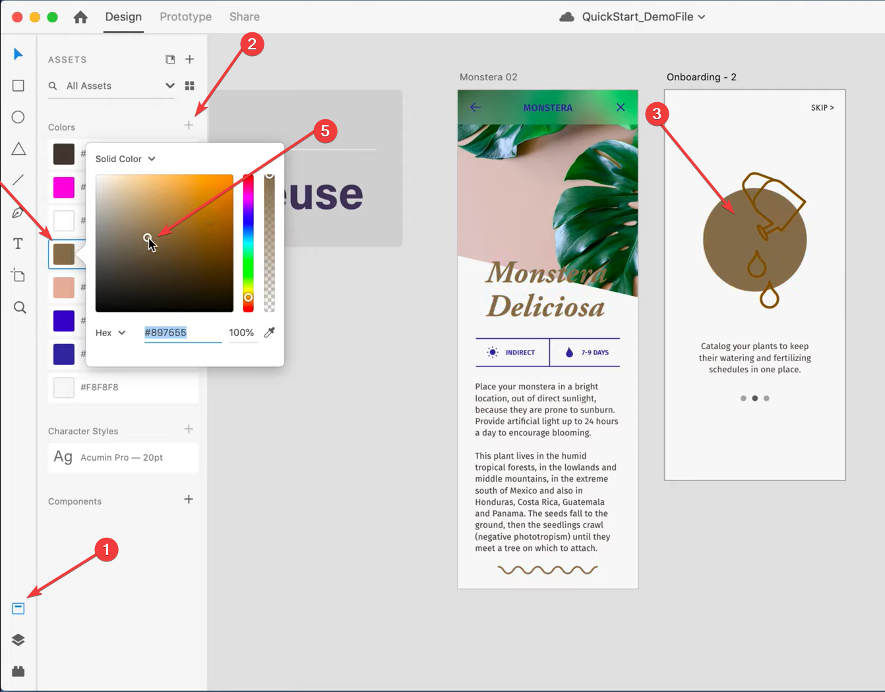
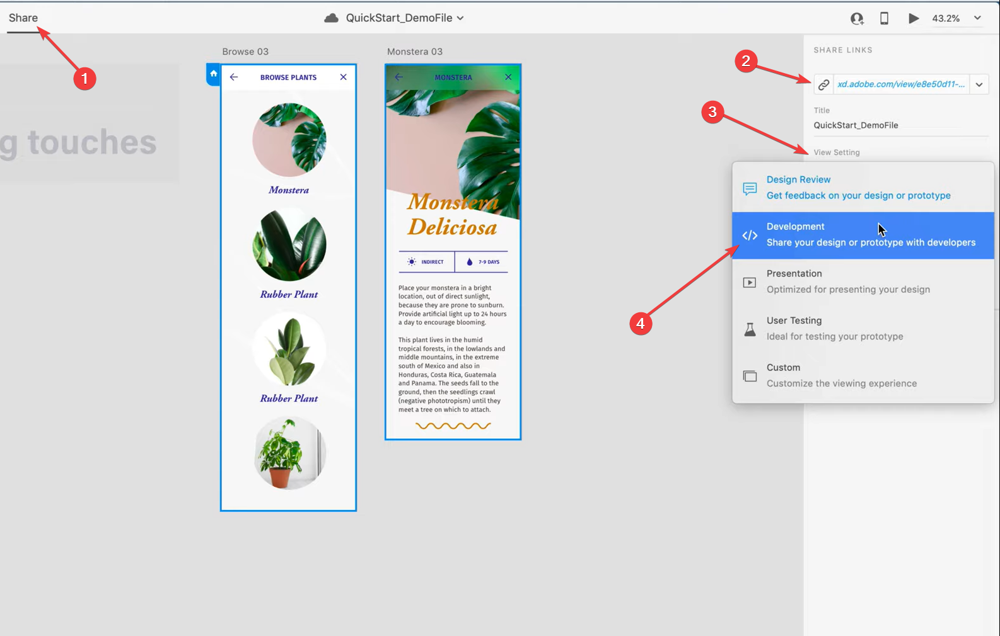

# 👨‍🎨 Adobe XD

## 🧱 Temel Kısayollar

| Kısayol | Açıklama |
| :--- | :--- |
| `I` | Artboard'ı seçip bu kısayolu uygularsanız, başka bir rengi arka plan rengi olarak ayarlar |

## 🍢 Kaydırma Animasyonu \(Scrolling\)

## 🎨 Proje Renklerini Değiştirme

## 👐 Projeyi Paylaşma

## 🧩 Eklentiler

| Eklenti | Açıklama |
| :--- | :--- |
| [🖼️ unDraw](https://adobe.com/go/xd_plugins_discover_plugin?pluginId=2d1bea48) | Projeye istenen illustrations ekleme |
| [📊 ViizyCharts](https://adobe.com/go/xd_plugins_discover_plugin?pluginId=c4f56b2a) | Veri görselleştirmesi |

## 🔗 Faydalı Bağlantılar

* [👨‍🏫 Adobe XD Getting Started](https://www.youtube.com/playlist?list=PLHjwuoik-ep1Vb4RPXNUbAVHxB1rJRC8W)
* [👨‍🏫 Adobe XD ~ YouTube](https://www.youtube.com/channel/UCxwE7-HpeFygSH0zEI2tkDQ)
* [👨‍🏫 Adobe Creative Cloud ~ YouTube](https://www.youtube.com/channel/UCL0iAkpqV5YaIVG7xkDtS4Q)
* [⭐ Web Design UI Örneği](https://www.youtube.com/watch?v=aShSUqSbhss)
* 👨‍🔧 [Your developer license has expired. To continue to use this app, please renew your license.](https://forums.adobe.com/thread/2607910)
* 💦 [Error P505 ve Adobe'u Komple Kaldırma](https://forums.adobe.com/thread/2313884)


🚀 Bu alandaki bağlantılar [YEmoji ~Bağlantılar](https://emoji.yemreak.com/kullanim/baglantilar) yapısına uygundur


