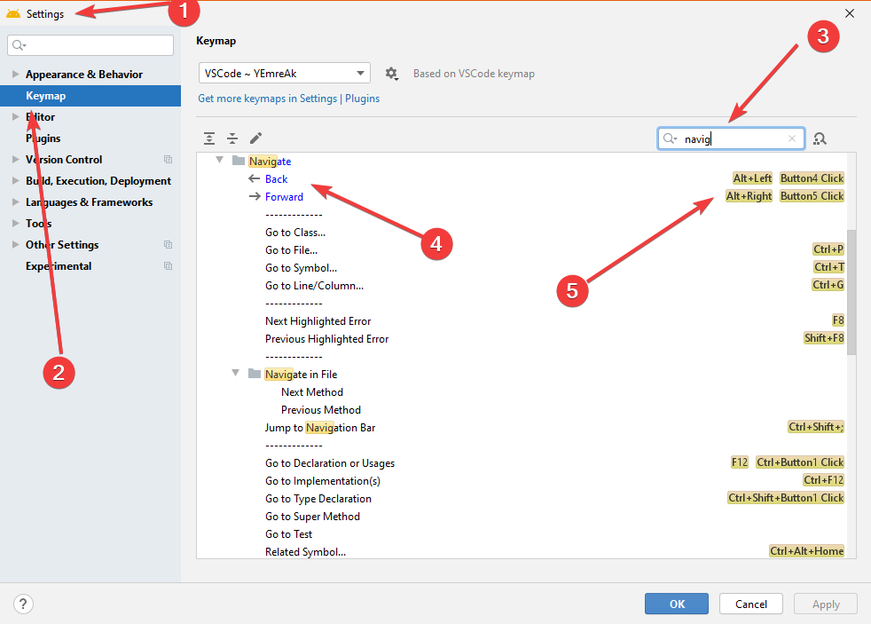

# ⚙️ Ayarlar \| JetBrains IDE

## ⌨️ VS Code Keymap

* 🚀 VS Code kısayollarını JetBrains üzerinde kullanmanızı sağlar
* 🔌 Plugins alanına `VS Code Keymap` yazarak indirebilirsiniz


‍🧙‍♂ Detaylı bilgi için [💞 Kısayollar](kisayollar.md#vscode-keymap) alanına bakabilirsin.


## 🌌 Editör Kaydırması

* ✨ Yumuşak kaydırma için \``Smooth Scroll` özelliğini aktif edebilirsin
* 👮‍♂️ JetBrains varsayılan olarak son satırdan aşağısına inmez
* 👇 Son satırı en üst satıra kadar kaydırabilmek için alttaki ayarı kullanın
* 🔨 `Settings -> Editor -> Virtual Space -> Show virtual space at file bottom`


🧙‍♂️ Detaylar için [Scroll Past End Of File](https://intellij-support.jetbrains.com/hc/en-us/community/posts/205814379/comments/205997989) bağlantısına bakabilirsin


## 🔤 Font Ayarları

Editör üzerindeki `==`, `=>`, `->`, `<=` gibi karakteri birleştiren hoş bir yazı tipidir

* ✲ Ctrl + ⎇ Alt + `S` yaptıktan sonra `Editor | Font` kısmında
  * _Font:_ `FiraCode Medium`
  * _Size:_ `12`
  * _Line spacing:_ `1.0`
  * `Enable Font Ligatures`


🚀 FiraCode'u [buradan](https://github.com/tonsky/FiraCode#solution) indirebilirsin


## 🖱️ İmleç Pozisyonu Yönetimi

* 📈 İmlecin bir önceki ya da sonraki pozisyona geçmesini sağlar
* ⚙️ `Setting` -&gt; `Keymap` -&gt; `Navigate` alanından `Back`, `Forward` değerlerine kısayol ekleyin

## 🕵️‍♂️ Dokümantasyon Ön İzleme

Fareyle kodun üzerinize geldiğinizde açıklamalarını ve dokümantasyonları gösterecektir.

*  ✲ Ctrl + ⎇ Alt + `S` yaptıktan sonra
* 👇  `Editor | General | Other` başlığı altında 
* 👁️ `Show quick documentation on mouse move` kısmını seçin 
* 🕐 Süreyi `500` yapın.

## 💡 Parametre İpuçları

* 💠 Metot kullanımlarında ipuçları gösterir
* 📈 Daha verimli kod yazmanızı sağlar
* 🔨 `Editor -> General -> Appearance -> Show parameter hints -> Configure` alanından
* 💁‍♂️ Don't ile başlamayanları işaretlersiniz her koşulda gösterecektir

## 📖 Türkçe Kontrolü Tanımlama

Dillere özgü sözlükleri indirmek için [buraya](https://drive.google.com/open?id=1UAGLGvwv_zLBzH7zH1oGRvYhzzP67M4k) tıklayabilirsin.

* ✲ Ctrl + ⎇ Alt + `S` yaptıktan sonra `Editor | Spelling | Dictionaries | Custom Dictionaries` başlığı altında `+` butonuna basıp `.dic` uzantılı sözlük dosyanı ekleyin.


~~📢 Sözlüğün çalışabilmesi için `hunspell` eklentisini indirmeniz gerekmekte. Plugin kurma detayı için~~ [~~buraya~~](https://www.jetbrains.com/help/idea/managing-plugins.html) ~~tıklayabilirsin.~~


## 🧐 Spellcheck Kaldırma

* ✲ Ctrl + ⎇ Alt + `S` yaptıktan sonra `Editor | Inspection | Spelling | Typo | Process comments` ile yorum satırlarını kontrol etmesini kaldırabilirsin.

## 🔀 Git Yönetimi

* `JetBrain IDE` - `Check out from Version Control` - `Git`
  * _Url:_ Proje URL'idir. \(Adress çubuğunda yazan metin\)
  * _Directory:_ Proje yolunudur. \(projenin/konumu\)
* `Test` & `Clone`

