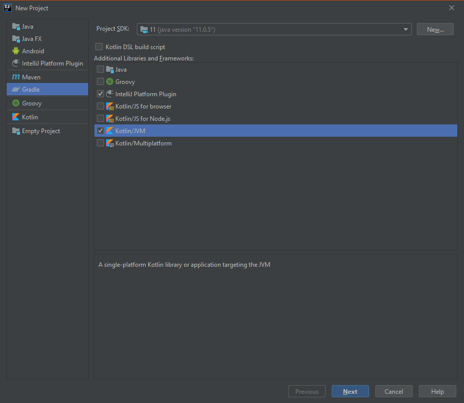
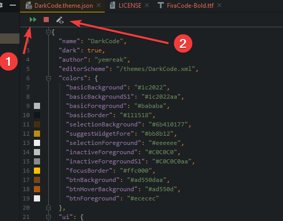
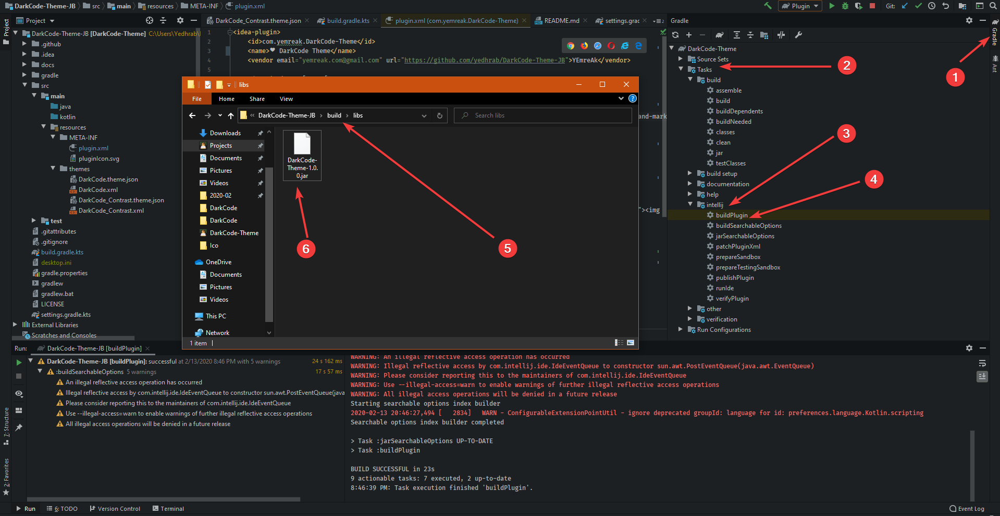

# 🔌 Eklenti Oluşturma \| JetBrains IDE

## 🏗️ Eklenti Projesi Oluşturma

* 📢 `Gradle-Java` eklentisinin yüklü olduğundan emin olun
* 👷‍♂️ `New Project` - `Gradle` - `IntelliJ Platform Plugin` - `Java` veya `Kotlin / JVM`



## 👨‍💼 Tema Yönetimi



## 🏗️ Eklentiyi Oluşturma



## 🎃 Kotlin DSL ile Yayınlama

*  👨‍🔧 Kotlin Gradle için `publishPlugin` yapısı `tasks.publishPlugin` kullanılır


```groovy
tasks.publishPlugin {
    token("TOKEN BİLGİSİ")
}
```



‍🧙‍♂ Detaylı bilgi için [Working with container objects](https://docs.gradle.org/current/userguide/kotlin_dsl.html#kotdsl:containers) alanına bakabilirsin.


## 🔗​ Faydalı Bağlantılar

* [📖 Gradle ile Eklenti Oluşturma \(Tavsiye Edilir\)](https://www.jetbrains.org/intellij/sdk/docs/basics/getting_started.html#using-gradle)
* [📖​ Creating Custom UI Themes](https://www.jetbrains.org/intellij/sdk/docs/reference_guide/ui_themes/themes.html)
* [📖 Customizing UI Themes - Icons and UI Controls](https://www.jetbrains.org/intellij/sdk/docs/reference_guide/ui_themes/themes_customize.html)
* [📖​ UI Themes - Editor Schemes and Background Images](https://www.jetbrains.org/intellij/sdk/docs/reference_guide/ui_themes/themes_extras.html)\*\*\*\*
* [📖​ Enabling Internal Mode](https://www.jetbrains.org/intellij/sdk/docs/reference_guide/internal_actions/enabling_internal.html)ß
* [**📖** Internal Actions - LaF Defaults](https://www.jetbrains.org/intellij/sdk/docs/reference_guide/internal_actions/internal_ui_lafd.html) ****


