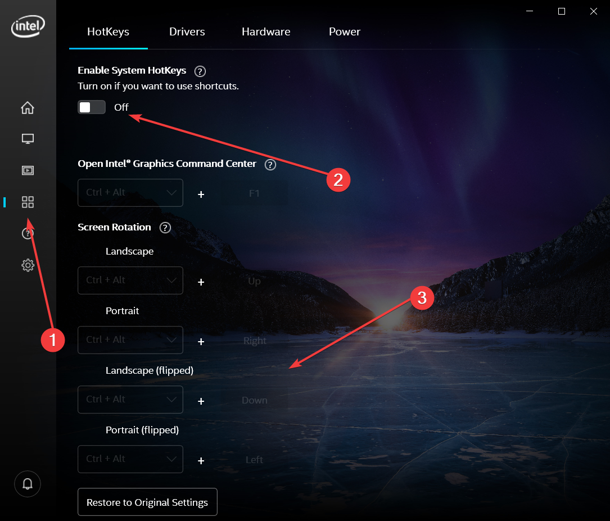

# 👨‍🔧 Hata Çözümleri \| VS Code

## 🔘 ✲ Ctrl  ⎇ Alt ↑ ↓ ← → Arrow Kısayolunun Çalışmaması

* 🚧 Intel Graphic Commands Center uygulaması tarafından bu kısayollar kullanıma alınmaktadır
* 🐞 Sistem kısayolları aktif olmasa bile VSCode tarafından algılanmamaktadır
* 👨‍🔧 Sorunun çözümü için 
  * 👷‍♂️ ✲ Ctrl ⎇ Alt ile başlayan kısayollara kendi değerlerini atayın
  * 💦 Ardından kısayollara atanan değerleri eski haline getirin
  * ✖️ Sistem kısayollarını tekrardan kapatın

