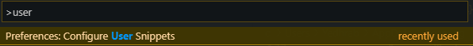

# 💫 VsCode Kısayolları

## 🌟 Sık Kullanılanlar

| Kısayol | Açıklama |
| :--- | :--- |
| ✲ Ctrl + F | Dosyada kelime arama |
| ✲ Ctrl + H | Dosyada kelime arama ve değiştirme |
| ✲ Ctrl + ⇧ Shift + F | Tüm projede kelime arama |
| ✲ Ctrl + ⇧ Shift + H | Tüm projede kelime arama ve değiştirme |

## 📈 Verimlilik

* Zen Mode ✲ Ctrl + K + Z

## ✨ Aksiyon Penceresi

✲ Ctrl + `P` ile aksiyon penceresini erişebilirsiniz.

| Kısayol | Açıklama | Kısayol |
| :--- | :--- | :--- |
| `#` | Çalışma dizininde arama |  |
| `@` & `@:` | Dosya içerisinde sembole özgü arama \(gruplu gösterme\) |  CTRL +  SHIFT +  O |
| `>` | Komutlarda arama | ✲ Ctrl + ⇧ Shift + P |
| `:` | Satıra yönelme |  |
| `?` | Yardım |  |

## 🏹 İmleç

* ⎇ Alt Birden fazla işaretçi belirleme
* ✲ Ctrl + ⇧ Shift + Yukarı yada Aşağı Tuşu İşaretçi sayısını arttırma
* ✲ Ctrl + U Bir önceki imleci seçer

## 🔤 Metin

* ⇧ Shift + ⎇ Alt + Sağ veya Sol Bir sonraki bloğu seçme
* ⇧ Shift + ⎇ Alt + Yukarı veya Aşağı Satırı çoğaltma
* ✲ Ctrl + D Kelimeyi seçme
  * Birden fazla tekrarlanırsa aynı metinleri seçer yanlarına imleç getirir
  * Değişkenleri yeniden adlandırmada çok faydalıdır
* ✲ Ctrl + L Satırı seçme
* ✲ Ctrl + X Satırı kesme
* ⎇ Alt + Yukarı yada Aşağı Tuşu Satırı taşıma
  * Sırasıya: Kelime, Satır, Kod bloğu, ..., Tüm metin

## 📑 Editör

* ⎇ Alt tuşuna basılı tutarak dosyalara tıklarsan yan panelde açılır
* ✲ Ctrl + ⎇ Alt + Sağ veya Sol Pencereyi sağa veya sola alır
* ✲ Ctrl + ⇧ Shift + A Seçili alanı yorum satırı yapma
* Tüm kodları gizleme \(_fold all_\)
  * Windows and Linux için ✲ Ctrl + K, ✲ Ctrl + 0 \(sıfır\)
  * macOS için ⌘ + K, ⌘ + 0 \(sıfır\)
* Kodları seviyeye göre gizleme
  * ✲ Ctrl + K, ✲ Ctrl + 
  * Örn: ✲ Ctrl + K, ✲ Ctrl + 2
* Tüm kodları gösterme \(_unfold all_\)
  * Windows and Linux için ✲ Ctrl + K, ✲ Ctrl + J \(sıfır\)
  * macOS için ⌘ + K, ⌘ + J

## 👁‍🗨 Görünüm

* ✲ Ctrl + Yukarı yada Aşağı Tuşu Görünen ekranı kaydırma
* ✲ Ctrl + ⇧ Shift + V _Markdown preview_'i açar
* ✲ Ctrl + J Alt paneli görünür kılar

## 👨‍💻 Snippets

* `$1` işareti ile `1.` olarak odaklanılacak alan belirlenir
* `${1:default}` ile `1.` olarak odaklanılacak olan `default` isimli alan belirlenir
* `$0` Son odaklanılacak alanı belirtir

## 🔗 Harici Bağlantılar

* [Vscode ipuçları](https://code.visualstudio.com/docs/getstarted/tips-and-tricks#_files-and-folders)
* [Snipped](https://code.visualstudio.com/docs/getstarted/tips-and-tricks#_snippets)

