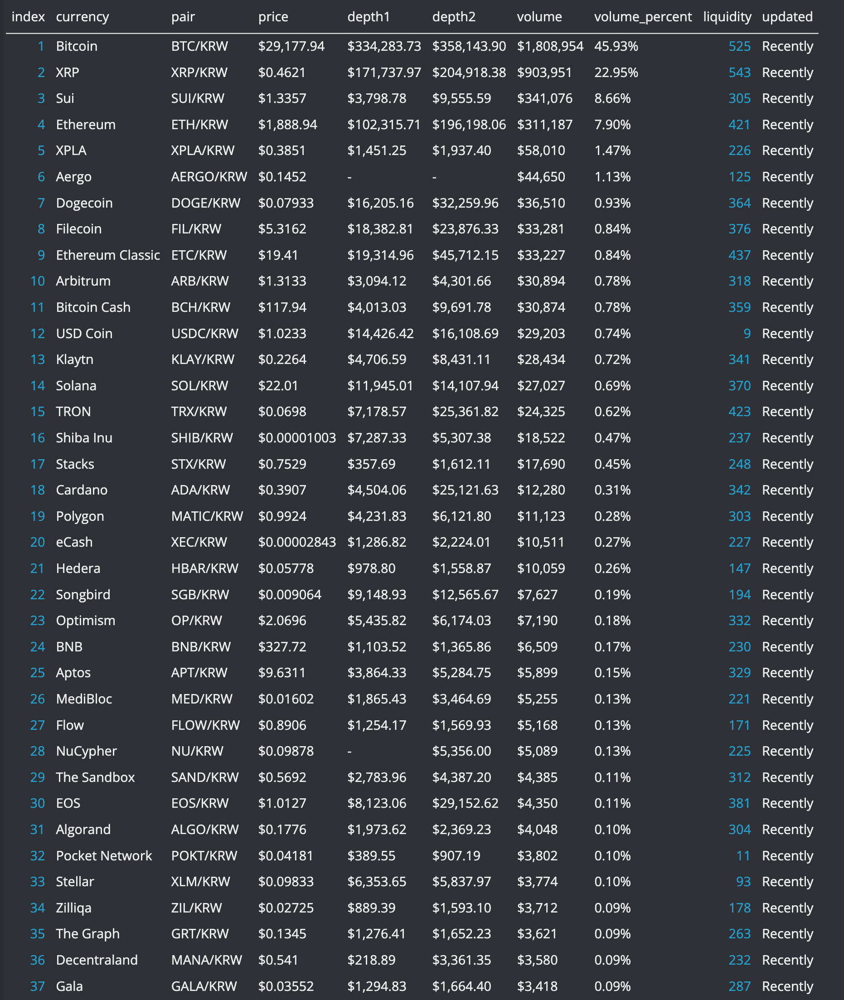

# 💵 CoinMarketCap'ten Exchange için Currency Bilgilerini Çekme ve CSV'ye Kaydetme

## 🔰 Proje Hakkında



<figure><figcaption></figcaption></figure>

💥 Python ve Selenium kullanarak CoinMarketCap'ten herhangi bir kripto para borsasının bilgilerini nasıl çekeceğinizi ve bu verileri CSV dosyasına nasıl kaydedeceğinizi öğreneceksiniz. Aşağıda kullanılacak kütüphaneler ve gerekli modüller bulunmaktadır:

📘 Kütüphaneler ve Modüller:

* selenium.webdriver
* csv
* time

🎓 Öğrenecekleriniz: 1️⃣ CoinMarketCap'ten veri çekme 2️⃣ Borsaların bilgilerini işleme ve düzenleme 3️⃣ Verileri bir CSV dosyasına yazma 4️⃣ Sayfada belirli elementlere kaydırma ve daha fazla veri yükleme

📼 Kod örneği ve detaylı açıklamalar için videoyu izleyin!

Etiketler: #python #selenium #coinmarketcap #exchange #web\_scraping #csv #veri\_çekme #veri\_işleme #web\_otomasyon #kripto\_para #kripto\_borsaları #coding #programming #developer #programmer #code

Category: Eğitim (Education)

Type: Nasıl Yapılır (How-to)

Akademik Sistem: Türkiye (Turkey)

Seviye: Orta (Intermediate)

Sınav, Kurs veya Standart: Web Veri Çekme ve İşleme (Web Data Extraction and Processing)

## 📜 Kaynak Kodu

```python
from seleniumwire.webdriver import Chrome
from selenium.webdriver.remote.webelement import WebElement
from selenium.webdriver.common.by import By
from time import sleep
from typing import Any
import csv

MAX_ROW = 60
MAX_ROW_ENLARGED = 200

TABLE_XPATH = '//*[@id="__next"]/div/div[1]/div[2]/div/div/div[2]/table'
BUTTON_XPATH = '//*[@id="__next"]/div/div[1]/div[2]/div/div/div[3]/button'


def scroll_into_elem(elem: WebElement):
    chrome.execute_script("arguments[0].scrollIntoView();", elem)
    sleep(0.5)


def write_to_csv(filename: str, data: list[list[Any]]):
    with open(filename, "w", newline="") as csvfile:
        csvwriter = csv.writer(csvfile)
        csvwriter.writerow(
            ["index", "exchange", "score", "volume", "liqudity", "markets", "coins"]
        )
        for row in data:
            csvwriter.writerow(row)


def fetch_table_rows(
    elem: WebElement, first_row: int, last_row: int
) -> list[list[Any]]:
    """Fetches the table rows from the given element"""
    fetched_rows: list[list[Any]] = []
    for i in range(first_row, last_row + 1):
        row_elem = elem.find_element(By.XPATH, f"tbody/tr[{i}]")
        splitted_row = row_elem.text.split("\n")
        if len(splitted_row) < 9:
            scroll_into_elem(row_elem)
            row_elem = elem.find_element(By.XPATH, f"tbody/tr[{i}]")
        [
            index,
            exchange,
            score,
            volume,
            _,
            liqudity,
            _,
            markets_coins,
        ] = row_elem.text.split("\n")[:8]
        [markets, coins] = markets_coins.split(" ")
        index, score, volume, liqudity, markets, coins = (
            int(index),
            float(score),
            float(volume.replace("$", "").replace(",", "")),
            int(liqudity) if liqudity != "--" else None,
            int(markets),
            int(coins),
        )
        fetched_rows.append([index, exchange, score, volume, liqudity, markets, coins])
    return fetched_rows


if __name__ == "__main__":
    chrome = Chrome()
    chrome.get("https://coinmarketcap.com/rankings/exchanges/")

    elem = chrome.find_element(By.XPATH, TABLE_XPATH)
    rows = fetch_table_rows(elem, 1, MAX_ROW)
    button = chrome.find_element(By.XPATH, BUTTON_XPATH)
    button.click()
    sleep(2)
    rows.extend(fetch_table_rows(elem, MAX_ROW + 1, MAX_ROW_ENLARGED))
    write_to_csv("exchanges.csv", rows)

```
